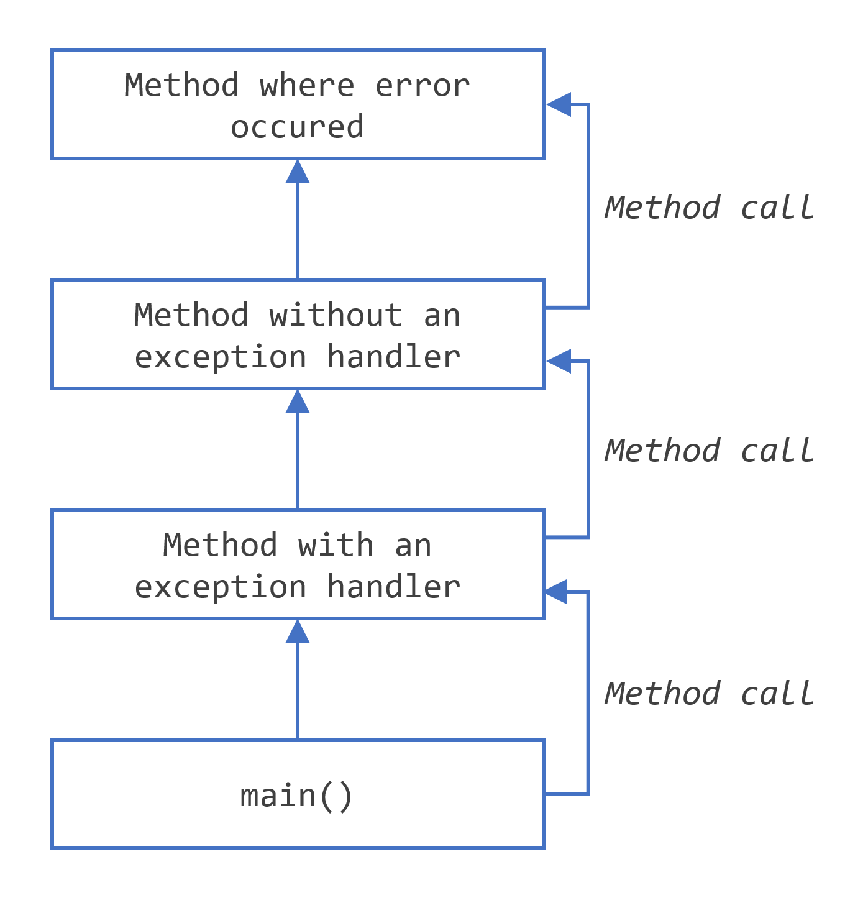

# Java

El primer paso es entender el lenguaje **Java**, que es la base de todo lo que haremos en esta formación.

Si quieres aprender a desarrollar un sitio web, el servidor o el back-end de una aplicación, o hasta una aplicación mobile que utiliza Java es esencial desarrollar un conocimiento sólido en orientación a objetos y buenas prácticas de código.

De este modo, aquí aprenderás desde recursos básicos del lenguaje, como variables, controles de flujo y ciclos de repetición, hasta los principales conceptos del paradigma de orientación a objetos, como **clases**, **herencia** e **interfaces** y como todo eso te ayudará en tu día a día en la programación.

**[https://dev.java/](https://dev.java/)**


# Lenguaje Java

* Top 5 lenguajes más usados.
* Orientado a Objetos.
* alta demanda.
* Gran ecosistema de librerías y frameworks.
* Parecido a C++.


Java 8 fue lanzado en el 2014, con cambios importantes en la plataforma, las nuevas versiones parten de la versión 8 incluyendo mejoras.

Se puede decir que Java 8 es la base para todo Java, como en javascript el ES6.

[https://www.jetbrains.com/es-es/lp/devecosystem-2021/](https://www.jetbrains.com/es-es/lp/devecosystem-2021/)


# Plataforma Java

Lenguaje POO, multiplataforma, fácil comprensión, la principal ventaja de Java es **la plataforma**, la máquina virtual de Java.

La máquina virtual es: portable, fácil de implementar, segura y omnipresente.


## Máquina virtual Java (JVM)

1960-1970 el método de creación de programas de aquel entonces:
```
Código -> Ejecutable -> Game
Código -> Ejecutable -> TV
Código -> Ejecutable -> Otros dispositivos
```

En aquel entonces, las empresas se mentenían con la venta de hardware, el software venía gratis.

SUN microsystems, James Gosling - creador de Java, crear un hardware especializado para ejecutar el código, esto fracasó porque era poco rentable y práctico.

En 1996, se creó la máquina virtual de Java con la idea de estándarizar la forma de crear programas:
```
                                                   -> Game
Código -> Ejecutable -> Máquina Virtual Java (JVM) -> TV
                                                   -> Otros dispositivos
```


Permite escribir un código, generar un código de ese ejecutable un `Bytecode`, es un ejecutable binario que contiene el código ejecutable traducido, el `Bytecode` tiene una extensión `.class`.


Código ejemplo de una clase Java.

```
package com.alura.java;

public class Persona {
	String nombre;
	String apellido;
	int edad;
	
	void datosDefault() {
		this.nombre = "";
		this.apellido = "";
		this.edad = 30;
	}
	
}
```

`package com.alura.java;`, es el nombre del paquete y la ruta del paquete Java, se debe incluir en cualquier creación de clases Java.


JVM realiza:

* Administración de memoria - garbage collection.
* Multiplataforma
* Seguridad
* Optimización
* Librerías

La JVM es sumamente importante en Java, ya que esta es la que se encargada que la aplicación se escriba una sola vez y se ejecute la n cantidad de veces en diferentes dispositivos (`WORA`, o "write once, run anywhere").


Lenguajes basados en Java, Ruby, Scala, Python, cljs, groovy.
Multiplataforma sirve en Linux, Mac, Windows y en dispositivos IoT.


El mayor beneficio es ejecutar el código independientemente del sistema operativo. En Java siempre tendremos el mismo archivo "ejecutable" (Bytecode) que será ejecutado por la máquina virtual de Java (JVM) independientemente del sistema operativo estemos usando. De esta forma, no es necesario reescribir el código o adaptarlo a cada sistema operativo. ¡Tenemos un único ejecutable para todas las plataformas!


Con Java podemos desarrollar:
* Sistemas web (Web sites, aplicaciones web).
* Sistemas solo server side (backend).
* Aplicaciones Android.
* Applets para navegadores web.


---

¿Cuál es la diferencia entre archivos ejecutables de Windows (.exe) y archivos ejecutables de Java (Bytecode)?

Los ejecutables de Windows pueden correr directamente en el sistema operativo, los de Java necesitan de la máquina virtual.

Los archivos ejecutables de Java son portátiles, los de Windows no. Recuerda que la palabra "portátil" se refiere a que el mismo archivo puede ser ejecutado en varios sistemas operativos (Windows, Linux, Mac, etc.).

---

## Bytecode

`Bytecode` es un código de máquina similar a `Assembly`. El nombre `Bytecode` es un conjunto de comandos que la máquina virtual de Java entiende, esos comandos son también llamados `opcodes` (operation code) y cada `opcode` posee exactamente *1 Byte* de tamaño. Entonces, tenemos un `opcode` de *1 Byte*, o más simple, `Bytecode`.


## Código fuente vs Bytecode

*Código fuente* es el código escrito por los humanos utilizando un lenguaje legible para humanos, frecuentemente en texto plano.

*Bytecode* es el código generado en la máquina virtual de Java que traduce el *código fuente* en instrucciones que pueda ser leída y ejecutada por la máquina. Se necesita de la *máquina virtual de Java*.


**Bytecode** es independiente del sistema operativo.


## Los principales componentes de la plataforma Java, que son:

* Java Virtual Machine (JVM).
* Lenguaje Java.
* Librerias Java (API).


---


\pagebreak


# Eclipse IDE

Barra de heramientas IDE:

* Window
  - Show View: Muestra nuevas ventanas para el desarrollo, como consola de errores, logs, explorador de proyectos, navegador, etc.

  - Perspective: Resultado de imagen para perspectiva de eclipse. Una perspectiva de eclipse es el nombre dado a una colección y disposición inicial de vistas y un área de edición.

* Escribir `sysout`, `Ctrl` + `space`, Eclipse autocompleta `System.out.println();`.

* Escribir `syserr`, `Ctrl` + `space`, Eclipse autocompleta `System.err.println();`.


* Close project: cada vez que se inicia un proyecto se deben cerrar los otros, esto nos permite evitar los mensajes de errores que puedan ser de otro proyecto.
  * Clic derecho sobre el proyecto a cerrar y `Close project`.

* Ctrl + clic variable: cambia visión a la variable clickeada.

* Para generar *getters* y *setters*, Eclipse autogenera código: Source -> Generate Getters and Setters -> elegir los atributos `private`s que tendrán getter/setter.

* Generar clases heredadas, New Class -> Superclass - Browse -> Buscar por el nombre de la superclase y Ok -> Nombre subclase -> Finish.

* Degub: depurar ejecucion de código (icono insecto)
  - Step Into: Ejecuta un código loop, ejemplo el inicio de un bucle.
  - Step Over: Ejecuta el resto de código paso a paso.
 
  La pila de ejecución (lado izquierdo) muestra `line [numero]`, ese número de línea es en donde la ejecución se detiene.

* `Clic` + `o` + clickear nombre de clase: Muestra todos los métodos de la clase completa.

* `main` + Ctrl + space: autocompleta método `main()`.


\pagebreak


# Instalación Java

[https://docs.fedoraproject.org/en-US/quick-docs/installing-java/](https://docs.fedoraproject.org/en-US/quick-docs/installing-java/)


* Para ejecutar código Java se necesita la versión Java **JRE - Java Runtime Environment**.

* Para poder escribir código Java se necesita la versión Java **JDK - Java Development Kit**.

Se necesita de ambos para tener un ambiente de desarrollo Java completo.

```
$ sudo dnf install java-latest-openjdk
$ sudo dnf install java-latest-openjdk-devel
$ sudo dnf install java-latest-openjdk-src
```

[https://www.java.com/es/download/](https://www.java.com/es/download/)


Crear la variable de entorno de Java

```
$ sudo alternatives --config java
```


Declarar JAVA_HOME
```
export JAVA_HOME=/usr/lib/jvm/java-1.8.0-openjdk/jre/bin/
```

Para hacer este cambio permanente se debe crear en `/etc/profile` para que sea para todos los usuario o en `.barshrc` para un usuario.


```
$ java -version
```

# Versiones de Java

```
JDK
 |-> Tools
 |-> JRE
     |->JVM
     |->Librerías
```

* JDK - Java Development Kit, para desarrolladores.

El Java Development Kit (JDK) es una extensión de JRE. Junto con los archivos y herramientas proporcionados por JRE, el JDK incluye compiladores y herramientas (como *JavaDoc* y *Java Debugger*) para crear programas *Java*. Por esta razón, cuando uno quiere desarrollar una aplicación Java, necesitan instalar un JDK.

> JDK = JRE + Herramientas de desarrollo. 


* JRE - Java Runtime Environment, para clientes.

Java Runtime Environment (JRE) es un conjunto de herramientas que proporcionan un entorno en donde las aplicaciones *Java* pueden ser ejecutadas. Cuando un usuario desea ejecutar un programa *Java*, este debe elegir el entorno que se adecue a sus necesidades (arquitectura y sistema operativo de la computadora).

> Java es sumamente cuidadoso con las versiones. Si nosotros desarrollamos nuestras aplicaciones con x versión, muy probablemente no sean compatibles con una versión y.

> JRE = JVM + Librerías.


# Compilar código

Las clases (públicas) creadas en Java, deben tener el mismo nombre que el fichero y con la extensión **.java**.


## Primer código Java

```
$ vim Ejemplo.java
```

```java
public class Ejemplo {

	public static void main(String[] args)	 {
		System.out.println("Primer línea java");
	}

}
```

```
$ javac Ejemplo.java
```

Ejecutar el código del fichero Bytecode, `Ejemplo.class`, java reconoce el fichero por lo que no necesita escribir su extensión **.class**.

```
$ java Ejemplo
```


* Se debe descibir el contexto de la clase, `public`.
* Un programa Java debe escribirse dentro de una clase, **`class`**.
* Cada bloque de código debe ir entre **`{ }`**.
* Siempre se debe terminar con **`;`**, de lo contrario da error.
* Siempre declarar el tipo de datos que se utilizarán en las variables.
* El compilador ejecutará la clase que contenga el método **main**, de lo contrario no iniciará nada.
* Imprimir en consola `System.out.println('texto')`.
* Multiples clases empiezan por una que contenga el método **main** y los instancie en dicho método.
* La entrada de una aplicación Java es siempre la función/método. En el ejemplo, `public static void main(String[] args)` o `public static void main(String... args)`.
* *String[]* es un array de objetos String, en *main* representan los argumentos que se entregan al ejecutarlo por línea de comandos.


Compilación y ejecución de código Java:
* Durante la compilación ocurre una verificación sintáctica del código fuente.
* En la compilación y ejecución pueden aparecer errores.
* La JVM ejecuta Bytecode.
* El compilador genera Bytecode en caso el código fuente no presente ningún error sintáctico.


## `javac`

Es el programa que convertirá el código fuente en código Bytecode, es decir, compilará el código fuente.

```
javac CodigoJava.java
```


## `java`

Ejecuta los ficheros Bytecode, no es necesario agregar su extensión `.class`, los reconoce automáticamente.

```
java CodigoJava
```

Ejecuta también ficheros ejecutables *.jar*.

```
java -jar CodigoJava.jar
```


\pagebreak


# Programando en Java

---

> **En Java todo es una referencia (referencia a datos en memoria)**

---

* Java es un languaje Orientado a Objetos.

* El método **main** puede ser omitido en las clases, pudiendo estar en una clase y esa clase inicializaría las otras clases del proyecto en el cual se trabaja.

* **Java es case-sensitive**

* Utilizar **CamelCase** para nombrar variables, clases, objetos, interfaces.

* El fichero debe tener el mismo nombre que la clase dentro de este, ejemplo, fichero *UnaClase.java* contiene la clase llamada *UnaClase*.

* Es lenguaje fuertemente tipado, es decir, cada variable se debe asociar el tipo de datos que se utilizará.

* Los tipos de datos no se pueden "cruzar", es decir, no se puede utilizar un booleano en un entero.

* Todas las sentencias terminan con *;*.

* Las declaraciones de variables deben empezar con la declaración de su tipo.

## Reglas de nombres

Estas reglas se utilizan para nombrar variables, clases, métodos.

* Deben empezar con letras, guión bajo o signo peso ($).
* El nombre no puede iniciar con número.
* Después del primer carácter se puede utilizar números.
* No utilizar palabras reservadas en los nombres.


## Keywords

| abstract | continue | for | new | switch |
| assert | default | goto | package |	synchronized |
| boolean | do | if | private | this |
| break | double | implements | protected | throw |
| byte | else | import | public | throws |
| case | enum | instanceof | return | transient |
| catch | extends | int | short | try |
| char | final | interface | static | void |
| class | finally | long | strictfp | volatile |
| const | float | native | super | while |


## Tipos primitivos

[https://www.ibm.com/docs/es/iis/11.5?topic=jrules-basic-java-types-methods](https://www.ibm.com/docs/es/iis/11.5?topic=jrules-basic-java-types-methods)

1. int
2. short
3. long
4. double
5. float
6. boolean
7. byte
8. char


## Autoboxing y auto-unboxing

[https://javadesdecero.es/avanzado/autoboxing-auto-unboxing-ejemplos/#3_Autoboxing_y_metodos](https://javadesdecero.es/avanzado/autoboxing-auto-unboxing-ejemplos/#3_Autoboxing_y_metodos)

A partir de JDK 5, autoboxing y autounboxing permite simplificar y agilizar el código que debe convertir los tipos primitivos en objeto y viceversa.

Autoboxing/unboxing está directamente relacionado con los **wrappers** en Java y con la forma que los valores se manejan dentro y fuera de una instancia de un wrapper (envoltorio).


### Wrappers de tipo

Se utilizan cuando se necesitan tratar un valor primitivo como un objeto.

Tipo de datos primitivos (int, double, long, etc) contienen los tipos de datos básicos, no son objetos, por lo tanto no son parte de la jerarquía de `Object`.

No se pueden usar estructuras de datos para almacenar tipos primitivos, para realizar esto se deben utilizar wrappers de tipo, son **clases que encapsulan un tipo primitivo dentro de un objeto**.

Los wrapper de tipo son:

1. Double
2. Float
3. Long
4. Integer
5. Short
6. Byte
7. Character
8. Boolean


Están empaquetados en **java.lang**. Estas clases ofrecen una amplia gama de métodos que permiten integrar completamente los tipos primitivos.


#### Wrappers de tipo numérico

Son aquellas que representan valores numéricos.

* Byte
* Short
* Integer
* Long
* Float
* Double


Todos estos heredan de la clase abstracta **Number**, este tiene métodos que devuelven un objeto para cada tipo numérico.

```
byte byteValue()

double doubleValue()

float floatValue()

int intValue()

long longValue()

short shortValue()
```


Todos estos wrappers tienen constructores que permiten construir un objeto a partir de un valor dado o una cadena de ese valor.


#### `valueOf()` en wrapper

Si string no contiene valores numéricos válidos lanza excepción **NumberFormatException**, a partir de JDK 9+ están obsoletos.

Se recomienda el uso de **`.valueOf()`** para obtener un objeto wrapper. Este es un método estático de todos los wrappers y clases numéricas.

```
Integer iOb = Integer.valueOf(100);
```


Todas los wrappers anulan *String()*, legible por humano, permite imprimir usando *println*.


#### Boxing y Unboxing

Encapsular un valor dentro de un objeto se llama **boxing**, antes de JDK 5 se hacía manualmente.

```
Integer iOb = Integer.valueOf(100);
```

El **unboxing** también se hacía manualmente, llamando explícitamente un método en el wrapper para obtener su valor.

```
int i = iOb.intValue()
```


Por lo que se tenia que hacer esto antes de JDK 5:

```
//Demostración manual de boxing y unboxing con wrapper
class Wrapper {
    public static void main(String[] args) {
        Integer iOb = Integer.valueOf(100);
        int i=iOb.intValue();
        System.out.println(i+ " "+iOb);
    }
}

// Salida:
100 100
```


Todo esto es tedioso y propenso a errores.


### Autoboxing - Auto-unboxing

1. **Autoboxing**, proceso por el cual un valor primitivo es automáticamente encapsulado (boxed) en su wrapper de tipo equivalente cuando se necesite un objeto de ese tipo.

2. **Auto-unboxing**, proceso por el cual el valor del objeto encapsulado se extrae automáticamente cuando se necesite su valor.

Estos **procesos automáticos** agilizan la codificación de varios algoritmos, eliminan errores humanos.

*Actualmente* se declara de esta forma valores primitivos.


#### Autoboxing

```
Integer iOb = 100;
```


#### Auto-unboxing

```
int i = iOb;
```


#### Ejemplo

```
//Demostración de autoboxing y unboxing
class Autobox {
    public static void main(String[] args) {
        Integer iOb = 100;
        int i=iOb;
        System.out.println(i+ " "+iOb);
    }
}
```


### Mal uso de Autoboxing - Auto-unboxing

El ejemplo técnicamente está correcto y compila, pero es mucho menos eficiente usando el tipo primitivo **double**, porque, en cada autobox y auto-unbox agrega sobrecarga que no está presente en los datos primitivos.

Es decir, usando wrappers estos se encapsulan, se declara, se llaman, se desenvuelven y se retornan los datos.

```
//Un mal uso de autoboxing / auto-unboxing
Double a,b,c;
a=10.2;
b=11.4;
c=12.6;
Double avg=(a+b+c)/3;
```

En resumen, es un gasto innecesario.


### Resumen

* Para cada primitivo hay una clase llamada Wrapper.
* Para almacenar un primitivo en una colección, necesita crear un objeto que envuelva el valor.
* La creación del objeto Wrapper se llama autoboxing.
* La extracción del valor primitivo del objeto Wrapper se llama unboxing.
* El autoboxing y unboxing ocurren automáticamente.
* Las clases wrapper tienen varios métodos auxiliares, por ejemplo para el parsing.
* Todas las clases wrappers que representan un valor numérico tienen la clase *java.lang.Number* como madre.


## Tipos de datos

[https://dev.java/learn/creating-primitive-type-variables-in-your-programs/](https://dev.java/learn/creating-primitive-type-variables-in-your-programs/)

| Wrapper | primitivo | Descripción | Valor default | id finalización |
|-|-|-|-|-|
| Integer | int | enteros | 0 | |
| String | String | String | null | |
| Boolean | boolean | booleano, true y false | false | |
| Byte | byte | tipo de datos en 8 bits compuestos por dos complementos enteros | 0 | |
| Short | short | tipo de datos de 16 bits compuestos por dos complementos enteros | 0 | |
| Float | float | numero punto flotante con precisión 32-bit IEEE 754 floating point | 0.0f | f |
| Long | long | tipo de datos de 64 bits compuestos por dos complementos enteros | 0L | L |
| Double | double | tipo de datos doble de preciso, 64-bit IEEE 754 floating point | 0.0d | d |
| Character | char | caracter ASCII unicode 16 bit, como mínimo `\0000` o `0` y máximo `\uffff` o `65535` incluído, letras deben ir entre comillas simples | \u0000 | |


* Para saber el valor máximo de cada tipo primitivo númerico, `NumericoPrimitivo.MAX_VALUE;`.

* Para saber el valor mínimo de cada tipo primitivo númerico, `NumericoPrimitivo.MIN_VALUE;`.

* Obtener el tamaño de tipo numérico en *bytes*, `NumericoPrimitivo.BYTES;`.

* [Tabla ASCII](https://www.asciitable.com/)

* `String` es un objeto inmutable, puede ser creado solamente una vez. No es tipo primitivo, pero es considerado al entregar soporte especial por el lenguaje.

* **Asignar un *String* se debe utilizar comillas dobles, `" "`.**

* **Asignar un *char* se debe utilizar comillas dobles, `' '`.**

* Uso de tipo `char` y objeto `String`.

```
char[] helloArray = { 'h', 'e', 'l', 'l', 'o', '.' };
String helloString = new String(helloArray);
System.out.println(helloString);
// hello.
```


## void

`void` especifica que un método no debe tener un valor de retorno.

Para poder retornar algún valor desde un método se debe reemplazar el uso de `void` por cualquier otro tipo de datos primitivos (int, char, boolean, etc.) y utilizar `return` dentro del método.

```
public class Main {

  static int myMethod(int x) {
    return 5 + x;
  };

  public void main(String[] args) {
    System.out.println(myMethod(3));
  };
  
}

// 8
```


## String

[String](https://docs.oracle.com/en/java/javase/19/docs/api/java.base/java/lang/String.html) es ampliamente usado en Java, son una secuencia de carácteres.

`String` es un objeto inmutable, para poder modificar, se debe instanciar y apuntar a la misma variable

En Java los string son objetos.

```
String greeting = "Hello world!";
// Hello world!
```

---

**NO USAR EN MUNDO REAL**

A modo de ejercicio, **NO USAR EN MUNDO REAL**.
```
String greeting = new String("Hello world!");
// Hello world!
```

**NO USAR EN MUNDO REAL**

---


Como cualquier otro objeto, se puede crear un objeto `String` usando el keyword `new` y un constructor. La clase `String` tiene 13 constructores que te permite proveer el valor inicial del string usando diferentes fuentes, como un Array de carácteres.

```
char[] helloArray = { 'h', 'e', 'l', 'l', 'o', '.' };
String helloString = new String(helloArray);
System.out.println(helloString);
// Hello world!
```

> Clase `String` es inmutable, una vez creado no puede ser cambiado, **siempre** se debe guardar en una variable pudiendo ser la misma.

```
String casa = "CASA";
casa = casa.replace("A", "a");
System.out.println(casa);
// CaSa

```


### Métodos de String

| .length() | retorna el tamaño del string. |
| .charAt(index) | retorna el carácter en el índice entregado, empezado por 0. |
| .concat(string2) | concatena dos strings, se puede utilizar el operador `+`. |
| .split(String_regex, int limite) | busca por coincidencias específico y lo divide. El límite especifica el tamaño máximo del array. |
| .subSequence(int start, int end) | retorna una nueva secuencia de carácteres desde el `start` a `end - 1`. |
| .trim() | retorna una copia del string sin los espacios en blanco. |
| .toLowerCase() | retorna una copia del string en minúsculas. |
| .toUpperCase() | retorna una copia del string en mayúsculas. |
| .indexOf() | busca desde el comienzo del string el carácter, de no coincidir -1. |
| .lastIndexOf() | busca desde el final del string el carácter, de no coincidir -1. |
| .indexOf(int, intInicio) | retorna el índice de la primera ocurrencia del caracter especificado iniciando desde el comienzo del string. |
| .lastIndexOf(int, intInicio) | retorna el índice de la primera ocurrencia del caracter especificado iniciando desde el final del string. |
| .contains(SecuenciaString) | retorna `true` si el string está en la secuencia. |
| .replace(oldChar, newChar) | reemplaza carácteres o secuencia de carácteres. |
| .replaceAll(oldChar, newChar) | reemplaza todas las coincidencias o secuencias de carácteres. |
| .replaceFirst(regex, reemplazo) | reemplaza substring del string que coincide con el regex. |
| .startsWith(prefijoString) | retorna `true` si el string comienza con el prefijoString. |
| .endsWith(prefijoString) | retorna `true` si el string comienza con el prefijoString. |
| .compareTo(string1, string2) | compara dos string lexicográficamente, retorna si > 0, = 0, < 0. |
| .compareToIgnoreCase(string1, string2) | compara dos string lexicográficamente, retorna si > 0, = 0, < 0. |
| .equals(string) | retorna `true` si el string argumento es igual. |
| .equalsIgnoreCase(string) | retorna `true` si el string argumento es igual. |
| .matches(string_regex) | comprueba su string coincide con la expresión regular especificada. |


### Formatear String

El símbolo `%` indica que se debe insertar un argumento según las instrucciones.

Agregar una coma `,` después de `%` este nos entregará el string reemplazando los puntos por coma, en valores numericos.

Se puede utilizar más de un formato del mismo tipo en un string, solamente se debe respetar el orden en el que se escriben.

#### Sintaxis

```
%[argumento][flags][width][.precision]type
```

* argumento : 

* flags : (opcional) opcion de formato especial como insertar comas, numeros negativos o hacer que un número esté ajustado a la izquierda.

* width : (opcional) define el número mínimo de caracteres que se usarán, si el mínimo es más grande que el número completo se usara todo el número, de lo contrario, si es menor este llenará de ceros.

* precision : (opcional) cantidad de decimales, debe comenzar con punto `.`, ejemplo, .2.

* type : (**obligatorio**)  es el tipo de dato a usar, para float es "f", para decimal es "d", para string es "s", etc.


Ejemplo:

```
format("%,6.1f", 42.000);
```


1. `System.out.printf()`, 

```
System.out.printf("Valor: $ %f", floatVar);
```


2. `String.format()`, 

```
String fs;
fs = String.format("Valor: $ %f", floatVar);
System.out.println(fs);
```

#### Tabla formatos datos

| Specifier | Description | Ejemplo |
|-|-|-|
| %b, %B | "true" or "false" based on the argument | |
| %s, %S | a string | |
| %c, %C | a Unicode character | (%c, 42) -> * |
| %d | a decimal integer (used for integers only) | %,d - inserca comas al numero |
| %o | an octal integer (used for integers only) | |
| %x, %X | a hexadecimal integer (used for integers only) | (%x, 42) -> 2a |
| %e, %E | for scientific notation (used for floating-point | numbers) | |
| %f | for decimal numbers | %,.2f - incerta coma y se usarán 2 decimales. |


### Convertir String a Números

Subclases [Number](https://docs.oracle.com/en/java/javase/19/docs/api/java.base/java/lang/Number.html) que envuelve tipos numéridos primitivos (
[Byte](https://docs.oracle.com/en/java/javase/19/docs/api/java.base/java/lang/Byte.html), [Integer](https://docs.oracle.com/en/java/javase/19/docs/api/java.base/java/lang/Integer.html), [Double](https://docs.oracle.com/en/java/javase/19/docs/api/java.base/java/lang/Double.html), [Float](https://docs.oracle.com/en/java/javase/19/docs/api/java.base/java/lang/Float.html), [Long](https://docs.oracle.com/en/java/javase/19/docs/api/java.base/java/lang/Long.html), [Short](https://docs.oracle.com/en/java/javase/19/docs/api/java.base/java/lang/Short.html)) tienen un método [.valueOf()](https://docs.oracle.com/en/java/javase/19/docs/api/java.base/java/lang/Integer.html#valueOf(int)) que convierte un string a el tipo que lo convierte.

```
String a = "1";
float a = (Float.valueOf(args[0])).floatValue();
// 1
```

### Convertir Números a String

1. Concatenar
```
int i;
// Concatenate "i" with an empty string; conversion is handled for you.
String s1 = "" + i;
```

2. `valueOf()`

```
// The valueOf class method.
String s2 = String.valueOf(i);
```

3. `.toString()`

```
int i;
double d;
String s3 = Integer.toString(i); 
String s4 = Double.toString(d); 
```


### Obtener carácter por índice

* `.charAt(índice)`, obtener mediante el índice, para el último se debe utilizar `.length() - 1`.

```
String anotherPalindrome = "Niagara. O roar again!"; 
char aChar = anotherPalindrome.charAt(9);
```


* `.substring(start, end)`, retorna un nuevo string que contiene un sub índice del string original. El final del índice se debe restar 1 al total.
*end* puede ser omitido.

```
String anotherPalindrome = "Niagara. O roar again!"; 
String roar = anotherPalindrome.substring(11, 15); 
```


### StringBuilder

[https://docs.oracle.com/javase/7/docs/api/java/lang/StringBuilder.html](https://docs.oracle.com/javase/7/docs/api/java/lang/StringBuilder.html)

Secuencia de carácteres mutables. Funciona como una lista de carácteres, agregando strings mediante método `.add()` y obteniendo el string final mediante método `.toString()`.

Ejemplo
```
StringBuilder builder = new StringBuilder("Ayuda");
builder.append("-");
builder.append("me ");
builder.append("subi ");
builder.append("en el ");
builder.append("omnibus ");
builder.append("equivocado ");
String texto = builder.toString();
System.out.println(texto);
```


### CharSecuence

[https://docs.oracle.com/javase/8/docs/api/java/lang/CharSequence.html](https://docs.oracle.com/javase/8/docs/api/java/lang/CharSequence.html)

Secuencia de carácteres de valor *char* legibles.

```
String nombre = "ALURA";
CharSequence cs = new StringBuilder("al");

nombre = nombre.replace("AL", cs);

System.out.println(nombre);
```


## Variables

Las variables pueden almacenar dos tipos de cosas:

1. Primitivos : valores fundamentales como `int`, `char`, `double`, `byte`, `short`, `boolean`.

2. Referencia a objetos : son las instancias de una clase al momento de crear un objeto.


Los nombres de variables son case-sensitive, alfanuméricos, guión bajo.

Para variables constantes se deben declarar con mayúsculas y utlizar keyword `final`.

Los valores de tipo primitivos tienen una pequeña desventaja en comparación con los wrappers de tipo (Integer, String, Double, etc), es que los primeros no tienen tanta flexibilidad en comparación con los wrappers.

**La palabra reservada `new` no es usado para inicializar una variable de tipo primitivo**, los de tipo primitivo son tipos de datos especiales, no son objetos creados desde una clase.

Son directamente representadas en el código sin requerir computación.


### Sintaxis

```
tipoDato nombreVariable = valorVariable;
```

```
boolean result = true;
char capitalC = 'C';
byte b = 100;
short s = 10000;
int i = 100000;
```


### Tipos de variables

1. Variables de instancia

Son los atributos o campos de un objeto que instancia una clase, dicho objeto tiene sus propias variables que son independiente de los otros objetos creados de la misma clase.

2. Variables locales

Son las variables declaradas dentro de un método

3. Variables como argumentos

Son valores enviados a un método que es llamado en el código, y estos métodos pueden retornar tipo de valores.


### Métodos

Son funciones, pero están dentro de una clase, a los métodos se les puede pasar variables con su tipo de dato y estas se llaman *parámetros* (variables locales).

```
public void metodo(String parametro) {
	System.out.println(parametro);
}
```

Mediante notación punto en una clase se puede acceder a los métodos, dependiendo del acceso que estén declarados.

Los métodos pueden retornar datos o no, dependiendo si en la construcción del método se especifica el tipo de datos.

```
public String metodo(String parametro) {
	System.out.println(parametro);
	return parametro;
}
```

El tipo de valor retornado debe coincidir con el tipo de valor declarado en el método. Si un valor es de tipo diferente se debe *castear* el valor y retornarlo.

Los métodos que retornan valor utilizando notación punto (*.*) se pueden "guardar" en una variable del mismo tipo que el valor retornado.


## Comentario

Simplemente usar **`//`** para comentar, el compilador los ignorará.

```
// líneas de
// comentarios
```


### Bloque de comentarios - documentación

```
/ **
 * Descripción de lo que hace la clase, interface, etc.
 *
 * @version 1.0
 * @author Mi Nombre
 * 
 * /
```


## Cast - Convertir tipo de variable

[https://www.w3schools.com/java/java_type_casting.asp](https://www.w3schools.com/java/java_type_casting.asp)

*cast* o *casting*, es la técnica para forzar el tipo de datos a otro, dichos datos deben ser familiares.

```
int a = (int) 2.33333f;  // compila - familiares
int a = (int) "2,333f";  // no compila - no familiares
```

Para convertir un string (String) a número (Integer/Float/Double/Long/Short) y viceversa se debe utilizar la clase *wrapper* para cada tipo de dato primitivo y utilizar el método *.valueOf(item)*.

---

No se puede *castear* un dato primitivo (char, int, float, long, etc.) a una *Wrapper Types* (String, Integer, Float, etc.) que sean distintos, porque estos tienen otra jerarquía de clases o son de distinto tipo.

```java
int i = 0;
long j = i;                        // cast implícito

int h = (int) j                   // cast explícito

String str = (String) i    // error no compilará

Integer i2 = (Integer) i;
String str = (String) i2   // error no compilará
```

Las clases de *Wrapper Type* tienen un método que permite convertir el dato entregado al tipo especificado, `.valueOf(valor);`

---

### Sintaxis

```
tipoValor variable = (tipoValor) variableToCast;
```

El tipo de variable entre paréntesis (castear) debe ser del mismo tipo el tipo de variable declarado al inicio.

### Ejemplo

```
public class Main {
  public static void main(String[] args) {
    double myDouble = 9.78d;
    int myInt = (int) myDouble;
    
    double digitoDouble = 2.22d;
    int digitoInt = 1;
    int resultado = (int) digitoDouble + digitoInt;
    
    
    System.out.println(myDouble);   // Outputs 9.78
    System.out.println(myInt);      // Outputs 9
    
    System.out.println(resultado);      // Outputs 3
    
  }
}
```


## `var` - java 10+

`var`, identificador de tipo para declarar una **variable local**. Haciendo esto le dejas al compilador decidir el tipo real de la variable que creas, este no puede ser cambiado.

Por ejemplo

```java
String message = "Hello world!";
Path path = Path.of("debug.log");
InputStream stream = Files.newInputStream(path);
```


En caso de tener que declarar el tipo explícitamente las variables, es redundante.

Utilizando `var`.

```java
var message = "Hello world!";
var path = Path.of("debug.log");
var stream = Files.newInputStream(path);
```


### Restricciones de usar `var`

1. Solamente se puede usar para variables locales declarados en métodos, constructores, e bloques iniciadores.
2. `var` no puede ser usado para campos, métodos o parámetros de constructores.
3. El compilador permite elegir un tipo cuando la variable es declarado. Desde `null` no tiene tipo, la variable debe ser inicializada.
4. No es tipo dinámico, se declara con el tipo de dato y este no cambia su tipo.
5. No usar en valores que usan operador diamante *<>*, porque el compilador no sabrá que tipo se está usando.

6. Usar en valores que usen los tipos declarados, incluyendo los valores que usen operador diamante.

```java
var lista = new ArrayList<String>();
```

<br>

## Método `main()`

[https://www.javatpoint.com/java-main-method](https://www.javatpoint.com/java-main-method)

`main()` es el punto de inicio para la ejecución de JVM para un programa Java.

Sin este método, JVM no ejecutará el programa.

Los dos principales usos de *main*:

* Probar la clase.
* Lanzar/iniciarlizar la aplicación Java.


### Sintaxis

```
class MetodoMain {

	public static void main(String[] args) {
//		[ ... ]
	} 
	
}
```

En dónde `public static void main(String[] args) {}` está compuesto de:

* *public*: es el tipo de acceso, debe ser `public`, si es `private` o `protected` no será visible para JVM.
* *static*: keyword, métodos *static* son invocados sin crear el objeto, por ende, *static* es necesario.
* *void*: tipo de retorno, métodos *main* no retornan ninugún valor.
* *main*: nombre método, es la firma predefinida en JVM, es llamado por JVM línea por línea y ejecutarse después de completar este método, es posible ver métodos *main* sobrecargado.
* *(String[] args)*: array del tipo String, *main()* acepta algunos datos del usuario, acepta un grupo de String (un array String). Usado como argumentos para línea de comandos. Se puede cambiar el tipo de datos a *int*, *double*, *char*, etc. siempre y cuando se creen en forma de array, ejemplo: *(int[] args)*.


<br>

## `record` - keyword

> [record keyword - doc](https://www.baeldung.com/java-record-keyword)
> [record keyword - Java 20](https://docs.oracle.com/en/java/javase/20/language/records.html)

* **Java 14+**

Crea clases inmutables sin la necesidad de implementar estas clases, es decir, se declara la clase, se le entrega los datos, pero no se debe escribir el código interno.

Los datos se aceden mediante el nombre de las variables dadas al momento de crear la clase.

Los métodos *getters* son los nombres de los parámetros dados. Recordar que no necesita *setters* porque es un objeto inmutable.

* Crear un `record`

```java
public record Person (String name, String address) {};
```

* Usar un `record`

```java
Person person = new Person("John Doe", "100 Linda Ln.");

person.name();
person.address();
```

Se puede sobre escribir el constructor, `record` asume que las variables declaradas serán usadas y no se agregarán otras, por lo que, en el constructor no es necesaria declararlas y asignarlas

```java
public record Person (String name, String address) {
    public Person {
        if (address == "") {
            throw new ValidationException();
        }
    };
};
```

Se puede sobre-escribir métodos o agregar métodos de tipo `public`, `default`, `private`.

```java
public record Person (String name, String address) {
    public Person {
        if (address == "") {
            throw new ValidationException();
        }
    };
    
    public boolean equals(Object obj) {
        return address == ((Person) obj).address;
    }
    
    private boolean isValidName(String name) {
        // codigo
    }
    
};
```

<br>


\pagebreak

<br>

# Estructuras de datos


## Arrays

---

Tema en profundidad en *Java_Java-util.md*

---

Es un objeto contenedor que mantiene un número de valores del mismo tipo.

Ofrece un rápido acceso aleatorio a elementos por su índice.

Cada elemento dentro de un array es una variable, y los elementos deben ser del mismo tipo.

```
int[] nums;
```

El array *nums* solamente acepta valores tipo *int*, si se crea un array tipo *Object* puede recibir cualquier cosa que herede de *Object*.

Para declarar un array se debe determinal el tipo de datos, se puede declarar la cantidad de items que tendrá dicho array.

Se debe utilizar el keyword `new`.

```
// Declarar un Array
int[] xArray;

// Declarar cuantos items tendrá el Array
anArray = new int[2];

// Asignar los valores por índice del Array
anArray[0] = 1;
anArray[1] = 2;

System.out.println("index 0: " + anArray[0]);
```

Al asignar más items que los que permite el Array dará error.

Se puede declarar Array de todos los tipos de datos primitivos y objeto `String`.


Propiedades de array:

* **.length**: entrega el tamaño del array.


### Multiples Array

Para declarar múltiples Array dentro de un Array, se deben invocar al declarar el nuevo Array.

```
String[][] names = {
	{"Mr. ", "Mrs. ", "Ms. "},
	{"Smith", "Jones"}
};

// Mr. Smith
System.out.println(names[0][0] + names[1][0]);
// Ms. Jones
System.out.println(names[0][2] + names[1][1]);
```

### Copiar un Array


1) Mediante método

Clase [System](https://docs.oracle.com/en/java/javase/19/docs/api/java.base/java/lang/System.html) tiene un método llamado `arraycopy()`, que copia los datos de un Array en otro.

La nueva array o Array de destino debe ser declarada antes de que se realice la copia.

`arraycopy()` recibe 5 argumentos:
* el array origen
  * el indice de inicio del array origen
* el array destino
  * el indice de inicio del array destino
  * el indice final del array destino

```
class ArrayCopyDemo {
    public static void main(String[] args) {
        String[] copyFrom = {
            "Affogato", "Americano", "Cappuccino", "Corretto", "Cortado",   
            "Doppio", "Espresso", "Frappucino", "Freddo", "Lungo", "Macchiato",      
            "Marocchino", "Ristretto" };
        
        String[] copyTo = new String[7];
        System.arraycopy(copyFrom, 2, copyTo, 0, 7);
        for (String coffee : copyTo) {
            System.out.print(coffee + " ");           
        }
    }
}
```


### Manipulando Array

Java SE provee varios métodos para manipular tareas (comúnmente copiar, ordenar y buscar) en la clase `java.util.Arrays`.

`java.util.Arrays` no requiere crear un Array destino, el Array es retornado por el método y este debe ser asignado a un nuevo tipo.

```
class ArrayCopyOfDemo {
    public static void main(String[] args) {
        String[] copyFrom = {
            "Affogato", "Americano", "Cappuccino", "Corretto", "Cortado",   
            "Doppio", "Espresso", "Frappucino", "Freddo", "Lungo", "Macchiato",      
            "Marocchino", "Ristretto" };
        
        String[] copyTo = java.util.Arrays.copyOfRange(copyFrom, 2, 9);        
        for (String coffee : copyTo) {
            System.out.print(coffee + " ");           
        }            
    }
}
```


#### Métodos de `java.util.Arrays`:

* [binarySearch()](https://docs.oracle.com/en/java/javase/19/docs/api/java.base/java/util/Arrays.html#binarySearch(int%5B%5D,int)) - Buscar en un Array.

* [equals()](https://docs.oracle.com/en/java/javase/19/docs/api/java.base/java/util/Arrays.html#equals(int%5B%5D,int%5B%5D)) - compara dos Arrays determinando si son iguales o no.

* [fill()](https://docs.oracle.com/en/java/javase/19/docs/api/java.base/java/util/Arrays.html#fill(int%5B%5D,int)) - llena un array por índice.

* [sort()](https://docs.oracle.com/en/java/javase/19/docs/api/java.base/java/util/Arrays.html#sort(int%5B%5D)) - secuencialmente, ordena Array en orden ascendente.

* [parallelSort()](https://docs.oracle.com/en/java/javase/19/docs/api/java.base/java/util/Arrays.html#parallelSort(int%5B%5D)) - concurrentemente, ordena Array, más rápido.

* [stream()](https://docs.oracle.com/en/java/javase/19/docs/api/java.base/java/util/Arrays.html#stream(int%5B%5D)) - crea un flujo que usa un Array como fuente, por ejemplo, para iterar un Array e imprimir los items.

```
java.util.Arrays.stream(copyTo).map(coffee -> coffee + " ").forEach(System.out::print);  
```

* [toString()](https://docs.oracle.com/en/java/javase/19/docs/api/java.base/java/util/Arrays.html#toString(int%5B%5D)) - convierte cada elemento en un string separados por comas y encerrados entre corchetes.

```
System.out.println(java.util.Arrays.toString(copyTo));
```

\pagebreak


# Usando Operadores

*==* compara bites entre dos variables.
*.equals()*, compara si los objetos son iguales.

| Operator | Description |
|-|-|
| = | Simple assignment operator |


| Order | Operators | Precedence |
|-|-|-|
| 1 | postfix | expr++ expr-- |
| 2 | unary | ++expr --expr +expr -expr ~ ! |
| 3 | multiplicative | * / % |
| 4 | additive | + - |
| 5 | shift | << >> >>> |
| 6 | relational | < > <= >= instanceof |
| 7 | equality | == != |
| 8 | bitwise AND | & |
| 9 | bitwise exclusive OR | ^ |
| 10 | bitwise inclusive OR | &#124; |
| 11 | logical AND | && |
| 12 | logical OR | &#124;&#124; |
| 13 | ternary | ? : |
| 14 | assignment | = += -= *= /= %= &= ^= &#124;= <<= >>= >>>= |


| Operator | Description |
|-|-|
| + | Additive operator (also used for String concatenation) |
| - | Subtraction operator |
| * | Multiplication operator |
| / | Division operator |
| % | Remainder operator |


| Operator | Description |
|-|-|
| + | Unary plus operator; indicates positive value (numbers are positive without this, however) |
| - | Unary minus operator; negates an expression |
| ++ | Increment operator; increments a value by 1 |
| -- | Decrement operator; decrements a value by 1 |
| ! | Logical complement operator; inverts the value of a boolean |


| Operator | Description |
|-|-|
| == | equal to |
| != | not equal to |
| > | greater than |
| >= | greater than or equal to |
| < | less than |
| <= | less than or equal to |


| Operator | Description |
|-|-|
| && | Conditional-AND |
| &#124;&#124; | Conditional-OR |


| Operator | Description |
|-|-|
| instanceof | Compares an object to a specified type |


## Operadores aritméticas

Multiples osperadores aritméticos se deben agrupar entre `( )`.

```
(10 * 5) / 100
// 0,5
```

\pagebreak


# print vs println

*System.out.println* inserta una nueva línea mientras que *System.out.print* imprime en la misma línea, si se quiere saltar una línea nueva se debe agregar *\n*.


# control-flow-statements

[https://dev.java/learn/control-flow-statements/](https://dev.java/learn/control-flow-statements/)


## if - else-if - else

```
class IfElseDemo {
    public static void main(String[] args) {

        int testscore = 76;
        char grade;

        if (testscore >= 90) {
            grade = 'A';
        } else if (testscore >= 80) {
            grade = 'B';
        } else if (testscore >= 70) {
            grade = 'C';
        } else if (testscore >= 60) {
            grade = 'D';
        } else {
            grade = 'F';
        }
        System.out.println("Grade = " + grade);
    }
}
```

## while

```
class WhileDemo {
    public static void main(String[] args){
        int count = 1;
        while (count < 11) {
            System.out.println("Count is: " + count);
            count++;
        }
    }
}
```

## do-while

```
class DoWhileDemo {
    public static void main(String[] args){
        int count = 1;
        do {
            System.out.println("Count is: " + count);
            count++;
        } while (count < 11);
    }
}
```

## for

Se puede iterar mediante el índice de sus items o tomando el grupo de datos y utilizar notación *item : listaGrupos*, iterar por cada *item* en (*:*) de la colección *listaGrupos*.

```
class ForDemo {
    public static void main(String[] args){
         for(int i = 1; i < 11; i++){
              System.out.println("Count is: " + i);
         }
    }
}
```

```
class ForOther {
    public static void main(String[] args){
    
			Integer[] ints = {1, 2, 3, 4};
    	List<Integer> listaNumeros = List.of(ints);
    
    	for(int numeros : listaNumeros){
    		System.out.println("Count is: " + i);
      }
         
    }
}
```

## break

`break` termina el bucle `for`

```
class BreakWithLabelDemo {
    public static void main(String[] args) {

        int[][] arrayOfInts = {
            {  32,   87,    3, 589 },
            {  12, 1076, 2000,   8 },
            { 622,  127,   77, 955 }
        };
        int searchfor = 12;

        int i;
        int j = 0;
        boolean foundIt = false;

    search:
        for (i = 0; i < arrayOfInts.length; i++) {
            for (j = 0; j < arrayOfInts[i].length;
                 j++) {
                if (arrayOfInts[i][j] == searchfor) {
                    foundIt = true;
                    break search;
                }
            }
        }

        if (foundIt) {
            System.out.println("Found " + searchfor + " at " + i + ", " + j);
        } else {
            System.out.println(searchfor + " not in the array");
        }
    }
}
```

## continue

`continue`, salta a la siguiente iteración para `for`, `while`, `do-while`.

```
class ContinueDemo {
    public static void main(String[] args) {

        String searchMe = "peter piper picked a " + "peck of pickled peppers";
        int max = searchMe.length();
        int numPs = 0;

        for (int i = 0; i < max; i++) {
            // interested only in p's
            if (searchMe.charAt(i) != 'p')
                continue;

            // process p's
            numPs++;
        }
        System.out.println("Found " + numPs + " p's in the string.");
    }
}
```

## return

`return`, devuelve valor desde método, control de flujo, donde fué invocado.

Tiene dos formas:
1. Devuelve valor.

```
return ++count;
```

2. No devuelve valor.

```
return;
```


## switch - yield


* `switch`

Es uno de los cinco controles de flujo en Java.

`switch` toma una variable como un argumento y usa el valor de este para elegir la ruta que será ejecutada.

Tipo de selectores disponibles:

* `byte`, `short`, `char`, `int` primitive data types.
* `Character`, `Byte`, `Short`, `Integer` wrapper types.
* enumerated types.
* `String` type.

`case` pueden ser números o string o cualquier otro valor permitido.


No usar `boolean`, `long`, `float`, `double`. 


```
int month = 8;
List<String> futureMonths = new ArrayList<>();

switch (month) {
    case 1:  futureMonths.add("January");
    case 2:  futureMonths.add("February");
    case 3:  futureMonths.add("March");
    case 4:  futureMonths.add("April");
    case 5:  futureMonths.add("May");
    case 6:  futureMonths.add("June");
    case 7:  futureMonths.add("July");
    case 8:  futureMonths.add("August");
    case 9:  futureMonths.add("September");
    case 10: futureMonths.add("October");
    case 11: futureMonths.add("November");
    case 12: futureMonths.add("December");
             break;
    default: break;
}
```


Multiples etiquetas `case`.

```
int month = 2;
int year = 2021;
int numDays = 0;

switch (month) {
    case 1: case 3: case 5:   // January March May
    case 7: case 8: case 10:  // July August October
    case 12:
        numDays = 31;
        break;
    case 4: case 6:   // April June
    case 9: case 11:  // September November
        numDays = 30;
        break;
    case 2: // February
        if (((year % 4 == 0) && 
             !(year % 100 == 0))
             || (year % 400 == 0))
            numDays = 29;
        else
            numDays = 28;
        break;
    default:
        System.out.println("Invalid month.");
        break;
}
```


Si los datos a evaluar son de tipos `boolean`, `long`, `float`, `double` se debe utilizar sentencia **if**, de lo contrario se puede utilizar **switch**.


* `yield` existe en una expresión `switch`.

`yield` debe ser usado siempre junto con un valor.

`yield` reemplaza la funcionalidad `return` dentro del bloque `switch`.


Nunca debe ser `void` el método que utiliza `switch-yield`.


Dentro de un método de clase.
```
public String convertToLabel(int quarter) {
    String quarterLabel =
        switch (quarter) {
            case 0  -> {
                System.out.println("Q1 - Winter");
                yield "Q1 - Winter";
            };
            default -> "Unknown quarter";
        };
    }
    return quarterLabel;
}
```


En una clase completa.
```
class Test {
    enum Day {
        MONDAY, TUESDAY, WEDNESDAY, THURSDAY, FRIDAY, SATURDAY, SUNDAY
    }

    public String calculate(Day d) {
        return switch (d) {
            case SATURDAY, SUNDAY -> "week-end";
                default -> {
                    int remainingWorkDays = 5 - d.ordinal();
                    yield remainingWorkDays;
                }
            };
    }
}
```


# Scanner - java.util.Scanner

[https://docs.oracle.com/javase/8/docs/api/java/util/Scanner.html](https://docs.oracle.com/javase/8/docs/api/java/util/Scanner.html)


Es un simple escaner de texto para analizar tipos primitivos y strings usando expresiones regulares.

*Scanner* rompe las entradas en tokens usando patrones delimitados que coinciden con los espacios en blanco, como resultado los token resultantes pueden ser convertidos en valores de diferentes tipos métodos de *Scanner*.

En palabras simples, escanea por entradas de usuario y retorna el valor convertido al tipo correspondiente.

El constructor utiliza como parámetro *System.in* y mediante el uso de método *.next()* podemos obtener las entradas del usuario.

Para cada tipo tiene un método correspondiente.

Cuando eleva una excepción *InputMismatchException*, el escaner no pasa el token que causó la excepción, este puede ser recibido o saltado por otro método.

*Scanner* no es seguro para uso multi-hilo sin sincronización externa.

*.close()* cierra el *Scanner* y todas las fuentes de entradas que se estén usado.


## Sintaxis

```
Scanner scan = new Scanner(System.in);

String entrada = scan.next();
```


## Casos de uso

Podemos capturar una línea o una serie de líneas input del usuario utilizando un bucle.

```
Scanner sc = new Scanner(new File("myNumbers"));
while (sc.hasNextLong()) {
	long aLong = sc.nextLong();
}
```

*.hasNextLong()* y similares, se utiliza para iterar en multiples entradas del mismo tipo.


## Delimitadores personalizados

Se puede utilizar delimitadores custom para filtrar y obtener los datos.

El delimitador por defecto es el espacio en blanco reconocido por [Character.isWhitespace](https://docs.oracle.com/javase/8/docs/api/java/lang/Character.html#isWhitespace-char-).

Utilizando el método *.useDelimiter(StringDelimiter)*.

* StringDelimiter : es un patrón para definir el delimitado.


Método *.reset()* reiniciará el delimitador al por defecto.


### Ejemplo

```
String input = "1 fish 2 fish red fish blue fish";

Scanner s = new Scanner(input).useDelimiter("\\s*fish\\s*");

System.out.println(s.nextInt());
System.out.println(s.nextInt());
System.out.println(s.next());
System.out.println(s.next());

s.close();
```

Como resultado se obtiene:

```
1
2
red
blue
```

## Métodos - Scanner

| Método | descripción |
|-|-|
| .close() | cierra Scanner. |
| .delimiter() | retorna el delimitador actualmente en uso. |
| .hashNext() | retorna true si tiene otro token en la entrada. | .hashNextBoolean() | retorna true si el siguiente token es un booleano case-insensitive. |
| .hashNextByte() | retorna true si el siguiente token en el escaner es un byte. |
| .hashNextDouble() | retorna true si el siguiente token es double. |
| .hashNextFloat() | retorna true si el siguiente token es float. |
| .hashNextInt() | retorna true si el siguiente token es int. |
| .hashNextLine() | retorna true si existe otra linea en escaner. |
| .hashNextLong() | retorna true si el siguiente token es Long. |
| .hashNextShort() | retorna true si el siguiente token es Short. |
| .next() | encuentra y retorna el token siguiente desde el escaner. |
| .next(String pattern) | encuentra y retorna token siguiente desde escanen que coincida con patrón. |
| .nextBoolean() | retorna siguiente token en entrada. |
| .nextByte() | retorna siguiente Byte. |
| .nextDouble() | retorna siguiente Double. |
| .nextFloat() | retorna siguiente Float. |
| .nextInt() | retorna siguiente Integer. |
| .nextLine() | retorna siguiente línea. |
| .nextLong() | retorna siguiente Long. |
| .nextShort() | retorna siguiente Short. |
| .reset() | reinicia Scanner. |
| .toString() | retorna representación de Scanner. |
| .skip(String patter) | salta entrada que coincida con patrón. |


\pagebreak


# Clase Object - java.lang.Object

[https://docs.oracle.com/javase/7/docs/api/java/lang/Object.html](https://docs.oracle.com/javase/7/docs/api/java/lang/Object.html)


`Object` es la raíz de la jerarquía de clases. Cada clase tiene a `Object` como superclase.

Todos los objetos, incluyendo arrays, implementan métodos de esta clase.

Todo hereda de `Object`.

Para crear un método que acepte cualquier objeto se debe utilizar como parámetro `Object`.

```
public void algunMetodo(Object algo) {
	System.out.println(algo);
}
```

Para comprobar el tipo de una clase se puede obtener un hashcode mediante el método `.hashCode()` de la clase en cuestión, este entregará la dirección en memoria de dicho objeto.

El método `.toString()` entrega una representación de la clase en cuestión, `.toString()` se puede sobre-escribir para retornar otro valor.

`.equals(otroObjeto)` retorna un booleano si los objetos son iguales.

`.getClass()` retorna el nombre de la clase.


## Propósito de Object

El propósito de clase `Object`:

1. Actúa como un tipo de polimorfismo para métodos que necesitan trabajar con cualquier otra clase.

2. Provee métodos reales que todos los objetos Java necesitan al momento de ejecutarse (poner todo dentro de la clase Object quiere decir que heredan de clase Object).


## Ejemplo - Object

El siguiente código no funcionará porque la clase Ferrari tiene el método *.goFast()* y no la clase Object.

```
Object o = new Ferrari();
o.goFast();   // no compilará
```


El compilador comprueba si el método usado existe en el tipo de clase declarado, en este caso Object.


Al crear una lista con objetos de una misma clase, podemos agregar y obtener para instanciarlos nuevamente, puesto que son del mismo tipo.

```
ArrayList<Dog> listDogs = new ArrayList<Dog>();

Dog dog = new Dog();

listDogs.add(dog);

Dog d = listDogs.get(0);
```


Pero, si se utiliza `Object` en la declaración de tipo de datos del *ArrayList* y luego intentamos instanciarlo en una clase, este nos dará error, porque el objeto que queremos instanciar pertenece a `Object` y no puede ser instanciado en otro tipo de clase que no sea `Object`.

Clases son instancias de `Object` (incluso heredan), pero `Object` NO instancia de las clases.

```
ArrayList<Object> listDogs = new ArrayList<Object>();

Dog dog = new Dog();

listDogs.add(dog);

Dog d = listDogs.get(0);  // Error
```

Es cierto que al momento de crear *dog* es una clase *Dog*, este se guarda en una lista de `Object` por lo que dicha objeto pasa a ser un `Object`, por lo que para poder obtenerlo se debe utilizar la clase `Object`.

Por lo que en la parte del *error* se debe utilizar:

```
Object obj = listDogs.get(0);  // Ahora compilará con éxito
```


Todos los elementos de una colección tipo `Object` son convertidos a objetos `Object`.

Acá entra el concepto de *Cast*, convertir un tipo de objeto en otro. 

Retomando el objeto anterior, podemos *castear* objeto obtenido de la lista y convertirlo en objeto `Dog`.

```
Dog d = (Dog) listDogs.get(0);  // Ahora compilará con éxito
```


Si se intenta castear un objeto en otra tipo de clase dará error, operador **instanceof** permite comparar los tipos de clase.

```
Object obj = listDogs.get(0);
if (obj instanceof Dog) {
	Dog d = (Dog) listDogs.get(0);
}
```


# Clases y Objetos

En Java todo hereda de la superclase **`Object**.

**Object** guarda la referencia.

Tipos primitivos guardan valor variable.


Uno de los métodos más conocidos es `.toString()`, existe para devolver información sobre el estado del objeto, es útil para depurar en desarrollo. Debe ser reemplazado, es buena práctica sobre-escrbir (`@Override`) el método para entrega mayor significado que el resultado estándar del método.

`.toString()` también es usado para mostrar los atributos privados de la clase (los datos no extremádamente sensibles).


* Para crear una instancia se debe declarar el tipo de datos, en este caso es de tipo de una clase, Java es de fuerte tipado).
* Para crear una instancia de una clase se debe utilizar el keyword `new`.

```

class User {
  String name;
  
  @Override
  public String toString() {
  	return this.name;
  }
  
};


User nuevaInstancia = new User();
nuevaInstancia.name = "nombre";
System.out.println(nuevaInstancia.toString());
```


Se puede crear instancias de una clase que sean del mismo tipo, es decir, se tiene una superclase Vehículo, se crean una subclase Moto.

Se pueden instanciar:

```
Moto moto = new Moto();

Vehiculo moto = new Moto();
```

Esto es porque Moto extiende la clase Vehículo y por ende, la instanciación se puede realizar mediante el tipo de la superclase y de la subclase.


**Se pueden instancear subclases relacionadas directamente con la superclase porque son del mismo tipo**.

---


* Una clase es una especificación de un tipo, que define **atributos** y **comportamientos**.

* Atributos, son los valores que identifican al objeto, estos son modificados por cada instancia que hereda estos atributos.

* Métodos, son los comportamientos del objeto, estos interactúan con los atributos del objeto, son heredables por las instancias y se pueden crear nuevos métodos para cada instancia individualmente.

* Para crear una instancia necesitamos usar la palabra clave `new`.

* **Instancias**, son representaciones del objeto con valores propios y utiliza el esqueleto del objeto o clase, sus métodos y atributos propios.

* **Referencias en la memoria**, con cada uso de `new` Java alberga en la memoria dicha instancia y la variable asignada a esa variable es un *puntero* o soft-link en la memoria que la instancia utiliza.

* Las *variables NO tienen espacio en la memoria*, **SON PUNTEROS simplemente**.

* Imprimir la variable de la instancia, nos entrega la dirección de la memoria que está utilizando la instancia, es un identificador alfanumérico.


## Valores por defecto

No es aconsejable fijar los valores por defecto en la declaraciones de los atributos, se deben realizar fuera en estas líneas.

```
public final static int valorConstante = 12;
```


# Clases

> Una clase describe qué conoce el objeto y qué hace el objeto.

**En Java todo es referencia (referencia en memoria)**.

Cada instancia de una clase tiene un valor de referencia en memoria diferente, dicha referencia se puede utilizar en distintas variables teniendo el mismo valor hash.

Una clase es un "plano" para un objeo, le dice a la JVM cómo construir el objeto. Cada objeto creado tiene su propio valor.

Existen tipos de clases que no pertenecen a ninguna interface o `extends` alguna otra, simplemente se crean para ahorrar código repetitivo, estas clases se llaman **clases útiles** o **utils class**. Por ejemplo, una clase que compruebe si una contraseña entregada por usuario corresponde a la sesión que se entregó devolviendo un booleano al finalizar el checkeo.

Las clases están compuestos por atributos, métodos y constructor.


```
class MyClass {
    // field, constructor, and 
    // method declarations
};
```


Los métodos de una clase son las acciones que tendrá el objeto creado, es decir, estos métodos modificarán el estado (campos o atributos) del objeto.

Para acceder a los métodos y atributos (que sean accesibles) de la clase se debe utilizar notación punto (`.`).

```
MyClass clase = new MyClass();

clase.metodo();
clase.atributo = "nuevo valor";
```


## Herencia

Herencia, las clases hijas se crean como una clase común pero agregando keyword `extends` y el nombre la clase padre.

```
class MountainBike extends Bicycle {

    // field, constructor, and 
    // method declarations
};
```

Las clases hijas heredan los métodos y atributos de la clase padre, además pueden tener sus propios atributos y métodos.


## Interfaces

La utilización de **interfaces** que permiten utilizar un intermediario entre la clase actual y la super-clase, mediante el uso de `implements`.

Vendría a ser como una especie de marcado o "tag" para las clases, pueden implementar más de una interface en cada clase, <u>Java no permite herencia múltiple, pero si múltiples interfaces.</u>

```
class MyClass extends MySuperClass implements YourInterface {
    // field, constructor, and
    // method declarations
}
```


En general, declarar clases deben incluir:

1. Modificadores como `public`, `private`.
2. El nombre de la clase con capitalizadas.
3. Para herencias utilizar keyword `extends`, Java no permite herencia múltiple.
4. Interfaces múltiples deben ir separadas por coma, Java permite la utilización de múltiples Interfaces para una clase.
5. Cada bloque de código debe ir entre `{ }`.


Ver en *2.-Java_POO.md*.


## Acceder a métodos de clase

Se utiliza notación punto (`.`) para acceder a los métodos, al igual que a los atributos (campos) que sean públicos.

```
<Clase>.<método>
```

Existe otra forma, el operador `::` se puede acceder a los métodos.

```
<Clase>::<método>
```


### :: operador

[https://www.geeksforgeeks.org/double-colon-operator-in-java/](https://www.geeksforgeeks.org/double-colon-operator-in-java/)

Acceder a los métodos utilizando notación punto y `::`.

Se puede usar `::` para referir a:

* métodos `static`
* método de instancia
* constructor


#### Sintaxis

```
ClassName::methodName
```

#### Ejemplo

```
lista.forEach(item -> {
	System.out::println;
});
```

Es equivalente a:

```
lista.forEach(item -> {
	System.out.println(item);
});
```


## Atributos de clase

Tipos de atributos o variables:

* Los **atributos** en Java se llaman **fields** o campos.
* Las variables en métodos o bloques de código son llamadas variables locales
* Los parámetros son variables que necesitan los métodos.
* Declarar el tipo de datos que pertenecen los campos o atributos, estos puede ser `public` o `private`.


## Control de acceso a clases

Existen dos niveles de control de acceso.

1. Nivel superior - `public` o paquete-privado (sin modificador).
2. Nivel de miembros - `public`, `private`, `protected` o paquete-privado (sin modificador).

Clases, métodos o atributos que NO tienen modificadores de acceso se conocen como *package-private* o *paquete-privado* y son visible solo por su propio paquete.


### Tabla de modificadores de acceso de miembros

Acceso para atribuos, métodos, constructores de una clase.

Tabla de los tipos de modificadores y el alcance que tiene cada uno.

| Modifier | Class | Package | Subclass | World |
|-|-|-|-|-|
| public | Yes | Yes | Yes | Yes |
| protected | Yes | Yes | Yes | No |
| private | Yes | No | No | No |
| no modifier o package-private | Yes | Yes | No | No |

* `public`: accesible desde cualquier parte.
* `protected`: accesible por paquete, clase y subclase.
* `private`: accesible solo por clase.
* `package-private` o `default`: accesible por paquete y clase.

* **Consideraciones para saber que tipo de acceso usar**
  * Para clases con acceso restrictivo se debe usar `private`.
  * Evitar atributos `public` excepto en atributos constantes (`public static final` ).
 

### public - private

Los **modificadores `public` y `private`** determinan el acceso de otras clases de los atributos o métodos.

* `public`, son visible y accedidos por todas las clases.
* `private`, son visible y accedidos solo por la clase propietaria.

Otros modificadores:

* `protected`, son visibles y accedidos por su propio paquete (package-private) y adicionalmente, por una *subclase de la misma clase del objeto principal* en otro paquete.


### Encapsulamiento

**Encapsualción**, es la técnica de programación que se encarga de diferenciar entre los datos públicos o privados para cada clase.

Utilizando modificador de acceso `private` asegura que nadie externo tendrá acceso a dicho atributo o método, para poder interactuar con estos se debe utilizar métodos y el uso del keyword `this`.

```
public class Dinero {
  private int saldo = 0;
  
  public void obtenerSaldo() {
    System.out.println(this.saldo);
  };
  
};
```

Los `setters` y `getters` deben usarse con precaución y no todos los atributos `private` se necesitan exponer mediante estos dos métodos, se corre el riesgo de caer en un `modelo anémico`, quiere decir que tiene sus comportamientos están controlados por otras clases.

Mediante `setters` y `getters` podemos controlar la modificación y acceso a campos privados de la clase, validar los datos entregados y trabajar con ellos.


#### Getter

*getter* son métodos que obtienen los datos privados usando `this`.

Por convención Java, los getter deben tener la sintaxis:

```
getMetodo()
```

Por ejemplo:
```
public int getSaldo() {
  return this.saldo;
};
```


#### Setter

*setter* son métodos que establecen u operan con datos privados mediante `this`.

Por convención Java, los setter deben tener la sintaxis:

```
setMetodo()
```


Por ejemplo:
```
public int setSaldo(valor) {
  this.saldo += valor
  return this.saldo;
};
```


### `static` - atributos

Atributos compartidos por todas las sub-clases.

`static` keyword, permite crear atributos compartidos por cada miembro que utilice la misma clase, es decir, hereden de una clase.

Todas las sub-clases tendrán una copia de la variable estática.

Son inicializada cuando una clase es cargada.

Para acceder a un atributo estático se realiza por *notación punto*.

Dicho método o campo (atributo) es transversal a las instancias creadas, aplica para todas.

El uso del modificador `static` en campos o atributo se llama **static fields** o **variable de clase**. Y quiere decir que está aspciado a una clase en lugar de un objeto.

Garantías de atributos estáticos:

* Variables estáticas en clases son inicializadas antes que cualquier objeto de dicha clase sea creada.
* Variables estáticas en una clase son inicializadas antes que cualquier método estático sea ejecutado.


Por ejemplo, se puede utilizar `static` para declara un identificador para cada objeto, asignandole un incremental al valor de la variable, todo esto dentro del constructor.

```
public class Bicycle {
        
    private int cadence;
    private int gear;
    private int speed;
    private int id;
    private static int numberOfBicycles = 0;  // atributo estático
        
    public Bicycle(int startCadence, int startSpeed, int startGear){
        gear = startGear;
        cadence = startCadence;
        speed = startSpeed;

        // increment number of Bicycles
        // and assign ID number
        id = ++numberOfBicycles;
    }

    // new method to return the ID instance variable
    public int getID() {
        return id;
    }
        ...
}
```

*numberOfBicycles* será compartidas para todas las clases que sean herederas de la clase `Bicycle`. Siendo accedida mediante por notación punto, por ejemplo:

```
Bicycle bikeBlanca = new Bicycle();
bikeBlanca.numberOfBicycles;
// 123456789
```

Se necesita de una variable con valor inicial declarado *numberOfBicycles* y del dato `private` *id* que se incrementará en función de *numberOfBicycles*.

Otra forma de crear atributos estáticos.

```
static {
	int numberOfBicycles = 0;
}
```


### `static` - métodos

`static` keyword, permite crear métodos estáticos.

La razón para utilizar métodos estáticos es la **reutilización estándar de comportamientos a través de diferentes instancias de clases**.

Métodos estáticos se utilizan para resolver problemas basados en polimorfismo, para poder tener la misma capacidad en las distintas sub-clases.

Métodos estáticos declarados con `static` son soportados por Java, para acceder a estos se deben utilizar notación punto.

Métodos `static` pueden retornar atributos `static`.

Los métodos estáticos son accesible por todas las clases que heredan de la clase padre y pueden ser modificados.

Métodos estáticos no pueden:

* NO pueden modificar el estado del objeto (atributos o campos).
* NO pueden usar atributos no estáticos.
* NO pueden usar métodos no estáticos.
* Sub-clases no pueden sobre-escribir métodos estáticos.
* NO se puede usar `super` o `this` en métodos estáticos.
* NO son funciones puras (funciones que devuelven el valor dependiendo del tipo de valor de entrada).


```
ClassName.methodName(args)
```

Siendo los argumentos opcionales.


Un ejemplo de método estático dentro de una clase.
```
public static int getNumberOfBicycles() {
    return numberOfBicycles;
}
```


No todas las combinaciones de instancias y variables de clases y métodos están permitidas:

* Los métodos de instancia pueden acceder directamente a variables de instancia y métodos de instancia.
* Los métodos de instancia pueden acceder directamente a variables de clase y métodos de clase.
* Los métodos de clase pueden acceder directamente a variables de clase y métodos de clase.
* Los métodos de clase no pueden acceder a variables de instancia o métodos de instancia directamente; deben usar una referencia de objeto. Además, los métodos de clase no pueden usar la palabra clave `this` ya que no hay una instancia a la que hacer referencia.


### Método static vs normales

#### Métodos estáticos

NO pueden utilizar métodos normales o atributos normales.

Métodos estáticos permite ejecutar un método sin instanciar la clase, estos métodos estáticos no dependen de variables de insntancia (referencia), por lo que no se necesita de un instancia/objeto, solo se necesita de la clase.

Métodos estáticos se acceden mediante el uso de la clase y notación punto.


```
Hola.mostrar();
// hola desde Hola clase.
```

#### Métodos normales

Los métodos normales necesitan de una variable de instancia, es decir, crear el objeto para poder acceder a los métodos de este.

Pueden utilizar métodos y atributos estáticos.

```
Hola saludo = new Hola();
saludo.mostrar();

// hola desde Hola clase.
```


<br>


### `final` - Constantes

`final`, declara atributos, métodos y clases que no se pueden alterar.

Por convención deben ser nombradas en *mayúsculas* y los espacios deben ser reemplazados por guión bajo, `_`.

Debe tener por obligación un valor declarado explícitamente.

Se puede combinar con `static`, es decir, `static final` para declarar una variable estática constante.

En atributos `final` no se pueden cambiar su valor y deben tener un valor.

En métodos `final` no se pueden sobre-escribir.

En clase `final` no se pueden `extends`, la razón para crear clases `final` es la seguridad previniendo extender la clase, se pueden elegir qué métodos marcar como `final`.


Nunca se podrá acceder a métodos estaticos mediante una instanciación, es decir, una construcción del objeto usando `new`.

Modificador `final` indica que el valor de este campo **no cambia**, si se intenta cambiar la compilación será errónea.

Ejemplo de constante.

```
public static final double PI = 3.141592653589793;
```

<br>

#### enums

* [https://www.w3schools.com/java/java_enums.asp](https://www.w3schools.com/java/java_enums.asp)
* [https://docs.oracle.com/en/java/javase/19/docs/api/java.base/java/lang/Enum.html](https://docs.oracle.com/en/java/javase/19/docs/api/java.base/java/lang/Enum.html)

`enum` es una *clase especial* que representa **constantes** (variables inmutables, como variables `final`).


Se utiliza para representar un grupo de constantes.

No pueden extenderse ni heredar de otras clases, es decir, es una clase utilitaria.

Al crear una clase `enum`, las constantes deben ir separados por coma y en mayúsculas.

En Eclipse, crear nueva clase y seleccionar tipo `enum`.


```
public enum VariablesConstantes {
	LUNES, MARTES, MIERCOLES, JUEVES, VIERNES
}
```

```
VariablesConstantes misConstantes = VariablesConstantes.LUNES;
VariablesConstantes.name();
// LUNES

VariablesConstantes.values();
// LUNES, MARTES, MIERCOLES, JUEVES, VIERNES

for (VariablesConstantes dia: VariablesConstantes.values()) {
	System.out.println(dia);
}
```

| Métodos de clase `enum` | Descripcion |
|-|-|
| `.name()` | devuelve nombre de la constante. |
| `.toString()` | convierte a String. |
| `.ordinal()` | devuelve el número de la posicion. |
| `.compareTo(Enum otroEnum)` | compara el enum según en el orden que están declarados. |
| `.values()` | retorna un Array con todos los enum. |
| `.equals(Object obj)` | compara objetos. |


<br>

## Métodos

```
public double calculateAnswer(double wingSpan, int numberOfEngines,
                              double length, double grossTons) {
    //do the calculation here
}
```

* Los parámetros de una método van entre `( )` y el bloque va entre `{ }`.

* Se deben determinar si son `public` o `private`.

* Para retornar valor desde el método se debe utilizar el keyword `return` y en la declaración del método se debe utilizar el tipo de dato a retornar.
```
public int getSaldo() {
  return saldo;
};
```

El uso de `void` implica que no retorna valor, es decir, no se puede usar `return`.

```
public void getSaldo() {
  System.out.println("Saldo: " + saldo);
};
```


* En **herencia**, podemos sobre-escribir métodos heredados para realizar operaciones específicas de la instancia. Utilizando diferentes tipos de datos en parámetros del método heredado.

* No declarar dos métodos con el mismo nombre de algún método heredado.

* Se debe pasar el tipos de datos como parámetros, si se precisa de parámetros determinados.

```
public static void métodoName(int numero, String nombre) {
  System.out.println(numero, nombre);
};
```


### Argumentos arbitrarios

Al no saber cuantos parámetros se pasarán se puede utilizar `varargs` para pasar una cantidad argumentos indeterminados.

Los argumentos pueden tener cualquier nombre, por convención se utiliza `args` o `varargs`, pero nombrar dicho parámetro con nombre contextual es buena práctica.

Esto se declara mediante el tipo de dato y acompañado de tres puntos `...`.

Declaración *varargs* (...).
```
public Polygon polygonFrom(Point... corners) {
    int numberOfSides = corners.length;
    double squareOfSide1, lengthOfSide1;
    squareOfSide1 = (corners[1].x - corners[0].x)
                     * (corners[1].x - corners[0].x) 
                     + (corners[1].y - corners[0].y)
                     * (corners[1].y - corners[0].y);
    lengthOfSide1 = Math.sqrt(squareOfSide1);

    // more method body code follows that creates and returns a 
    // polygon connecting the Points
}

```

En contraste con una cantidad de variables determinadas.

```
public Polygon polygonFrom(Point[] corners) {
}
```


**varargs** es como un Array, y acceder a los datos se realiza mediante índices.


## Constructor

Una clase contiene constructor que invoca objetos creados desde la clase padre.

EL constructor es un método, pero el método tiene el nombre de la clase y *NO* retorna valor.

El poder del constructor está en forzar el ingreso de datos para poder "construir" el objeto. En el bloque de constructor se puede incorporar validadores, es acá donde se deben establecer valores por defecto.

Puede existir más de un constructor en una clase, pero cada constructor debe tener tipos de argumentos diferentes. Al momento de construir el objeto con argumentos la JVM buscará el constructor que acepte los argumentos.

Clases con más de un constructor se denominan *constructor sobre-cargado*.

Los constructores pueden tener acceso *public*, *private*, *protected*, *default*.

En sub-clases, dentro del constructor podemos llamar al constructor de la super-clase utilizando **`super()`**.

```
// constructor

public Duck {
	int size;	
	
	public Duck(int newSize) {
		super();                 // llama al constructor super-class
		size = newSize;
	}
	
}

```


Con `super()` ponemos al constructor de la superclase encima de la clase que lo invoca en el espacio de memoria *Stack*, una vez que termine se eliminará del *Stack*.

Al ser omitido `super()` el compilador automáticamente lo incorpora por ti, el compilador utiliza siempre el constructor sin argumentos, el por defecto.

`super()` va siempr al inicio del constructor, nunca después de las otras líneas de código.

Si la super-clase tiene constructores con argumentos, `super()` va con argumentos.

Cada diferente constructor puede utilizar `super()` o `this()`, pero **NUNCA ambos**.

El uso de `this()` quiere decir al propio objeto, la idea de usarlo en un constructor es para llamar a otro constructor sobre-cargado de la misma clase.

`this()` puede ser usado solamente una vez.


---

[https://docs.oracle.com/javase/tutorial/java/javaOO/constructors.html](https://docs.oracle.com/javase/tutorial/java/javaOO/constructors.html)

> Si una clase no contiene constructor declarado, el constructor por defecto es utilizado.

```
public UnaClase() {
};
```

> Ahora, si se crea un constructor personalizado, el constructor por defecto es reemplazado y este no es generado.

---


**Pueden existir más de un constructor en una clase, pero estos deben realizar tareas diferentes.**.


**Definición de Constructor de una clase.**

```
class Bicycle {

// constructor
  public Bicycle(int startCadence, int startSpeed, int startGear) {
      gear = startGear;
      cadence = startCadence;
      speed = startSpeed;
  };


// métodos

};
```


Al crear instancias de una clase con **constructor**, al momento de crear dicha instancia se le deben pasar los parámetros con los tipos de datos requeridos.

```
Bicycle myBike = new Bicycle(30, 0, 8);
```

---

`new` crea un espacio en la memoria para la instancia creada y para guardar en una variable (que es un puntero a dicha ubicación en memoria, no almacena datos) se debe utilizar el mismo tipo de clase, en este caso es la clase `Bicycle`.

---


El **constructor** además puede inicializar la clase con atributos con valores por defecto.

```
class Bicycle {

  public Bicycle()) {
      gear = 1;
      cadence = 10;
      speed = 0;
  };
  
}
```


Por lo que en una instancia no se le pasan datos, esta se crea con los valores por defecto.


**NO pueden haber más de 1 constructor con los mismos argumentos por clase**.


## Encadenamiento de Constructores

Por cada creación de un objeto mediante el constructor, se llama al constructor de `Object`, puesto que todas las clases heredan de `Object`.

Por ejemplo, el constructor de la sub-clase Hippo (extiende de Animal), luego llama el constructor de la super-clase Animal, terminando con el constructor de la super-clase `Object`.

Cada constructo llamado, se encola en el espacio de memoria *Stack*, una vez que termina, en el caso de `Object` este es eliminado del *Stack* volviendo a las clases al grupo de clases del stack involucradas, ejecutándose en orden y siendo eliminados correspondientemente.

* Representación de llamados de Constructores en el *Stack*

| 1 | 2 | 3 | 4 |
|-|-|-|-|
|         |          | Object() |          |
|         | Animal() | Animal() | Animal() |
| Hippo() | Hippo()  | Hippo()  | Hippo()  |


## this

[https://dev.java/learn/more-on-classes/](https://dev.java/learn/more-on-classes/)

**`this`** keyword, hace referencia a atributos del propio objeto. Este puede ser usado en un método o constructor.


### this en métodos

La razón más común de usar `this` en métodos es mostrar un campo o atributo del objeto.

```
public class Point {
    public int x = 0;
    public int y = 0;
        
    //constructor
    public Point(int x, int y) {
        this.x = x;
        this.y = y;
    }
}
```

Para poder hacer cambios se debe referenciar al campo `this.x` en lugar de `x`.


### this en constructor

`this` se puede utilizar dentro de un constructor, esto se llama invocación explícita del constructor.

```
public class Rectangle {
    private int x, y;
    private int width, height;
        
    public Rectangle() {
        this(0, 0, 1, 1);
    }
    public Rectangle(int width, int height) {
        this(0, 0, width, height);
    }
    public Rectangle(int x, int y, int width, int height) {
        this.x = x;
        this.y = y;
        this.width = width;
        this.height = height;
    }
    ...
}
```

Esta clase contiene varios constructores, cada uno inicializa algunas o todas las variables de objeto. El constructor provee de valores por defecto para cualquier variable miembro sin argumentos.


## Clases Anidadas - Referenciar a otra clase

En Java, las variables son referencias a otras clases.

Para poder enlazar una clase dentro de otra clase se debe indicar el tipo de datos y un nombre de variable.

En este caso las clases `Cuenta` y `Cliente` están en el mismo paquete.


Las clases anidadas están agrupadas en dos tipos.

1. Tipo de Clases locales
2. Tipo de Clases anónimas


Cuenta
```
public class Cuenta {
	double saldo = 0;
	int agencia = 0;
	int numero = 0;
	static int cuentaID = 1;
	int id;
	Cliente cliente;
};
```

Cuenta hace referencia a cliente y el tipo de dato es Cliente.

Cliente
```
public class Cliente {
	
	String titular = "";
	String nombre = "";
	String telefono = "";
}
```

Ahora para poder asignar valores a Cliente, se debe crear una instancia Cliente y asignar dicha instancia al atributo de Cuenta Cliente.

```
Cliente clienteUno = new Cliente();
primeraCuenta.cliente = clienteUno;

primeraCuenta.cliente.titular = "Cliente 1";
primeraCuenta.cliente.nombre = "Cliente 1";
primeraCuenta.cliente.telefono = "123456789";
```

Para acceder a los datos de Cliente se debe utilizar notación punto `.`.

Para comprobar que la instancia creada corresponde a la clase Cliente se puede imprimir la ubicación en memoria.

```
System.out.println(clienteUno);
System.out.println(primeraCuenta.cliente);
```


También se puede asociar o anidar clases de forma directa, sin necesidad de crear una variable.

```
primeraCuenta.cliente = new Cliente();

primeraCuenta.cliente.titular = "Cliente 1";
primeraCuenta.cliente.nombre = "Cliente 1";
primeraCuenta.cliente.telefono = "123456789";
```


Podemos hacer esto aún más directo, en la clase `Cuenta` podemos inicializar una clase nueva `Cliente` cada vez que creamos una cuenta.

Cuenta
```
public class Cuenta {
	double saldo = 0;
	int agencia = 0;
	int numero = 0;
	static int cuentaID = 1;
	int id;
	Cliente cliente = new Cliente();
};
```

Ahora clase `Cuenta` es más eficiente y el nos ahorramos código evitándonos crear manualmente por cada cuenta un cliente.

Podemos acceder a los atributos (campos) y métodos por notación punto, `.`.


### Categorías de clases anidadas

Las clases anidadas tienen 2 categorías:

1. **No estáticas**: son llamadas clases internas. Son accesibles por otros miembros incluso usando `private`.

Acceder a estas clases se debe utilizar notación punto.

Para instanciar clases anidadas, primero debes instanciar la clase principal y luego la anidada.

```
class OuterClass {
    ...
    class NestedClass {
        ...
    }
}


OuterClass outerObject = new OuterClass();
OuterClass.InnerClass innerObject = outerObject.new InnerClass();

```

2. **Estáticas**: declaradas con `static` y son llamadas clases anidadas. No son accesibles por otros miembros.

Se pueden utilizar los modificadores `private`, `public`, `protected` o package-private. A diferencia de las otras clases que solo pueden ser públicas o privadas.

```
class OuterClass {
    ...
    class InnerClass {
        ...
    }
    static class StaticNestedClass {
        ...
    }
}
```

No se pueden referenciar directamente a una instancia, solamente se pueden usar a traves de la referencia del objeto.

```
StaticNestedClass staticNestedObject = new StaticNestedClass();
```

### Ejemplo clases anidadas

OuterClass.java
```
public class OuterClass {

    String outerField = "Outer field";
    static String staticOuterField = "Static outer field";

    class InnerClass {
        void accessMembers() {
            System.out.println(outerField);
            System.out.println(staticOuterField);
        }
    }

    static class StaticNestedClass {
        void accessMembers(OuterClass outer) {
            // Compiler error: Cannot make a static reference to the non-static
            //     field outerField
            // System.out.println(outerField);
            System.out.println(outer.outerField);
            System.out.println(staticOuterField);
        }
    }

    public static void main(String[] args) {
        System.out.println("Inner class:");
        System.out.println("------------");
        OuterClass outerObject = new OuterClass();
        OuterClass.InnerClass innerObject = outerObject.new InnerClass();
        innerObject.accessMembers();

        System.out.println("\nStatic nested class:");
        System.out.println("--------------------");
        StaticNestedClass staticNestedObject = new StaticNestedClass();
        staticNestedObject.accessMembers(outerObject);

        System.out.println("\nTop-level class:");
        System.out.println("--------------------");
        TopLevelClass topLevelObject = new TopLevelClass();
        topLevelObject.accessMembers(outerObject);
    }
}
```

TopLevelClass.java
```
public class TopLevelClass {

    void accessMembers(OuterClass outer) {
        // Compiler error: Cannot make a static reference to the non-static
        //     field OuterClass.outerField
        // System.out.println(OuterClass.outerField);
        System.out.println(outer.outerField);
        System.out.println(OuterClass.staticOuterField);
    }
}
```


Tiene el siguiente output
```
Inner class:
------------
Outer field
Static outer field

Static nested class:
--------------------
Outer field
Static outer field

Top-level class:
--------------------
Outer field
Static outer field
```


Las clases anidadas estáticas interactúan con la instancia miembro fuera de la clase como cualquier otra clase de nivel superior.

*StaticNestedClass* no se accede directamente *outerField* porque esta es una instancia variable de una clase cerrada *OuterClass*.


### Clases anónimas

Clases anónimas permite crear código más conciso. Te permite declarar e instanciar una clase al mismo tiempo.

Al crear una/as clase/s que solamente implementen una interface (y con pocos métodos) esta sería más un método que un objeto, por lo que, esta clase debe ser usada como *clase anónima* dentro de otra clase.

Al crear una clase anónima también se genera un objeto.

Son como clases locales excepto que no tienen un nombre, estas se usan si se necesitan de una clase local una vez.

La sintaxis de una clase anónima es como invocación de un constructor, excepto que esta definición de clase contenido en un bloque de código.

Ejemplo, `frenchGreeting` y `spanishGreeting` usan clase local para inicializar de la variable `englishGreeting`.

```
public class HelloWorldAnonymousClasses {

    interface HelloWorld {
        public void greet();
        public void greetSomeone(String someone);
    }

    public void sayHello() {

        class EnglishGreeting implements HelloWorld {
            String name = "world";
            public void greet() {
                greetSomeone("world");
            }
            public void greetSomeone(String someone) {
                name = someone;
                System.out.println("Hello " + name);
            }
        }

        HelloWorld englishGreeting = new EnglishGreeting();
        
// clase anónima
        HelloWorld frenchGreeting = new HelloWorld() {
            String name = "tout le monde";
            public void greet() {
                greetSomeone("tout le monde");
            }
            public void greetSomeone(String someone) {
                name = someone;
                System.out.println("Salut " + name);
            }
//      };

// clase anónimalambdas
        HelloWorld spanishGreeting = new HelloWorld() {
            String name = "mundo";
            public void greet() {
                greetSomeone("mundo");
            }
            public void greetSomeone(String someone) {
                name = someone;
                System.out.println("Hola, " + name);
            }
        };
//
        
        englishGreeting.greet();
        frenchGreeting.greetSomeone("Fred");
        spanishGreeting.greet();
    }

    public static void main(String... args) {
        HelloWorldAnonymousClasses myApp =
            new HelloWorldAnonymousClasses();
        myApp.sayHello();
    }
}
```

<br>

### expresiones Lambdas

[https://dev.java/learn/writing-your-first-lambda-expression/](https://dev.java/learn/writing-your-first-lambda-expression/)

**Expresiones Lambdas** se incluyeron en Java 8, sirven para simplificar el código dejando más legible para el humano y aliviando al compilador.

Expresiones lambdas son objetos, y se pueden ejecutar llamando a su único método *Abstract*, por lo que, la expresión lambda implementa una *interface Funcional*.

Lambdas son solo clases, como todo en Java.

Fueron creadas para hacer que la programación sea funcional, de hecho, las expresiones lambdas son funciones.

No se necesita saber de clases anónimas para usar **expresiones lambdas**, para escribir expresiones lambdas se debe enteder 3 pasos:

1. identificar el tipo de expresión lambda que quieres escribir.
2. encontrar el método correcto para implementar.
3. implementar ese método.

Se puede implementar expresiones lambda en cualquier *Functional Interface*.

---

Recordar **@FunctionalInterface** quiere decir que la interfaz tiene solamente un método abstracto.

---

Algunas implementaciones, como *Comparator*, *Runnable*, *Consumer*.
```
Comparator<String> comparator = (s1, s2) -> s1.compareToIgnoreCase(s2);

Runnable runnable = () -> System.out.println("Hello!");

Consumer<String> consumer = str -> System.out.println(str);
```

La única restricción de expresiones lambda es que **tiene que ser una interfaz funcional**. Por lo que, una clase anónima que no implementa una interface funcional no puede escribir expresiones lambda.

Métodos de algunas clases de Collection, implementan *.forEach()* que son expresiones lambda.

```
coleccion.forEach(item -> System.out.println(item));
```

---

Una interfaz funcional es una interfaz que solamente tiene un *método abstracto*.

*@FunctionalInterface* se utiliza en el método de la interfaz funcional, usarlo en otro lado fuera de este tipo de interfaz dará error.


Ejemplo de interface funcional.

```
@FunctionalInterface
public interface Runnable {
    public abstract void run();
}

```

---


#### Escribiendo funciones lambda

La expresión lambda se escribe en un método abstracto que necesita implementación.

Sintaxis tiene 3 elementos:

1. un bloque de parámetros.
2. una pequeña pieza ASCII, `->`.
3. un bloque de código con el cuerpo que contiene la implementación del método.


* Lambda un parámetro
```
//                      1       2                    3
lista.forEach(item  ->  System.out.println(item));
```

* Lambda un parámetro múltiples
```
lista.sort((Integer o1, Integer o2) -> {
  return Integer.compare(o1, o2);
});

System.out.println(lista);
// [1, 2, 3, 4, 5]
```

Expresiones con más de una línea se deben envolver en llaves `{ }`. De requerir valor de retorno se debe usar keyword *return*. Cada línea debe terminar en punto y guión `;`.

Si la expresión lambda tiene un parámetro, no necesita usar paréntesis `( )`, por otro lado, en multiples parámetros necesitan los paréntesis `( )`.

Se puede comparar cualquier tipo de dato, dado que heredan de `Object`, para los datos primitivos se debe utilizar su wrapper.

Se puede omitir el uso de *return* y el uso de llaves `{ }` y solamente usar el comparador debido a que `.compare()` retorna un valor y lambdas retornan dicho valor también, no necesitan terminar con `;`.

Optimizando el código anterior:

```
lista.sort((Integer o1, Integer o2) -> Integer.compare(o1, o2));
```


##### Ejemplos de lambda

* Usando el `List` (en similares).

```
List<Integer> unaLista = Arrays.asList(5,4,3,2,1);
System.out.println(unaLista);
//  [5, 4, 3, 2, 1]
		
unaLista.sort((Integer o1, Integer o2) -> {
	return Integer.compare(o1, o2);
});
		
System.out.println(unaLista);
//  [1, 2, 3, 4, 5]
```


* Usando `Collections`.

```
List<Integer> unaLista = Arrays.asList(5,4,3,2,1);
System.out.println(unaLista);
//  [5, 4, 3, 2, 1]
		
Collections.sort(unaLista, (Integer o1, Integer o2) -> {
	return Integer.compare(o1, o2);
});
		
System.out.println(unaLista);
//  [1, 2, 3, 4, 5]
```


### Que elegir

Entre clases anidadas, clases locales, clases anónimas, expresiones Lambda.

Como se mencionó en la sección Clases anidadas, las clases anidadas le permiten agrupar lógicamente las clases que solo se usan en un lugar, aumentar el uso de la encapsulación y crear un código más legible y mantenible. Las clases locales, las clases anónimas y las expresiones lambda también imparten estas ventajas; sin embargo, están destinados a ser utilizados para situaciones más específicas:

1. Clase local: Úselo si necesita crear más de una instancia de una clase, acceder a su constructor o introducir un nuevo tipo con nombre (porque, por ejemplo, necesita invocar métodos adicionales más adelante).

2. Clase anónima: utilícela si necesita declarar campos o métodos adicionales.

3. Expresión lambda:

  * Úselo si está encapsulando una sola unidad de comportamiento que desea pasar a otro código. Por ejemplo, usaría una expresión lambda si desea que se realice una determinada acción en cada elemento de una colección, cuando se complete un proceso o cuando un proceso encuentre un error.
  
  * Úselo si necesita una instancia simple de una interfaz funcional y no se aplica ninguno de los criterios anteriores (por ejemplo, no necesita un constructor, un tipo con nombre, campos o métodos adicionales).

4. Clase anidada: utilícela si sus requisitos son similares a los de una clase local, desea que el tipo esté más disponible y no necesita acceso a variables locales o parámetros de método.

5. Utilice una clase anidada no estática (o una clase interna) si necesita acceso a los campos y métodos no públicos de una instancia adjunta. Use una clase anidada estática si no necesita este acceso.


## Importar clases

`import` keyword, importa clases y se debe utilizar notación punto `.`, en el formato:

```
import package.className
```

`import` **siempre** va luego de package (que es la declaración de pertenencia de la clase actual).


Por organización y por la convención adoptada, debemos seguir el dominio de la empresa. Es decir, si la empresa tiene el dominio *alura.com.br*, los paquetes deben ser subpaquetes de *br.com.alura*.


## Static import

Importados estáticos hace que el código sea más corto, pero hace que el código sea más difícil de leer.

La idea es importar las clases y el método a usar.

```
import static java.lang.Math.*;
import static java.lang.System.out;

class WithStaticImports {
	
	public static void main(String[] args) {
	
		out.println("sqrt " + sqrt(2.0));
		
		out.println("tan " + tan(60));
	
	}
	
}
```

### Desventajas

* No es recomendable porque dificulta la lectura.
* Provoca posibles conflictos de nombres.


\pagebreak


# Objetos

Existe solamente una variable referencia a objeto.

La variable del objeto no almacena el objeto, sino que almacena la referencia en memoria del objeto.

Campos (atributos) que conoce el objeto de sí se llama **variables de instancia**, representa el estado (información) y puede tener valores únicos para cada objeto creado.

Cada objeto creado, interactúa invocando los métodos de las clases. Cuando un objeto termina de realizar su tarea, los recursos se reciclan para ser usados en otros objetos.

Al cambiar el valor a *null* de una variable que referencia a un objeto, esta pierde la referencia al objeto.
Pero el objeto creado anteriormente sigue existiendo en el montón, Gargabe Collection no lo eliminará aún. Todavía puede retomarse el objeto.

Métodos como *toString* y *hashCode* son fundamentales para la clase *Object*.

La creación de un objeto proviene de un plano `class`. Utilizando la clase como tipo de dato y `new`.

```
Point originOne = new Point(23, 94);
Rectangle rectOne = new Rectangle(originOne, 100, 200);
Rectangle rectTwo = new Rectangle(50, 100);
```


En el ejemplo, tiene tres partes:

1. Declaración: la variables asociadas al tipo de objeto.
```
Point originOne;
```

2. Instanciación: el uso de `new` crea un objeto.
```
Point originOne = new Point(23, 94);
```

3. Inicialización: el operador `new` seguido del constructor inicializa el nuevo objeto.
```
Point originOne = new Point(23, 94);
```


`Point originOne;`, esta forma sentencia una cantidad indeterminada de objeto, este no se crea hasta que sea asignado utilizando `new`.


**Estado consistente del objeto**, es cuando una clase realiza la tarea determinada y cumple con los requisitos para los cuales el objeto fue creado.

Ejemplo, una clase de billetera, guarda saldo, numero de cuenta, etc. y estos datos son interactuables por métodos y aseguradas.


## Vida de un objeto

Depende enteramente de la referencia, si aún existe, el objeto aún vive en el espacio de memoria llamado *Heap*. Si la referencia "muere" el objeto también.

La vida de una referencia depende si es una variable de referencia o variable local.


### Vida de Variable de referencia

La variable de referencia (instancia) vive tanto como el objeto esté vivo en el espacio de memoria *Heap*.

Si el objeto abandona el *Heap*, la variable se elimina del *Stack*. Por consiguiente el objeto se convierte en **elegible por gargabe collection**, liberando la memoria que utilizó el objeto.

Se debe asegurar de que el objeto sea abandonado para poder reciclar memoria, si te aferras al objeto no podrás reciclar y el programa sufrirá de escacez de memoria.

Tiene un alcance dentro de todo el objeto creado. Si existe una variable con el mismo nombre, ya sea variable local o atributo dará error.


### Vida de Variable local

Como es una variable que está dentro de métodos, viven el tiempo en que el método está en el *Stack*, una vez que termina el método, es eliminado del stack y por consiguiente la vida de la variable local termina.

Si una variable local todavía está vivo, tiene estado de persistente, por ejemplo, cuando un método *resultado* llama a *sumarSecuencia*, *resultado* guarda el valor retornado de *sumarSecuencia*, por lo que todavía existe en el *Stack*, teniendo un estado persistente.

Recordar que variable local tienen alcance local, es decir, en el propio método.


## Formas de selección Garbage Collection

1. La referencia está fuera de alcance, permanentemente.

```
void go() {
	Life z = new Life();
}
```

2. La referencia es asignado a otro objeto.

```
Life z = new Life();   // objeto 1
z = new Life();        // objeto 2, objeto 1 muere.
```

3. Se explicita **null**, se "desprograma".

```
Life z = new Life();
z = null;             // z es nulo, el objeto muere.
```


## Objecto funcional

Es un objeto que tiene una función/método/procedimiento son clases anónimas.


## instanceof

`instanceof`, comprueba si una instancia pertenece a una Clase retornando *true* o *false*.

```
instanciaObjeto instanceof Objeto;
```


## null

Objetos no se inicializan automáticamente, por defecto son `null`.

Por ello que existen los constructores.

```
public class ClaseNueva {
  int dato;
  
  public ClaseNueva() {
    this.dato = 1;
  };
}
```

## Uso del objeto

Una vez creado, podemos acceder a los métodos, atributos de estos mediante notación punto, `objeto.atributo`.

* Para acceder a un campo o atributo de un objeto se debe instanciar su atributo declarando el tipo de datos, el nombre de la variable y `new` Objeto.

Es posible nombrar a los campos o atributos como "estados" del objeto.

```
int height = new Rectangle().height;
```


* Para acceder a los métodos del objeto se debe utilizar notación punto `.` y pasar los argumentos si los necesita.

```
String contenido = objectReference.methodName(argumentList);
```

O sin argumentos

```
String contenido = objectReference.methodName();
```

Los datos retornados del método se pueden asociar en una variable con el tipo correcto.


## Igualdad entre objetos

Existen dos formas de determinar si objetos son iguales:

1. Igualdad de referencia

> Dos referencias, un objeto en el heap (agujero donde viven los objetos).

Para comprobar las igualdades de un objeto al comprobar el resultado del método **`.hashCode()`** de ambos objetos a comparar (método heredado de clase *Object*).

`.hashCode()` muestra la ubicación en memoria del objeto en el heap,  para determinar la igualdad se usa operador *==* para comparar los bits.


2. Igualdad de objetos

> Dos referencias, dos objetos en el heap, pero ambos objetos son equivalentes.

En este caso, se debe sobre-escribir método **`.hashCode()`** y `.equals()` heredados de *Object*.

Al sobreescribir `.hashCode()` se debe asegurar que los dos objetos equivalente retornen el mismo hashcode, de la misma forma sobreescibiendo `.equals()` retornando *true* si son iguales.

```
if (cancion1.equals(cancion2) && cancion1.hashCode() == cancion2.hashCode()) {
    // ambos objetos hacen referencias a un único objeto, por lo que son iguales.
}
```

---

Por lo tanto, en cuanto garantizar igualdad de objetos, se debe llamar mencionar el par `.hashCode()` y `.equals()`.

Si uno se sobre-escribe el otro también se debe sobre-escribir.

---

Puntos importante:

* *.hashCode()* iguales entre dos objetos no garantizan que los objetos sean lo mismo, entra en juego *.equals()*. 
* Dos objetos son iguales si su *.hashCode()* son iguales.
* Si dos objetos son iguales, se debe usar *.equals()* retornando true/false.
* Si se sobre-escribe *.equals()* se debe sobre-escribir *.hashCode()*.
* El comportamiento por defecto de *.hashCode()* genera un entero único por cada objeto, por lo que nunca dos objetos pueden ser considerados iguales.
* EL comportamiento por defecto de *.equals()* es un operador *==*, por lo que, ningún objeto puede ser considerado igual desde dos referencias a dos objetos diferentes con ciertos contenidos diferentes.
* `a.equals(b)` quiere decir que `a.hashCode() == b.hashCode()`.
* `a.hashCode() == b.hashCode()` no es lo mismo que `a.equals(b)`.


## Composición de un objeto

Composición en Java es **utilizar objetos dentro de otros objetos**.

Por ejemplo:

Se crea una clase "Utilitaria" que comprueba si el login es exitoso o no.

Dentro de la clase "Cliente", en su constructor, se inicializa la clase "Utilitaria" utilizando `new`.

```
// Constructor de "Cliente"

private Utilitaria utilLogin;

public Cliente() {
  this.utilLogin = new Utilitaria();
}

@Override
public boolean iniciarSesion(String clave) {
  return this.utilLogin.iniciarSesion(clave);
}

@Override
public void setClave(String clave) {
  this.utilLogin.setClave(clave);
}

```

Ahora "Cliente" inicializará siempre con "Utilitaria" por defecto, está en blanco, pero permite a los métodos utilizar "Utilitaria" para hacer login.

Los métodos *iniciarSesion* y *setClave* utilizarán clase *Utilitaria*.

Con ello "utilLogin" nunca iniciará en `null`.


Esto es composición, es utilizar un objeto dentro de otro objeto, o, una clase dentro de otra clase.

En cada clase que se necesite composición se puede establecer.

---

La ventaja de utilizar composición e interfaces por sobre el uso de herencias, es que nos entregan más flexibilidad al código debido a que no están forzados al acoplamiento que si tiene la herencia.

**Alta cohesión y bajo acoplamiento.**

---


## Stack y Heap

Las área de memoria llamadas *Stack* y *Heap* es en donde viven los objetos creados.

Cuando arranca la JVM, esta reclama un pedazo de memoria del SO. y lo usa para ejecutar programas JAva.

La cantidad de memoria depende de la versión JVM que se usa y además se puede modificar para aumentar o disminuirla.

En Java los programadores le importa el área de memoria donde los objetos viven *the heap* (el agujero), y en donde los métodos de invocaciones y atributos viven el *stack*.

Variables son referencias a un objeto y solamente la variable va en el *stack*.

Todos los objetos viven en el gargabe-collectible heap, pero las variables viven en el *stack*, donde vivan depende de que tipo de variable sean, el tipo no quiere decir si son de los tipos primitivos, sino que si son **variables de instancia** (atributos) o **variables locales** (variables internas de los métodos).

Variables locales son conocidas como *variables stack*.


* variables de instancia (fields o atributos) : son variables declaradas dentro de una clase pero no dentro de un método, viven tanto como vive el objeto.

* variables locales : son variables declaradas dentro de métodos, incluyendo los métodos con parámetros, son temporales y viven tanto como el tiempo que estén en el *stack*.


Las variables que tenen objetos no se van al *heap* hasta que dicho objeto se inicialice.

```
private Antenna ant; // No va al heap
```

```
private Antenna ant = new; // Si va al heap
```


Los métodos son apilables (stackable), uno encima de otro y se ejecutan en orden.


## Pasos de creación de objeto.

1. Declarar una variable de referencia.
2. Crear un objeto.
3. Asignar el objeto a la referencia.

```
Duck duck = new Duck();
```

1. `Duck duck` : declarar una variable de referencia.
2. `new Duck();` : crear un objeto nuevo, llamando al constructor de la clase *Duck*.
3. `=` : enlazar el objeto y referenciarlo.


## The Garbage Collector

Cada vez que un objeto es creado en Java, este se va aun área en la memoria conocido como **The Heap**. Todos los objetos, absolutamente todos, viven en el heap (montón). Actualmente ese montón actualmente se llama **Garbage-Collective Heap**.

Cuando un objeto se crea, se ubica en el montón, a medida que el objeto tiene más instancias, este necesitará más espacio. Cuando JVM ve que dicho objeto no se utiliza otra vez, ese objeto es elegido por el recolector de basura, si queda poca memoria, el recolector se ejecuta, elimina los objetos en desuso y libera la memoria para que ese espacio pueda ser reusado.

Algunos lenguajes necesitan seguir los objetos creados y destruirlos cuando no se necesiten.

Manejar la memoria es tedioso y propenso a errores. Plataforma Java permite crear tantos objetos como quieras sin preocuparte de destruirlos manualmente.

JRE elimina objetos cuando en un determinado tiempo no se usan, este proceso se llama **garbage collection**.

Objeto que no se referencia se destruye, variables que están fuera de alcance del bloque o explícitamente eliminar un objeto referido estableciendo el valor especial **`null`** a dicha variable que tenía el objeto.

Todas las múltiples referencias que tenga el objeto serán eliminadas si garbage collection selecciona el objeto.

JRE periódicamente libera memoria mediante **garbage collection**.


### La vida en Garbage Collection

* Al crear una instancia de un objeto, este se manda al montón (espacio en memoria para mantener los objetos creados).

* Cualquier variable que instancie al mismo objeto no crea un nuevo objeto en sí, solamente crea un puntero al objeto.

```
Book a = new Book();
Book b = a;
```

* Se puede re-asignar una variable para que apunte a otro objeto, el puntero anterior se pierde.

* Al dejar de apuntar un objeto, este objeto es tomado por Garbage Collection para reciclar el espacio en memoria.

* Si una variable que estaba apuntando a un objeto se re-asigna a *null*, el objeto no es seleccionado por Garbaje Collection, todavía está en el montón y puede ser retomado.


\pagebreak


<a name="exceptions---manejo-de-errores"></a>

# Exceptions - Manejo de errores

Estructura de errores y excepciones.

* Errores - se utilizan para informar errores en la máquina virtual, no deben heredar de *Error*.

* Excepciones
    
    * **Check** - validado, compilador obliga usar `try-catch` en `main()`, no extienden `RuntimeException`, siendo `main()` el último bloque en donde usar `try-catch`, recordar que se puede manejar en cualquier método. 
        * Extienden clase **`Exception`**
    
    * **Unchecks** - no validado, compilador no obliga usar `try-catch`, pasa la excepción al nivel superior.
        * extienden clase **`RunTimeException`**


Exception es una forma corta para **Exceptional event**.

Exceptions son objetos, tienen métodos y mensajes.

>
> Exception: es un **evento** que ocurre durante una ejecución de un programa, se interrumpe su flujo normal en las instrucciones del programa.
>
> Las excepciones son *polimorfismo*.
>
> **Exception** es el objeto base de todas las excepciones.
>
> Múltiples excepciones debe ser ordenadas desde las más pequeñas a las más amplias.
>

Se debe *Declarar* las excepciones o *Manejar* las excepciones.

Cuando ocurre dentro de un método, este método crea un objeto y lo maneja fuera del tiempo de ejecución del sistema. El objeto, llamado *exception object*, contiene información del error, incluyendo tipo y estado del programa cuando ocurre el error. El manejo de este error en el tiempo de ejecución es llamado *lanzamiento de una exception*.

Después de este lanzamiento el sistema intenta buscar cómo manejarlo, el grupo de posibles "cosas" que lo manejen es ordenado en una lista de métodos que serán llamados para obtener el método dónde el error ocurre, esta lista es conocida como **stack**.





El tiempo de ejecución del sistema busca en el call-stack por el método que contenga el bloque que maneje la exception, este bloque de código se llama *exception handler*.

La búsqueda empieza con el método en donde ocurra y procede a buscar en orden invertido en el call-stack por el método que lo manejará. Cuando lo encuentra, el sistema pasa la exception al manejador. El manejador es considerado apropiado si el tipo de exception coincide con el tipo del manejador requiere y es el manejador elige si capturar la exception.


Si en el tiempo de ejecución del sistema no encuentra un manejador apropiado, el tiempo de ejecución (y el programa) termina.


## Pila de ejecución

Forma en la que se ejecutan las instrucciones

```
public class Pila_ejecucion {
	
	public static void main(String[] args) {
		System.out.println("inicio de main");
		metodo1();
		System.out.println("Fin de main");
	}
	
	public static void metodo1() {
		System.out.println("inicio de metodo1");
		metodo2();
		System.out.println("fin de metodo1");
	}
	
	public static void metodo2() {
		System.out.println("inicio de metodo2");
		for (int i = 1; i <= 5; i++) {
			System.out.println(i);
		}
		System.out.println("fin de metodo2");
	}
}
```

En el ejemplo anterior, al ejecutar el programa, empieza con *main()*, este llama a *metodo1*, se ejecuta *metodo1*, este llama a *metodo2*, una vez que termina *metodo2* se quita de la pila de ejecucion, al igual que *metodo1*, finalmente termina *main()* y sale de la pila de ejecucion.


Resultado de ejecución

```
inicio de main
inicio de metodo1
inicio de metodo2
1
2
3
4
5
fin de metodo2
fin de metodo1
Fin de main
```


### Porqué la pila de ejecucion en JVM

* Para saber cuál método está siendo ejecutado.

Una pila de Java es parte de la JVM y almacena los métodos que se están ejecutando. Además del bloque de código, la pila almacena las variables y referencias de ese bloque. Entonces, la JVM organiza la ejecución y sabe exactamente qué método se está ejecutando, que es siempre el método en la parte superior de la pila. La JVM también sabe qué otros aún deben ejecutarse, que son precisamente los métodos que continúan.


* Para organizar la ejecución de los métodos.

Una pila de Java es parte de la JVM y almacena los métodos que se están ejecutando. Además del bloque de código, la pila almacena las variables y referencias de ese bloque. Entonces, la JVM organiza la ejecución y sabe exactamente qué método se está ejecutando, que es siempre el método en la parte superior de la pila. La JVM también sabe qué otros aún deben ejecutarse, que son precisamente los métodos que continúan.


<br>

<a name="capturando-error"></a>

## Capturando error

* `throw`
* `throws`
* `try`
* `catch`
* `finally`

JVM lanza errores, porque trabajan con bytecodes. Los errores no se pueden manejar mediante las exceptions, con los errores el programa terminará su ejecución si o si.

Las exceptions están a nivel del código interno en JVM, estos si se pueden manejar y controlar, permitiendo la ejecución del resto del código.

En Java utiliza el término *Catch or Specify*, quiere decir que la exception debe estar enmarcada por lo siguientes terminos:

1. `try` provee un manejador para exceptions.

2. Un método que especifica si pasa la exception, este método debe proveer clausulas `throws` que listan las excepciones. Se pueden pasar varios exceptions.

En caso de crear *Custom Exceptions* es extendido de **Exception**, en el método o clase que utilizarán ese custom exception, debe utlizar `throws` keyword, este indica que este código puede lanzar la excepción que está usando `throw`.

El método que utilice `throws` envía la excepción generada un nivel arriba, hasta que encuentre un menejador, `try-catch`, el método que manejará los errores debe especificar cada error que se le pase.

3. Utilizando `new` para crear *Custom Exception* y se deben lanzar ese custom exception utilizando `throw`, debajo de la línea `throw` no debe tener código (este no se ejecutará).

```java
throw new ArithmeticException("Algun mensaje explicativo");
```

4. Las exceptions solamente se pueden crear mediante objetos que extienden objeto **RunTimeException**, por ende, para crear una clase exception personalizada se debe crear y extender a **RunTimeException**.

En algún punto de la línea se debe tratar la exception.

```java
public class MiException extends RuntimeException {
	
	public MiException() {
	}
	
	public MiException(String message) {
		super(message);
	}
}
```

Lanzar *MiException* a nivel superior.

```java
public void metodo() throws MiException {
	throw new MiException("Algun mensaje explicativo");
}
```

El compilador no pone atención a excepciones tipo **RuntimeException**, no se tiene que declarar entre un *try/catch*.

5. Las exceptions solamente se pueden crear mediante objetos que extienden objeto **Exception**, por ende, para crear una clase exception personalizada se debe crear y extender a **Exception**.

Se obliga manejar la exception. En el método `main` debe tratar la exception.

```java
public class MiException extends Exception {
	
	public MiException() {
	}
	
	public MiException(String message) {
		super(message);
	}
}
```

Lanzar *MiException* a nivel superior.
```
public static void main(String[] args) throws MiException {
	try {
		metodo2();
	} catch (MiException e)  {
		System.out.println(e.getMessage());
	}
}

public static void metodo2() throws MiException {
	throw new MiException("Algun mensaje explicativo");
}
```

<br>

<a name="unchecked---checked"></a>

### Unchecked - Checked

* **Unchecked** (no verificado): `throws`, no verificado por el compilador, puede que lo lance o no, el compilador no va alertar de la exception no es su trabajo. Ejemplo: RunTimeException.

* **Checked** (verificado): el compilador si obliga a manejar la exception cuando sea lanzada usando `try`, `catch`.
 

`throws` el método puede o no manejar el error, este avisa al nivel superior pasando la exception, para tratar la exception se debe utilizar `try-catch`.

<br>

<a name="3-tipos-de-exceptions"></a>

## 3 tipos de exceptions

1. Checked exception, son condiciones exceptions que una aplicación debe anticipar y recuperarse de estas. Por ejemplo, no encuentra fichero y debe manejar el error.

2. Exception is the error, son condiciones exceptions que son externas a la aplicación, usualmente no anticipan o se pueden recuperar del error. Por ejemplo, abre exitosamente un fichero, pero este está corrupto por un mal funcionamiento del hardware.

3. Runtime exception, son condiciones exceptions que son internas a la aplicación, y la aplicación usualmente no puede anticipar o recuperarse. Son bugs, errores lógicos, mal uso de API.

Errores y runtime exceptions son conocidos como *unchecked exceptions*.


## try catch finally

`try`, `catch`, `finally` keywords, son los que permiten manejar errores, abre con `try`, para capturar los errores por su tipo `catch` y para ejecutar código al finalizar el *unchecked exceptions* `finally` y este último es opcional, pero recomendado.

`try` puede contener múltiples `catch`

`catch` puede contener múltiples clausulas utilizando `|` para separarlas.

En `catch`. `Exception` - atrapa todas las excepciones hijas de la clase `Exception`. Heredadas de `Exception`, se puede usar su nombre de clase para atrapar el error específico.

`finally` se ejecuta siempre y cuando exista en el bloque `try`, este asegura que ejecutará código si existe una excepción inesperada.

Utilizar `finally` es buena práctica, además de manejar errores inesperados, este puede contener `return`, `continue` o `break`.

Utilizar `finally` cuando se está trabajando con conexiones (sesiones, base de datos, etc.) para cerrar la conexión.

`finally` no se ejecuta si algún bloque anterior a este se ejecuta.


```java
try {

} catch (Exception allExceptions) {

} catch (ExceptionType name) {

} catch (ExceptionType | ExceptionOtherType name) {

} finally {

}
```

* [Lista de exceptions Java](https://programming.guide/java/list-of-java-exceptions.html)
* [Lista de exceptions - pdf](Lista_de_Exceptions.pdf)


### Métodos de ExceptionType:

* `.printStackTrace()` - imprime el stack de error.
* `.getMessage()` - obtiene el mensaje del objeto exception.


Ejemplo de uso:

```
public void writeList() {
    PrintWriter out = null;

    try {
        System.out.println("Entering" + " try statement");

        out = new PrintWriter(new FileWriter("OutFile.txt"));
        for (int i = 0; i < SIZE; i++) {
            out.println("Value at: " + i + " = " + list.get(i));
        }
    } catch (IndexOutOfBoundsException e) {
        System.err.println("Caught IndexOutOfBoundsException: "
                           +  e.getMessage());

    } catch (IOException e) {
        System.err.println("Caught IOException: " +  e.getMessage());

    } finally {
        if (out != null) {
            System.out.println("Closing PrintWriter");
            out.close();
        }
        else {
            System.out.println("PrintWriter not open");
        }
    }
}
```


### try with resources

> Java 7+

Implementar `try` con **recursos**, permite crear operaciones auto-cerrables mediante una implementación de interface `AutoCloseable`.

`AutoCloseable` tiene un método llamado `close()` que debe ser implementada en la clase utilizando annotacion `@Override`.

Múltiples recursos deben estar separados usando punto y coma (`;`). Los recursos serán cerrados en orden inverso al orden en el cual fueron asignados.

Esto permite crear bloque `try` con mucho menor cantidad de código.

`try` con recursos no nombra los objetos como tal, sino como **recursos** (en la sección dentro del paréntesis de `try`).

**Recursos**, son elementos que se utilizan y se botan o cierran.


ConexionClase
```
public class ConexionClase implements AutoCloseable {

	public ConexionClase() {
		System.out.println("Open connection");
	}
	
	public void leerDatos() {
		System.out.println("Receiving Data");
	}
	
	public void cerrar() {
		System.out.println("Close connection!");
	}
	
	
	@Override
	public void close() throws Exception {
		cerrar();
	}
	
	
}
```

TestConexionClase
```
public class TestConexionClase {

  public static voud main(String[] args) throws Exception {
  	
  	try (ConexionClase con = new ConexionClase()) {
  		con.leerDatos();
  	} catch (Exception ex) {
  		System.out.println("Ejecutando catch");
			ex.printStackTrace();
  	}
  	
  	
  }
  
}
```


## throws en Métodos

`throws` keyword, pasar lista de errores.
`throw` keyword, pasa error.

A veces es apropiado capturar excepciones que puedan ocurrir dentro de los métodos, en otros casos, es mejor dejar que un método más arriba del call-stack meneje la excepción.


Por ejemplo, en una clase *ListOfNumbers*, no puedas anticipar todas las necesidades de los usuarios, en este caso no utilizar `catch` y es mejor permitir que un método superior en el call-stack lo maneje.

Si un método tienen una exceptin este debe pasar dicha exception.

Para poder realizare esto en la apertura del método se debe incluir `throws` y el nombre del tipo de exception.

Ejemplo.

```
public void writeList() throws IOException {

};
```


## Logging API

Dentro de un bloque `catch` se pueden registrar los errores y enviarlos aun fichero utilizando la utilidad `java.util.logging`

```
try {
    Handler handler = new FileHandler("OutFile.log");
    Logger.getLogger("").addHandler(handler);
    
} catch (IOException e) {
    Logger logger = Logger.getLogger("package.name"); 
    StackTraceElement elements[] = e.getStackTrace();
    for (int i = 0, n = elements.length; i < n; i++) {
        logger.log(Level.WARNING, elements[i].getMethodName());
    }
}
```


# Javadoc - documentación del código

[https://www.geeksforgeeks.org/what-is-javadoc-tool-and-how-to-use-it/](https://www.geeksforgeeks.org/what-is-javadoc-tool-and-how-to-use-it/)

Comando `javadoc` analiza declaraciones y comentarios de documentacion en un grupo de ficheros fuentes Java y produce un grupo de páginas HTML correspondientes (por defecto) de clases públicas y protegidas, anidadas (excepto las clases anónimas anidadas), interfaces, constructores, métodos, y campos (atributos). Se puede utilizar comando `javadoc` para generar documentación API o implementar documentacion para un grupo de ficheros fuente.

Se debe crear bloques de comentarios y luego utilizar `javadoc`.

## Documentación
```
/**
*
*
*
*/
```


## Texto
```
/*
*
*
*
*/
```

## Comentarios - son ignorados

```
// comentarios
```

<br>

# Annotations

> [Annotations - doc](https://docs.oracle.com/javase/tutorial/java/annotations/)
> [Lista java.lang - doc](https://docs.oracle.com/javase/8/docs/api/java/lang/annotation/package-summary.html)

Una forma de metadata que provee información sobre un programa que no es parte del programa en sí.

No tienen efecto directo en la operación del código al que se aplican.

Usos:

* Información para el compilador:  son usados por el compilador para detectar errores y suprimir advertencias.
* Procesamiento en tiempo de compilación y tiempo de implementación:  herramientas de software pueden procesar información anotaciones para generar código, ficheros XML, entre otros.
* Procesado tiempo de ejecución:  algunas anotaciones se analizan al momento de ejecutarse.

Al diseñar un tipo de anotación, debe tener en cuenta la cardinalidad de las anotaciones de ese tipo.

Ahora es posible usar una anotación cero veces, una vez o, si el tipo de anotación está marcado como `@Repetible`, más de una vez.

También es posible restringir dónde se puede usar un tipo de anotación usando la meta-anotación `@Target`, por ejemplo, puede crear un tipo de anotación repetible que solo se puede usar en métodos y campos.

Es importante diseñar su tipo de anotación cuidadosamente para asegurarse de que el programador que usa la anotación la encuentre lo más flexible y poderosa posible.

<br>

## Uso de Annotations

Comienzan con *@*, pueden tener elementos dentro, se aplican a:

* clases
* métodos
* variables locales y variables de instancia
* parámetros
* otros lugares en el código

Se pueden usar múltiples anotaciones a una declaración, una por línea.

Se pueden repetir las anotaciones teniendo distinto contenido, si los tiene.

```java
@Override
void mySuperMethod() { ... }

@Author(
   name = "Benjamin Franklin",
   date = "3/27/2003"
)
class MyClass { ... }
```

<br>

## Type Annotations

Son anotaciones que pueden ser usados para declarar uso de un tipo de dato, incluyendo el uso de `new`, *casting type*, implementar clausulas, `throws` cláusulas.  


* Class instance creation expression:

```java
new @Interned MyObject();
```

* Type cast:

```java
myString = (@NonNull String) str;
```

* implements clause:

```java
class UnmodifiableList<T> implements
    @Readonly List<@Readonly T> { ... }
```

* Thrown exception declaration:

```java
void monitorTemperature() throws
    @Critical TemperatureException { ... }
```

<br>

## Creando anotaciones

Las anotaciones son una especie de *Interface*, es decir, que pueden declarar en ficheros aparte usando`@interface` en la declaración.

```java
public @interface Schedule {
  String dayOfMonth() default "first";
  String dayOfWeek() default "Mon";
  int hour() default 12;
}
```


<br>

## Declarando Annotation

Muchas anotaciones pueden reemplazar comentarios en el código.

```java
@ClassPreamble (
   author = "John Doe",
   date = "3/17/2002",
   currentRevision = 6,
   lastModified = "4/12/2004",
   lastModifiedBy = "Jane Doe",
   // Note array notation
   reviewers = {"Alice", "Bob", "Cindy"}
)
public class Generation3List extends Generation2List {

// class code goes here

}
```

En el ejemplo, anotación *@ClassPreamble* para que se muestra en la documentación *java-doc* debe la anotación creada debe llevar `@Documented`.

<br>

## Anotaciones Pre-definidas

> [Lista java.lang - doc](https://docs.oracle.com/javase/8/docs/api/java/lang/annotation/package-summary.html)

Java API tiene anotaciones predefinidas usados por el compilador Java y algunas aplicados a otras anotaciones.

## Anotaciones `java.lang`

| Anotación | Descripción |
|-|-|
| `@Deprecated` | indica que el elemento está descartado y no se debe usar más. |
| `@Override` | indica al compilador que el elemento sobre-escribirá al elemento de la superclase. |
| `@SupressWarnings("advertencia")` | indica al compilador que la advertencia especificada debe ser ignorada, se puede indicar más de una usando, *{"una", "dos"}*. |
| `@SafeVarargs` | aplicado a un método o constructor, afirma que el código no realiza operaciones potencialmente inseguras en su parámetro *varargs*. |
| `@FunctionalInterface` | indica que el tipo de declaración es una interface funcional. |

### Anotaciones para otras Anotaciones

* `@Retention`  : especifica cómo se almacenará la anotación.
    * `RetentionPolicy.SOURCE`  : la anotación marcada es retenida solamente a nivel de fuente y es ignorado por el compilador.
    * `RetentionPolicy.CLASS`  : la anotación marcada es retenida por el compilador al momento de realizar la compilación, pero es ignorado por JVM.
    * `RetentionPolicy.RUNTIME`  : la anotación marcada es retenida por JVM y puede ser usada por el entorno de ejecución.
* `@Documented`  : indica que la anotación marcada debe ser documentada por `Javadoc`.
* `@Target`  : la anotación marca otra anotación para restringir que elementos Java pueden ser aplicadas también.
    * `ElementType.ANNOTATION_TYPE`  : puede ser aplicada a  un tipo de anotación.
    * `ElementType.CONSTRUCTOR`  : puede ser aplicado al constructor.
    * `ElementType.FIELD`  : puede ser aplicado a un campo o propiedad.
    * `ElementType.LOCAL_VARIABLE`  : puede ser aplicado a una variable local.
    * `ElementType.METHOD`  : puede ser aplicado a una anotación de nivel de método.
    * `ElementType.PACKAGE`  : puede ser aplicado a una declaración de paquete.
    * `ElementType.PARAMETER`  : puede ser aplicado a parámetros de un método.
    * `ElementType.TYPE`  : puede ser aplicado a cualquier elemento de un clase.

* `@Inherited`  : indica que la anotación puede ser heredada de la super clase.
* `@Repeatable`  : india que la anotación marcada puede ser usada más de una vez en la misma declaración o tipo de uso.

<br>

## Checker Framework

> [Checker Framework](https://checkerframework.org/)

Permite implementar anotaciones creadas para diversos propósitos, permitiendo detectar y prevenir errores en programas Java.

<br>

## Repitiendo anotaciones

Existen situaciones en las que se quiere repetir la misma anotación.

Se debe usar `@Repeatable` y seguido de la anotación.

```java
import java.lang.annotation.Repeatable;

@Repeatable(Schedules.class)
public @interface Schedule {
  String dayOfMonth() default "first";
  String dayOfWeek() default "Mon";
  int hour() default 12;
}
```

El contenido de una anotación puede ser un array, el componente array debe ser de tipo de anotación repetible.

```java
public @interface Schedules {
    Schedule[] value();
}
```

<br>

## Lista completa de tags o anotaciones:

* `@author` (usado en la clase o interfaz)
* `@version` (usado en la clase o interfaz)
* `@param` (usado en el método y constructor)
* `@return` (usado solo en el método)
* `@exception` o `@throws` (en el método o constructor)
* `@see`
* `@since`
* `@seriel`
* `@deprecated`


Es importante que las etiquetas `javadoc` existan solo para estandarizar algunos datos fundamentales de su código fuente, como el autor y la versión.


<br>

\pagebreak

<br>

# Archivos JAR

[https://www.geeksforgeeks.org/jar-files-java/](https://www.geeksforgeeks.org/jar-files-java/)

JAR típicamente es un formato de fichero usado para agragar muchas ficheros de clases Java, metadata asociada, recursos (texto, imagen, etc.) en un fichero para distribuir aplicaciones o librerías en la plataforma Java.

En simple, los ficheros JAR contienen una versión comprimida de ficheros .class, audio, imagenes, directorios.

Exportar proyecto a fichero `.jar`.

Segundo clic en el proyecto -> Export -> Java -> JAR file


## Usando ficheros JAR

Por convención todos los ficheros **.jar** van dentro de un directorio llamado **lib** dentro del directorio principal del proyecto.

Librería es cualquier código externo a nuestro proyecto, estas librerías se llaman **dependencias**.

Para agregar los ficheros **.jar**, se debe utilizar **Build Path** y utilizar el *.jar*.

Agregar un JAR a *Build Path* del proyecto.
```
Clic secundario sobre el **.jar** -> Build Path -> Add to Build Path.
```


## JAR ejecutables

```
Export -> Java -> Runnable JAR file -> Seleccionar el Launch Application (una clase con main())-> Ubicación final del JAR y su nombre -> Finish
```


# java.lang

[https://docs.oracle.com/en/java/javase/19/docs/api/java.base/java/lang/package-summary.html](https://docs.oracle.com/en/java/javase/19/docs/api/java.base/java/lang/package-summary.html)


Todas las clases que utiliza Java por defecto, provienen de `java.lang`.

`Exception`, `RuntimeException`, `NullPointerException` o `ArithmeticException` todas las clases provienen de `java.lang`.


# System - java.lang.System

[https://docs.oracle.com/en/java/javase/19/docs/api/java.base/java/lang/System.html](https://docs.oracle.com/en/java/javase/19/docs/api/java.base/java/lang/System.html)


System.out.println()
System.out.


# Math - java.lang.Math

[https://docs.oracle.com/javase/8/docs/api/java/lang/Math.html](https://docs.oracle.com/javase/8/docs/api/java/lang/Math.html)


`Math` contiene métodos para realizar operaciones numéricas básicas como exponente elementa, logaritmos, raíz cuadrada, funciones trigonométricas.

Todas las implementaciones de funciones en Math no definen un retorno igual bit-to-bit de resultados. Esta relajación permite mejor rendimiento en implementaciones donde la estricta reproducibidad no es requerida, a diferencia de *StrictMath*.

Se debe elegir entre numeros de tipo *int* o *long* para obtener los resultados deseados.

`Math` no tiene ningún valor de variable de instancia, el constructor es `private` por lo que no se puede instanciar utilizando *new*.

Los métodos como `.round()`, `.min()`, `.max()` son estáticos, no necesitan instanciar `Math`, solamente utilizar esta clase y acceder al método requerido.


## Métodos estáticos

| Método | Descripción |
|-|-|
| .PI | valor de PI, radio de circunferencia. |


## Métodos Math

| Método | descripción |
|-|-|
| .abs(valor) | retorna valor absoluto. |
| .acos(double valor) | retorna valor arco coseno, retorna angulo en el rango 0.0 por medio de PI. |
| .addExact(x, y) | retorna suma, eleva excepción si resultado sobrepasa un int. |
| .asin(double a) | retorna arco seno del valor, retorna angulo entre el rango -pi/2 y +pi/2. |
| .atan(double a) | retorna arco tangente del valor, retorna angulo entre el rango -pi/2 y +pi/2. |
| .atan2(double x, double y) | retorna angulo theta desde conversión de coordenadsa rectangulares (x, y) a coordenadas polar (r, theta). |
| .cbrt(double a) | retorna raíz cúbica del valor dado. |
| .ceil(double a ) | retorna el valor más pequeño (cercano al negativo infinito) que es más grande o igual al valor entregado y es igual a un integer. |
| .floor(double a) | retorna el valor mayor (cercano al positivo infinito) del valor menor o igual al valor entregado e igual al entero matemático. |
| .floorDiv(x, y) | retorna el valor mayor (cercano al positivo infinito) del valor menor o igual al valor entregado e igual al quociente algebraico. |
| .floorMod(x, y) | retorna el módulo floor del argumento dado. |
| .getExponent(valor d) | retorna exponente imparcial usado en la representación del valor double o float dado. |
| .cos(double a) | retorna coseno trigonomético de un ángulo. |
| .decrementExact(valor) | retorna valor decrementado en 1, eleva excepcipon si sobrepasa un int o float dependiendo del tipo de valor dado. |
| .incrementExact(valor) | retorna valor incrementado en 1, eleva excepcipon si sobrepasa un int o float dependiendo del tipo de valor dado. |
| .hypot(double x, double y) | retorna sqrt(x² + y²) sin desbordamiento intermedio o subdesbordamiento. |
| .log(double a) | retorna logaritmo natural (base e). |
| .log10(double a) | retorna logaritmo base 10 del valor. |
| .log1p(double x) | retorna logaritmo natural de la suma de argumentos y 1. |
| .min(x, y) | retorna mínimo entre dos valores double/int/float/long. |
| .max(x, y) | retorna máximo entre dos valores double/int/float/long. |
| .multiplyExact(x , y) | retorna el producto de los argumentos, eleva excepción si resultado sobrepasa int/long. |
| .subtractExact(x , y) | retorna la diferencia de los argumentos, eleva excepción si resultado sobrepasa int/long. |
| .pow(double a, double b) | retorna valor elevado al segundo valor. |
| .random() | retorna valor double con signo posisitivo, entre 0.0 y 1.0. |
| .round(valor) | retorna valor cercano al argumento double/float. |
| .sin(double a) | retorna seno trigonométrico de un ángulo. |
| .sqrt(double a) | retorna raíz cuadrada de un valor double. |
| .tan(double a) | retorna tangente trigonométrica de un ángulo. |
| .toDegrees(double angrad) | convierte una medida de ángulo en radianes aproximadamente al angulo medido en grados. |
| .toRadians(double angdeg) | convierte una medida angulo en grados aproximadamente a la medida del ángulo en radianes. |


