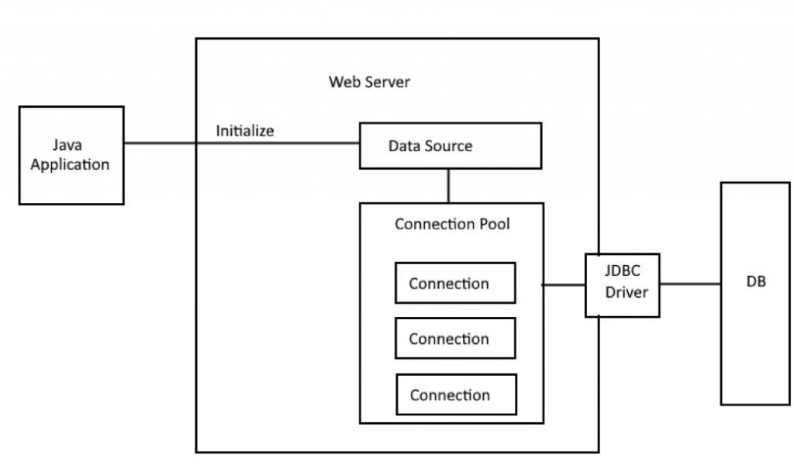

# JDBC

[https://www.tutorialspoint.com/jdbc](https://www.tutorialspoint.com/jdbc)


Java DataBase Connectivity (JDBC) API, provee acceso universal de información desde el lenguaje de programación Java. Usando JDBC api, puedes acceder virtualmente a cualquier fuente, desde base de datos racionales a hojas de calculo y ficheros flat (es un modelo de base de datos que describe cualquiera de los medio de codificar un modelo de base de datos como un archivo de texto simple).

JDBC provee de base común en herramientas e interfaces alternativos que se pueden construir.


# Cómo funciona

JDBC provee un completo conjunto de interfaces que permiten el acceso portable a base de datos, pudiendo ser usado en aplicaciones Java, Applets, Servlets, Java ServerPages (JSPs), Enterprise JavaBeans (EJBs).

Todos los diferentes ejecutables permiten usar un driver JDBC para acceder a la base de datos. Permite a programas Java contener de código de base de datos independiente.

Es un intermediario entre lenguaje Java y las bases de datos.


# Tareas que se pueden hacer

* Establecer conexiones a base de datos.
* Crear sentencias SQL o MySQL.
* Ejecutar sentencias SQL o MySQL.
* Visualizar y modificar registros.


# Arquitectura JDBC 

JDBC API soporta procesamiento de modelo de basse de datos tier-two y tier-three.


Arquitectura JDBC consiste en dos capas:

* JDBC API - provee conexión entre aplicacion y Administrador JDBC.
* JDBC driver API - soporta conexión de administrador a controlador de JDBC.


La API de JDBC utiliza un administrador de controladores y controladores específicos de bases de datos para proporcionar conectividad transparente a bases de datos heterogéneas.

El administrador de controladores JDBC garantiza que se utilice el controlador correcto para acceder a cada fuente de datos. El administrador de controladores es capaz de admitir múltiples controladores simultáneos conectados a múltiples bases de datos heterogéneas.


# Componentes JDBC

* DriverManager - clase que maneja una lista de drivers de base de daos. Coincide las peticiones de conexiones desde las aplicaicones Java a la base de datos indicada usando un *sub protocolo*. El primer driver que reconoce el subprotocolo bajo JDBC es usado para la conexion.

* Driver - interface que maneja las comunicaciones con el servidor de base de datos. Raramente interactuarás directamente con objetos *Driver*. En lugar de ello, se usará objetos *DriverManager*, el cual maneja objetos de este tipo, este abstrae los detalles asociados con el trabajo de objetos *Driver*.

* Connection - interface con todos los métodos para conectar una base de datos. El objeto de conexion representa contexto de comunicación.

* Statement - objetos creados desde interface para enviar sentencias SQL a la base de datos. Algunas interfaces aceptan parámetros adicionalmente para ejecutar procedimientos de almacenamiento.

* ResultSet - estos objetos mantienen la información recibida desde la base de datos después que se ejecuta la consulta SQL usando objeto *Statement*, este actúa como un iterador para poder moverse entre la información.

* SQLException - clase que maneja cualquier error que ocurre en la aplicacon de base de datos.


# Paquete JDBC

**java.sql** y **javax.sql** son los paquetes principales para *JDBC*, ofrecen las principales clases para interactuar con fuentes de información.


\pagebreak


[https://www.tutorialspoint.com/jdbc/jdbc-sample-code.htm](https://www.tutorialspoint.com/jdbc/jdbc-sample-code.htm)


# Creando aplicacion JDBC

[https://www.tutorialspoint.com/jdbc/jdbc-sample-code.htm](https://www.tutorialspoint.com/jdbc/jdbc-sample-code.htm)

[https://jarroba.com/maven-en-eclipse/](https://jarroba.com/maven-en-eclipse/)


1. Creamos un nuevo proyecto Maven en Eclipse.

* New project -> Create a simple project.
* Group ID -> Nombre del proyecto en formato FDQN.
* Artifact ID -> Nombre del artefacto (proyecto).
* Finish
* 

2. Editamos *pom.xml*, agregramos el driver de base de datos correspondiente.

* Buscamos el driver en *https://mvnrepository.com*, copiamos y pegamos dentro del tag **dependencies*.
* Agregamos al final el plugin Maven, buscamos en la página repositorio de Maven.
La versión de java dentro de `<configuation>` se debe especificar si es 1.8 (8), 11, o 17, o la que se requiera.
```
  <build>
  	<plugins>
  		<plugin>
  			<groupId>org.apache.maven.plugins</groupId>
  			<artifactId>maven-compiler-plugin</artifactId>
  			<version>3.10.1</version>
  			<configuration>
  				<source>17</source>
  				<target>17</target>
  				<optimize>true</optimize>
  			</configuration>
  		</plugin>
  	</plugins>
  </build>
```


3. Dentro del proyecto creamos un paquete nuevo, dentro de *src/main/java*.

4. Agregamos una clase dentro del paquete creado.

5. Importarmos `java.sql.*` y `javax.sql.*`.

6. Creamos la aplicación.


# Tomar control de transacción - auto-commit

[https://www.baeldung.com/java-jdbc-auto-commit](https://www.baeldung.com/java-jdbc-auto-commit)


JDBC para cada sentencia SQL, abre una conexion, opera la sentencia y cierra la conexion.

En caso de existir un error en medio de una operación, puede registrar una parte de esta y el resto la pierde, debido a que JDBC tiene **auto-commit** habilitado para cada operación realizada es terminada exitosamente.

Podemos tomar ese control de la transacción debemes deshabilitar el **auto-commit** y habilitar cuando queramos o la tarea se complete.


Debemos agregar en el código el comando *commit* para realizar la transacción a la base de datos y se guarden.

Dentro de un bloque *try-catch*, en la parte *try* realizar el commit.


## Sintaxis commit

* `.setAutoCommit()` Por defecto está habilitado.

```
connection.setAutoCommit(false);
```


* `.commit()`, realiza la operación de transacción.

```
connection.commit();
```


# Rollback

Si existe un error en la transacción de los datos a la base de datos, estas operaciones tienen que ser revertidas y retonar el mensaje de error.


```
connection.rollback();
```


Dentro de un bloque *try-catch*, en la parte *catch* si se declara algún error debemos utilizar `connection.rollback()` para evitar corrupción de datos.


# Ejemplo - commit-rollback

```
// Se crea una conexion
Connection connection = ...;

// Manejo manual de control de transacción
connection.setAutoCommit(false);

try {

//	[ operacion SQL ]


// Se realiza la operación SQL
	connection.commit();
	

// Se cierra conexion
	connection.close();

} catch (Exception e) {

// En caso de error, se revierte la operación
	connection.rollback;
}
```


# Try-catch with Resources

Son bloques *try-catch* que utilizan recursos y que al finalizar se cierran automáticamente, la condición es que deben ser instanciados de la clase *AutoCloseable*.

**ResultSet** es una instancia de **AutoCloseable**, el método que utilice este tipo de recurso debe hacer **throws** para pasar los posibles errores al nivel superior y este debe manejarlo.

Estas interfaces extienden la interfaz **AutoCloseable**, el *try-with-resources* ejecuta el comando *.close()* implícitamente.

El recurso que usará *try-catch con recursos* debe ir con el keyword **final**.

Se pueden crear *try-catch con recursos* anidados, ejemplo:

```
final Connection recurso = ...;

try (recurso) {

	//  Una vez que termine de operar con éxito se cierra la conexión.

} catch (Exception e) {
	e.printStackTrace();
	throw new RuntimeException(e);
}
```


## Ejemplo

```

PreparedStatement preparedstatement = connection.prepareStatement("SELECT * FROM datos WHERE id = ?");
preparedstatement.setInt(1, 10);
preparedstatement.execute();


final ResultSet keyItem = preparedstatement.getGeneratedKeys();

try (keyItem)  {

	while (keyItem.next()) {
		int num = keyItem.getInt(keyItem.getRow());
		System.out.println("Registro modificado, ID: " + num);
	}

} catch (Exception e) {
	e.printStackTrace();
	throw new RuntimeException(e);

}
```


# Connection Pool

Connection Pool es un pool de objetos *Connection*, es un patrón de diseño basado en objeto de pool.

Es usado cuando el costo de tiempo y recursos es alto para crear nuevos objetos. La aplicacion crea un objeto en ventaja y los ubica en un pool o contenedor, al necesitar un objeto en lugar de crearlo lo obtiene del pool.

Una aplicación que usa estrategia de pooling connection ya tiene objetos connection DB el cual puede ser reusado. Entonces, cuando se necesite interacción con la base de datos, la aplicación obtiene instancias de conexión desde el Pool.

Connection Pool mejora el rendimiento de la aplicación que interactúa la base de datos.




Cualquier framework pool necesita hacer tres tareas.

* Crear Connection Objects.
* Administrar uso de Objects creados y validarlos.
* Objetos Release/Destroy.


## Librerías Connection Pooling

* [Apache Commons DBCP 2](https://mvnrepository.com/artifact/org.apache.commons/commons-dbcp2/2.9.0)
* [HikariCP](https://mvnrepository.com/artifact/com.zaxxer/HikariCP/5.0.1)
* [C3P0](https://mvnrepository.com/artifact/com.mchange/c3p0/0.9.5.5)


# C3P0

[https://www.mchange.com/projects/c3p0/#quickstart](https://www.mchange.com/projects/c3p0/#quickstart)

C3P0 es una librería más antigua, listo para usar.

Provee varios servicios:

* Una clase que se adapta con driver basados *DriverManager* JDBC a los más nuevos esquemas *javax.sql.DataSource* para adquirir las *Connections* database.

* Pooling transparente de *Connection* y *PreparedStatements* siendo *DataSources* que "envuelve" driver tradicionales o *DataSources* arbitrarios sin pool.


*DataSources* de c3p0 son ambos **Referenceable** y **Serializable**, por lo tanto, son adecuados para vincularse a una amplia variedad de servicios de nombres basados en JNDI.

*Statement* y *ResultSet* son cuidadosamente limpiados cuando *Connections* y *Statements* son comprobados para prevenir recursos - exaustivo cuando los clientes están flojos pero con recursos en común - administración de estrategía de solamente limpiado las *Connections*.


En el mundo real, al estar en uso el total de conexiones del pool de conexiones un cliente nuevo debe esperar a que una conexión termine su operación para poder procesar la transacción SQL.

Esto previene la saturación de conexiones de base de datos.


Podemos configurar las siguientes propiedades de C3P0.

* **driverClass** : driver JDBC preferido.
* **jdbcUrl** : JDBC url para la base de datos.
* **initialPoolSize** : numero de conexiones creados en el pool al inicio.
* **acquireIncrement** : numeros de conexiones nuevas necesarias para ser creados cuando el tamaño actual no es suficiente.
* **maxIdleTime** : numero de segundas *Connection* que se mantienen dentro del Pool sin ser usados.
* **maxPoolSize** : número máximo de conexiones que se mantienen en el Pool.
* **minPoolSize** : número mínimo de conexiones que se necesita mantener en el Pool.


## Instalacion usando Maven


* Dependencia *C3P0*

Permite la creación de pool de conexiones.

```
<dependency>
	<groupId>com.mchange</groupId>
	<artifactId>c3p0</artifactId>
	<version>0.9.5.5</version>
</dependency>		
```


* Dependencia *mchange-commons-java*

Premite agregar más agregar más detalles del *DataSource* vía log de la consola.

```
<dependency>
	<groupId>com.mchange</groupId>
	<artifactId>mchange-commons-java</artifactId>
	<version>0.2.20</version>
</dependency>		
```
 


## Usando C3P0

[https://www.mchange.com/projects/c3p0/#contents](https://www.mchange.com/projects/c3p0/#contents)


Inicializar y configurar un **ComboPooledDataSource**, tiene un constructor sin argumentos.


### Sintaxis C3P0

Se puede establecer url, usuario, contraseña.

```
ComboPooledDataSource cpds = new ComboPooledDataSource();

cpds.setDriverClass( "org.postgresql.Driver" ); // loads the jdbc driver
cpds.setJdbcUrl( "jdbc:postgresql://localhost/testdb" );

cpds.setUser("swaldman");
cpds.setPassword("test-password");

// the settings below are optional -- c3p0 can work with defaults

cpds.setMinPoolSize(5);
cpds.setAcquireIncrement(5);
cpds.setMaxPoolSize(20);

// The DataSource cpds is now a fully configured and usable pooled DataSource
...


// When you are done, you can clean up the DataSource

cpds.close();

```


## Implementación de C3P0

```
package com.journaldev.example;

/**
 * Java JDBC Connection pool using C3PO example program
 * 
 * @author pankaj
 */

import javax.sql.DataSource
import java.sql.Connection;
import java.sql.ResultSet;
import java.sql.SQLException;
import java.sql.Statement;

import com.mchange.v2.c3p0.ComboPooledDataSource;


public class C3P0Demo {

//
	private DataSource dataSource = null;

	public C3P0Demo {
	
		ComboPooledDataSource comboPooledDataSource = new ComboPooledDataSource();

		comboPooledDataSource.setJdbcUrl("jdbc:mysql://localhost:3306/empdb?useSSL=false");
		comboPooledDataSource.setUser("root");
		comboPooledDataSource.setPassword("root");

		comboPooledDataSource.setMinPoolSize(3);
		comboPooledDataSource.setAcquireIncrement(3);
		comboPooledDataSource.setMaxPoolSize(30);
		
		this.dataSource = comboPooledDataSource;
		
	}

	
	public static void main(String[] args) throws SQLException {

		Connection connection = null;
		Statement statement = null;
		ResultSet resultSet = null;

		try {

			connection = this.comboPooledDataSource.getConnection();

			statement = connection.createStatement();

			resultSet = statement.executeQuery("select * from tblemployee");


			while (resultSet.next()) {
				System.out.println("empId:" + resultSet.getInt("empId"));
				System.out.println("empName:" + resultSet.getString("empName"));
				System.out.println("dob:" + resultSet.getDate("dob"));
				System.out.println("designation:" + resultSet.getString("designation"));
			}
			
			
		} finally {
			
			resultSet.close();
			statement.close();
			connection.close();
			
		}
		
	}
}
```


\pagebreak

# Patrones de diseño


## MVC - Model View Controller

Así como la base de datos representan objetos en las tablas y los datos tienen relación entre sí, se debe crear modelos en Java para representar los elementos que se quieren tratar, es decir, crear objetos para cada elemento que trabajaremos con una base de datos, por ejemplo, una clase "Productos" que tendrá nombre, descripción, precio y la información de este se guardará en una base de datos.

Crear un paquete modelo que contentan las clases que representen los datos en la base de datos es una buena práctica y es necesario realizar.

Patrón de diseño *MVC* ayuda a dividir la responsabilidad, permite el fácil mantenimiento, claridad y reutilizabilidad del código.

Vista debe mostrar la información que se obtiene de la base de datos.

Las capas más conocidas son las de view, controller, modelo y persistencia, que componen el estándar MVC.


* Model

Representación de la información que utiliza el sistema, gestiona el acceso a dicha información, tanto consultas como actualizaciones (lógica de negocio).


* View

Presenta la información y lógica de negocio del modelo en una interfaz interactiva al usuario.


* Controller

Responde a eventos (acciones del usuario) e invoca peticiones al "modelo" cuando se hace alguna solicitud sobre la información. También puede enviar comandos a las "vistas" asociadas si se solicita.

*Controller* es un intermediario entre "View" y "Model".


```
View   <----->   Controller   <----->   Model
```


## DAO - Data Access Object

Patrón de diseño **Data Access Object - DAO**, con este patron de diseño resuelve el acceso a los datos, básicamente tiene que ver con la gestión de diversas fuentes de datos y además abstrae la forma de acceder a ellos.

Debe representar el modelo y realizar las operaciones que conectan a la base de datos.

Por cada cada tabla agregada se deben crear nuevas clases DAO que las represente.

Es el patrón de diseño más utilizado hoy en día, las clases DAO tienen la responsabilidad de la persistencia de los datos (guardarlos en la base de datos).

Con esta metodología permite acceder a todas las operaciones que se realizarán en la base de datos.

Esta clase se encarga de recibir un objeto que representa el objeto a guardar en la base de datos, una conexion y mediante los métodos se realizan las operaciones o transacciones hacia la base de datos.

Clases DAO mantienen centralizadas todas las operaciones hacia la base de datos.

La clase DAO deben manejar las operaciones CRUD hacia la base de datos.

```
|-------------|        |----------|        |----------|
| Applicación |  --->  | ClaseDAO |  --->  | DataBase |
|-------------|        |----------|        |----------|
```


La abstracción permite utilizar varias base de datos diferentes sin romper el funcionamiento.

Crear un paquete y dentro de este se crea la clase DAO, la clase DAO utiliza el o los modelos que representan los objetos que se guardarán en la base de datos.

Una clase DAO es una interface y otra clase implementa la clase DAO interface rescribiendo los métodos de la interface. Teniendo la siguiente estructura:

```
|--------------|        |-------------------|        |-----------------------|
| InterfaceDAO |  --->  | ClaseDAOimplement |  --->  | TestClaseDAOimplement |
|--------------|        |-------------------|        |-----------------------|
```

* InterfaceDAO : es la interface que declara los métodos que de deben implementar en las clases que la usarán. Estos métodos están vacíos.

* ClaseDAOimplement : es la clase que implementa los métodos de la *InterfaceDAO*, es acá en dónde radica la lógica. En esta clase se llama a los modelos creados para representar los datos en el modelo negocio.

* TestClaseDAOimplement : es la clase para probar la clase *ClaseDAOimplement*.


La clase DAO debe recibir una conexión y NO establecer una automáticamente, porque al inicializar con una conexión automática en el constructor tendremos distintas conexiones, realizaran distintas transacciones y perderemos la utilidad del recurso, además que por cada inicialización del objeto DAO iniciaremos una nueva conexion perjudicando la performance de la base de datos.

NO inicializar una conexión en el constructor del DAO.

**Es el Controller quien crea y mantiene una conexion** es ahí en donde se debe instanciar el *FactoryConnection* o la clase que maneja el pool de conexiones.


## Ejemplo metodología DAO

* InterfaceDAO : esta interface deja explícitamente los métodos CRUD que se deben implementar en las clases que utilicen esta interface.

```
public interface InterfaceDAO {


	public void guardar(ClaseDAO clase);
	
	public void modificar(ClaseDAO clase);
	
	public void eliminar(ClaseDAO clase);
	
	public void leer(ClaseDAO clase);
	
}
```


* ClaseDAOimplement : implementa InterfaceDAO, esta proporciona la metodología CRUD, debe tener un constructor que se inicialice con una conexión, esta se utilizará para cada operación CRUD.

```

public class ClaseDAOimplement implements InterfaceDAO {

		private Connection conexionUNICA
		private ClaseDAO clase;

		
		public ClaseDAOimplement(Connection con, ObjetoData data) {
			this.clase = data;
			this.conexionUNICA = con;
		}
		
	
		public void guardar() {
		
			// Menejo de datos para guardar en la base de datos.
		
		};
		
		
	public void modificar(ClaseDAO clase) {
		// implementar método
	};
	
	public void eliminar(ClaseDAO clase) {
		// implementar método
	};
	
	public void leer(ClaseDAO clase) {
		// implementar método
	};

}

```


* TestClaseDAOimplement : pruebas de la clase que implementa la interface dao.

```
public class TestClaseDAOimplement {

	public void main(String[] args) {
	
		// esta clase prueba la implementación DAO
		
		ClaseDAOimplement claseDAO = new ClaseDAOimplement(conexion, objetoData);
		claseDAO.guardar();
		
	}

}
```


# Relaciones entre tablas

La utilización de consultas y unión entre las llaves foráneas permiten acceder a los datos relacionados y mostrar la información completa.

Se puede realizar mediante uso de *WHERE* o *INNER JOIN* (busca datos iguales y une las tablas mediante el uso de ALIAS).

Ejemplo de uso de *INNER JOIN*.
```
SELECT P.id, P.nombre, P.cantidad FROM productos P INNER JOIN categorias C ON P.categoria_id = C.id;
```


Pero existe un problema que es importante resolver al realizar multiples consultas usando varias conexiones diferentes, este problema se llama *queries N + 1*, tienen un alto impacto en el rendimiento y la base de datos.


# Queries N + 1

Es la realización de multiples consultas, consultas anidadas en donde se utilice más de una vez para obtener datos, esto no es un problema para aplicaciones pequeñas aisladas, pero es un verdadero problema en aplicaciones grandes y con uso multitudinario.

Una forma de evitarlo, es realizar una consulta para todos los datos relacionados qu se utilizarán y luego utilizar las **Collections** que nos entrega **java.lang**.

Iterando en la "gran consulta" y separando mediante los métodos de la consulta resultante.

Hacer una consulta para obtener todos los datos relacionados, por ejemplo, y filtrar, agrupar, y de devolver los datos utilizando las colecciones.

De una sola consulta, tratamos los datos y les damos formato correcto para usarlos.


Por ejemplo, en un método iteramos el resultado obtenido para poder extraer los modelos y poder agruparlos en un diccionario y estos agregarlos a una lista para enviarlos a la clase que utilizará estos datos tratados. Así evitamos hacer consultas múltiples para los datos.


CategoriaDAO
```
[ ... ]

	public List<Categoria> listarProductos() {
		
//		Este método toma la query que une las relaciones y filtra, junta en listas separadas por categoria
//		la agrega a una lista de la clase de Categoria (una categoria puede tener muchos productos)
//		filtra y agrupa por cada objeto "Producto" creado usando "categoriaIterator".
//		Retorna una lista de productos agrupados por categoría.
		
		List<Categoria> resultado = new ArrayList<>();
		
		
		try {
			
			String query = "SELECT categorias.id AS catid, "
					+ "categorias.nombre AS catname, datos.id AS prodid, "
					+ "datos.nombre AS prodname, datos.cantidad "
					+ "FROM datos, categorias WHERE categorias.id = datos.categoria_id "
					+ "GROUP BY categorias.id, categorias.nombre, datos.id, datos.nombre, categorias.nombre;";
			
			
			final PreparedStatement sentencia = this.conexion.prepareStatement(query);
			
			try (sentencia) {
				
				System.out.println(sentencia);
				
				final ResultSet resultQuery = sentencia.executeQuery();
				
				try (resultQuery) {
					while (resultQuery.next()) {
						
						int categoriaID = resultQuery.getInt("CATID");
						String nombreCat = resultQuery.getString("CATNAME");
						
						
//  Crea un stream del resultado, filtra por item comparando por categoria, busca cualquier coincidencia de no encontrar
//  .orElseGet() crea un nuevo objeto Categoria.
//  Posteriormente se crea nuevos objetos Producto por cada item de la lista, este se entrega al iteradorCategoria y lo agrega.
//  "iteradorCategoria" es un método dentro de modelo "Categoria" y es un campo List de tipo Producto, para cada producto con la misma
//  categoria se agrega a dicha categoria.
//  Se crean por cada categría nueva una clase Categoria, esta almacena todos los productos que tienen la misma categoría.

						Categoria categoriaIterador = resultado.stream()
												  .filter(item -> item.getId().equals(categoriaID))
								          .findAny().orElseGet(() -> {
								              Categoria cat = new Categoria(
									                			  categoriaID,
									                			  nombreCat
								                			  );
								              resultado.add(cat);
								              return cat;
								          });
						
						Producto producto = new Producto(
									resultQuery.getInt("PRODID"),
									resultQuery.getString("PRODNAME"),
									resultQuery.getInt("CANTIDAD")
								);
								                  
						
						categoriaIterador.agregarProductos(producto);
						
						
					}
				}
			}
			
			return resultado;
			
		} catch (SQLException e) {
			// TODO: handle exception
			e.printStackTrace();
			throw new RuntimeException(e);
		}
		
	}
	
[ ... ]
```


# Cuando usar .execute(), .executeQuery(), .executeUpdate()

[https://alldifferences.net/difference-between-executequery-executeupdate-and-execute/](https://alldifferences.net/difference-between-executequery-executeupdate-and-execute/)


* *.execute(String sql)* : ejecuta sentencia SQL String retornando booleano.

* *.executeQuery(String sql)* : ejecuta sentencia SQL y retorna objeto ResultSet con los resultados, normalmente usado para *SELECT*.

* *.executeUpdate()* : ejecuta sentencia SQL y retorna un valor entero, usado para *INSERT*, *DELETE* o *UPDATE*, *CREATE*, *DROP*.


# Usando ResultSet()

Para poder obtener un *ResultSet* con los elementos resultante de una query, se debe primero ejecutar la sentencia y luego obtener el *ResultSet*.

```
sentencia.execute();

ResultSet resultado = sentencia.getResultSet();
```


# Prevenir SQL Injection

Simplemente usar **PrepareStatement**, este objeto permite crear sentencias SQL precomiladas y evita el ataque SQL Injection.

Las variables de los strings SQL se deben reemplazar utilizando `?`, y asignarlos mediante métodos.

Por ejemplo:
```
Integer id = 10;

String query = "SELECT * FROM datos WHERE id = ?"

PrepareStatement sentencia = conexion.prepareStatement(query);
sentencia.setInt(1, id);

sentencia.execute();
```


> En la parte *"JDBC - Objetos Documentación"* se encuentra más detalles de **PrepareStatement**.


\Pagebreak


# JDBC - Objetos Documentación


## DriverManager - java.sql.DriverManager

[https://docs.oracle.com/javase/8/docs/api/java/sql/DriverManager.html](https://docs.oracle.com/javase/8/docs/api/java/sql/DriverManager.html)

Servicio básico de driver JDBC, provee una forma de conectar a la fuente base.Usa un objeto DataSource para conectar a la fuente.

### Método - DriverManager

| Método | descripción |
|-|-|
| .getConnection(urlString, user, password) | establece conexión mediante url String, se le entrega el usuario y contraseña. |
| .getDriver(String url) | intenta ubicar un driver que entienda la url. |
| .setLoginTimeout(int segundos) | número máximo de segundos que el driver esperará para intentar conectarse a una base de datos una vez que el driver sea identificado. |


## Connection

[https://docs.oracle.com/javase/8/docs/api/java/sql/Connection.html](https://docs.oracle.com/javase/8/docs/api/java/sql/Connection.html)

Sessión con la base de datos específica. Sentencias SQL son ejecutadas y los resultados son retornados dentro del contexto de una conexión.

### Métodos - Connection

| Método | descripción |
|-|-|
| .close() | cierra conexión JDBC. |
| .createStatement() | crea objeto Statement para enviar sentencias SQL a la base de datos. |
| .setAutoCommit(booleano) | establece auto-commit para cada operacion SQL, default es true. |
| .commit() | realiza operación manual de commit para cada operación SQL, se debe deshabilitar auto-commit, .setAutoCommit(false) |
| .rollback() | revierte las operaciones realizadas en la operación SQL. |


## Statement

[https://docs.oracle.com/javase/8/docs/api/java/sql/Statement.html](https://docs.oracle.com/javase/8/docs/api/java/sql/Statement.html)

Objeto usado para ejecutar sentencias SQL estáticas y retornar los resultados.

Por defecto, solamente un objeto *ResultSet* por objeto *Statement* puede ser abierto al mismo tiempo. Todas las ejecuciones de *Statement* cierran el actual *ResultSet*.

`.execute()`, el método devuelve *true* cuando el resultado es un *java.sql.ResultSet* (resultado de un SELECT) y *false* cuando el resultado no devuelve contenido (resultado de un DELETE, UPDATE o DELETE).

Para resultados *Insert*, *Delete*, *Put*, podemos retornar el valor del id del registro utilizado *Statement.RETURN_GENERATED_KEYS*. 

Asignarlo a un *ResultSet*, iterarlo y obtener el id.

```
sentencia.execute(create, Statement.RETURN_GENERATED_KEYS);
		
ResultSet insertData = sentencia.getGeneratedKeys();

while (insertData.next()) {
	int numeroFila = insertData.getRow();
	System.out.println("Registro ingresado, ID: " + insertData.getInt(numeroFila));
}
```


### Métodos - Statement

| Método | descripción |
|-|-|
| .execute(String sql) | ejecuta sentencia SQL String retornando booleano. |
| .executeQuery(String sql) | ejecuta sentencia SQL y retorna objeto ResultSet con los resultados. |
| .executeUpdate(String sql) | ejecuta setencia SQl, puede ser INSERT, UPDATE, DELETE (retornan nada). |
| .getConnection() | recibe un objeto COnnection que es producido por el objeto Statement. |
| .getUpdateCount() | retorna un numero de la cantidades de actualizaciones, si no se actualizaron retorna 0. No existe más resultados retorna -1. |
| .close() | cierra Statement. |
 


## ResultSet

[https://docs.oracle.com/javase/8/docs/api/java/sql/ResultSet.html](https://docs.oracle.com/javase/8/docs/api/java/sql/ResultSet.html)

Interface, representación de la tabla de una base de datos del grupo de resultado, usualmente generado por la sentencia de la query.

*ResultSet* es un objeto que tiene un cursor apuntanto a la fila de información actual la primera fila. Para iterar tiene método `.next()` retornando true o false, puede ser usado en loop `while`.

*ResultSet* es un objeto NO actualizable y el cursor se mueve hacia adelante solamente.

Para generar un *ResultSet* iterable de inicio a fin y viceversa y actualizable.

```
Statement stmt = con.createStatement(ResultSet.TYPE_SCROLL_INSENSITIVE, ResultSet.CONCUR_UPDATABLE);

ResultSet rs = stmt.executeQuery("SELECT a, b FROM TABLE2");
// rs will be scrollable, will not show changes made by others,
// and will be updatable
```

Para mover el cursor se utiliza `.absolute(int posicion)`, el cursor se desplazará a ese punto.

Para actualizar una fila de *ResultSet*, se debe iterar y usar `.updateRow()`.

```
rs.absolute(5); // moves the cursor to the fifth row of rs
rs.updateString("NAME", "AINSWORTH"); // updates the
// NAME column of row 5 to be "AINSWORTH"
rs.updateRow(); // updates the row in the data source
```


*ResultSet* es automáticamente cerrado cuando objeto *Statement* que lo generó se cierra, re ejecutado o usado para recibir los resultados siguientes desde una secuencia múltiple.

El numero, tipo y propiedades de columnas de objeto *ResultSet* son provista por *ResultSetMetaData* objeto retornado por el método `.getMetaData()`.


### Métodos - ResultSet

| Método | descripción |
|-|-|
| .close() | cierra ResultSet. |
| .absolute(int row) | mueve el cursor a la fila del número. | 
| .first() | mueve el cursor al primer elemento del ResultSet. |
| .beforeFirst() | mueve el cursor al principio del objeto ResultSet. |
| .afterLast() | mueve el cursor al final del objeto ResultSet. |
| .last() | mueve el cursor al último elemento del ResultSet. |
| .cancelRowUpdates() | cancela actualizaciones hechas en la fila actual del ResultSet. |
| .close() | libera objeto ResultSet. |
| .deleteRow() | elimina row actual. |
| .findColumn(String columnaName) | mapea nombre de columna en ResultSet para obtener su índice. |
| .next() | mueve el cursor hacia adelante desde la posición actual. |
| .previous() | mueve el cursor a la fila previa. |


* Métodos durante iteración

| Método | descripción |
|-|-|
| .getRow() | recibe el número de la fila actual. |
| .getBoolean(String columnName) | recibe el valor de la columna como un booleano. |
| .getDate(int columnIndex, Calendar cal) | recibe el valor de la columna como un objeto Date. |
| .getDouble(String columnName) | recibe el valor de la columna como un double. |
| .getFloat(String columnName) | recibe un float de la columna. |
| .getInt(String columnName) | recibe un int de la columna. |
| .getLong(String columna) | recibe un long desde columna. |
| .getObject(int columnIndex, Class<T> tipo) | retorna un objeto del índice de la columna con el tipo de objeto entregado. |
| .getObject(String columnLabel) | retorna objeto desde nombre columna.
| .getTime(String columnName) | retorna objeto Time de la columna por su nombre. |
| .getTimestamp(String columnName) | retorna objeto Timestamp desde nombre columna. |
| .updateBoolean(String columnName, boolean) | actualiza valor booleano columna . |
| .updateDate(String columnName, Date x) | actualiza valor Date. |
| .updateDouble(String columnName, double x) | actualiza valor double. |
| .updateFloat(String columnName, float x) | actualiza valor float. |
| .updateInt(String columnName, int x) | actualiza valor int. |
| .updateLong(String columnName, long x) | actualiza valor long. |
| .updateString(String columnName, String x) actualiza valor String. |
| .updateTime(String columnName, Time x) | actualiza valor Time. |
| .updateTimestamp(String columnName, Timestamp x) | actualiza valor Timestamp. |
| .updateRow() | actualiza contenido en la base de datos y el objeto ResultSet. |


## PreparedStatement

[https://docs.oracle.com/javase/8/docs/api/java/sql/PreparedStatement.html](https://docs.oracle.com/javase/8/docs/api/java/sql/PreparedStatement.html)


**PreparedStatement**, objeto que representa sentencia SQL precompilada.

Una sentencia SQL se precompila y almacena en un objeto *PreparedStatement*, puede ser usado eficientemente para ejecutar múltiples sentencias varias veces.

Métodos setter deben tener parámetros del tipo que reciben.

**PreparedStatement**, previene SQL Injection mediante el uso de métodos.

Método de *Connection*.

*PreparedStatement* siempre inicia desde índice 1.

Ejemplo de uso, en una conexión activa:

```
PreparedStatement pstmt = con.prepareStatement("UPDATE EMPLOYEES SET SALARY = ? WHERE ID = ?");

pstmt.setBigDecimal(1, 153833.00);
pstmt.setInt(2, 110592);
```


### Métodos - PreparedStatement

| Método | descripción |
|-|-|
| .close() | cierra PreparedStatement. |
| .setDate(int indiceParametro, Date x) | establece fecha según la ubicación. |
| .setFloat(int indiceParametro, Float x) | establece float según la ubicación. |
| .setInt(int indiceParametro, int x) | establece int según la ubicación. |
| .setString(int indiceParametro, String x) | establece String según la ubicación. |
| .setLong(int indiceParametro, long x) | establece long según la ubicación. |
| .setNull(int indiceParametro, Null x) | establece null según la ubicación. |
| .setObject(int indiceParametro, Object x) | establece object según la ubicación. |
| .setTime(int indiceParametro, Time x) | establece time según la ubicación. |
| .setTimestamp(int indiceParametro, Timestamp x) | establece timestamp según la ubicación. |
| .setUrl(int indiceParametro, Url x) | establece url según la ubicación. |
| .setNull(int indiceParametro, Null x) | establece null según la ubicación. |
| .execute() | ejecuta sentencia SQL. |
| .executeQuery() | ejecuta sentencia SQL retorna ResultSet. |
| .executeUpdate() | ejecuta sentencia SQL para INSERT, UPDATE, DELETE y retorna ResultSet. |
| .setArray(int indiceParametro, Array x) | establece array según la ubicación. |


# Pool Connection

## ComboPooledDataSource

[https://www.mchange.com/projects/c3p0/apidocs/com/mchange/v2/c3p0/ComboPooledDataSource.html](https://www.mchange.com/projects/c3p0/apidocs/com/mchange/v2/c3p0/ComboPooledDataSource.html)

**ComboPooledDataSource**, es la forma de crear pool *DataSource*, no recibe parámetros.

Se debe establecer como mínimo los siguientes parámetros:

* .setJdbcUrl(String urlsql) : entrega la url de base de datos.
* .setUser(String username) : establece usuario de base de datos.
* .setPassword(String password) : establece contraseña de usuario de base de datos.

* .setMinPoolSize(int minimo) : establece mínimo de conexiones.
* .setMaxPoolSize(int maximo) : establece máximo de conexiones.
* .setAcquireIncrement(int incremental) : establece cantidada de conexiones que se crearán cuando se llegue al máximo.


### Configuraciones ComboPooledDataSource

[https://www.mchange.com/projects/c3p0/#configuration_properties](https://www.mchange.com/projects/c3p0/#configuration_properties)

Otras configuraciones:

* .maxIdleTime(int tiempoSegundos) : segundos que mantiene la conexion en el pool antes que sea descartada, 0 (default) nunca expira.
* 


## DataSource

[https://docs.oracle.com/javase/tutorial/jdbc/basics/sqldatasources.html](https://docs.oracle.com/javase/tutorial/jdbc/basics/sqldatasources.html)

[https://docs.oracle.com/javase/8/docs/api/javax/sql/DataSource.html](https://docs.oracle.com/javase/8/docs/api/javax/sql/DataSource.html)


**DataSource**, es una representación de una fábrica de conexiones a fuente física de datos. Este objeto se debe usar para obtener las conexiones.

Las conexiones obtenidas son del tipo *Connection*.

Permite migrar entre diferentes servidores.

Manejo de errores **SQLException**, **SQLTimeoutException**.


### Métodos DataSource

| Método | Descripción |
|-|-|
| .getConnection() | intenta establecer conexión con la fuente de datos del objeto DataSource. |

