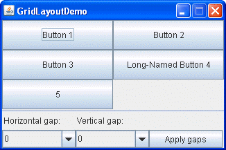
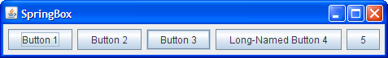

# Java SWING

> [SWING - doc](https://docs.oracle.com/javase/8/docs/api/javax/swing/package-summary.html)

Provee un grupo de componentes "livianos" escritos en Java, multiplataforma.

<br>

<a name="jframe"></a>

# JFrame - java.swing.JFrame

> [JFrame](https://docs.oracle.com/javase/8/docs/api/javax/swing/JFrame.html)

Objeto que representa una ventana en la pantalla, en esta se ubican todos los componentes o elementos que se ven en una ventana.

```java
JFrame frame = new JFrame();

frame.getContentPane().add(elemento);

frame.setTitle("Titulo del frame");

frame.setSize(300, 300);
frame.setDefaultCloseOperation(JFrame.EXIT_ON_CLOSE);
frame.setVisible(true);
```


<br>

<a name="jbutton"></a>

# JButton - java.swing.JButton

```java
JButton boton = new JButton("clic");

boton.setText("nuevo texto");

boton.getText()

boton.addEventListener(customActionListener);
```

<br>

<a name=""></a>

# JRadioButton - java.swing.JRadioButton

> [JRadioButton](https://docs.oracle.com/javase/8/docs/api/javax/swing/JRadioButton.html)

```java
JRadioButton radioboton = new JRadioButton("A) 1");
radioboton.setBounds(70, 50, 100, 30);

ButtonGroup bg = new ButtonGroup();
bg.add(radioboton);

panel.add(radioboton);
```

<br>

<a name=""></a>

# JCheckBox - java.swing.JCheckBox

```java
JCheckBox checkbox = new JCheckBox("alternativa 1");

checkbox.addItemListener(this);

public void itemStateChanged(ItemEvent evt) {
    String onOrOff = "off";
    if (checkbox.isSelected()) {
        onOrOff = "on";
    }
    System.out.println("Check box is " + onOrOff);
}

checkbox.setSelected(true);
checkbox.setSelected(false);

panel.add(checkbox);
```

<br>

<a name=""></a>

# JLabel - java.swing.JLabel

> [JLabel - doc](https://docs.oracle.com/javase/8/docs/api/javax/swing/JLabel.html)

```java
JLabel label = new JLabel("etiqueta");

label.setText("nueva etiqueta");

label.getText();

panel.add(label);
```

<br>

<a name=""></a>

# JList - java.swing.JList

> [JList - doc](https://docs.oracle.com/javase/8/docs/api/javax/swing/JList.html)

```java
String[] listaEntradas = {"alpha", "beta", "gamma", "delta", "epsilon", "zeta", "eta", "theta "};

JList<String> lista = new JList<>(listaEntradas);


JScrollPane scroller = new JScrollPane(lista);
scroller.setVerticalScrollBarPolicy(ScrollPaneConstants.VERTICAL_SCROLLBAR_ALWAYS);
scroller.setHorizontalScrollBarPolicy(ScrollPaneConstants.HORIZONTAL_SCROLLBAR_NEVER);

panel.add(scroller);

lista.setVisibleRowCount(4);

lista.addListSelectionListener(this);

public void valueChanged(ListSelectionEvent evt) {
    if (!evt.getValueIsAdjusting()) {
        String selection = lista.getSelectedValue();
        System.out.println(selection);
    }
}
```


<br>

<a name=""></a>

# JScrollPane - java.swing.JScrollPane

> [JScrollPane](https://docs.oracle.com/javase/8/docs/api/javax/swing/JScrollPane.html)

```java
JScrollPane scroller = new JScrollPane(elementoScrolleable);
scroller.setVerticalScrollBarPolicy(ScrollPaneConstants.VERTICAL_SCROLLBAR_ALWAYS);
scroller.setVerticalScrollBarPolicy(ScrollPaneConstants.HORIZONTAL_SCROLLBAR_NEVER);

panel.add(scroller);
```

<br>

<a name=""></a>

# JSlider - java.swing.JSlider

> [JSlider - doc](https://docs.oracle.com/javase/8/docs/api/javax/swing/JSlider.html)

```java
JSlider slider = new JSlider(JSlider.HORIZONTAL, 0, 50, 25);

slider.setMinorTickSpacing(2);
slider.setMajorTickSpacing(10);

slider.setPaintTicks(true);
slider.setPaintLabels(true);

slider.setPaintTrack(true);

slider.addChangeListener(customChangeListener);

panel.add(slider);
```

<br>

<a name=""></a>

# JTextArea - java.swing.JTextArea

> [JTextArea - doc](https://docs.oracle.com/javase/8/docs/api/javax/swing/JTextArea.html)

Se crea el *JTextArea*, se crea un *JScrollPane* y es este el que se agrega al *JPanel*

```java
JTextArea texto = new JTextArea(10, 20);
texto.setLineWrap(true);

JScrollPane scroller = new JScrollPane(texto);

scroller.setVerticalScrollBarPolicy(ScrollPaneConstants.VERTICA_SCROLLBAR_ALLWAYS);
scroller.setHorizontalScrollBarPolicy(ScrollPaneConstants.HORIZONTAL_SCROLLBAR_NEVER);

panel.add(scroller);

texto.setText("texto contenido por el textarea");

texto.append("texto agregado al contenido");

texto.selectAll();

texto.requestFocus();
```

<br>

<a name=""></a>

# JTextField - java.swing.JTextField

> [JTextField - doc](https://docs.oracle.com/javase/8/docs/api/javax/swing/JTextField.html)

```java
JTextField field = new JTextField(20);

field.setText("");

field.addActionListener(customActionListener);

field.requestFocus();

field.selectAll();
```


<br>

<a name=""></a>

# JTable - java.swing.JTable

> [JTable](https://docs.oracle.com/javase/8/docs/api/javax/swing/JTable.html)

```java
String data[][] = {
        {"101","Amit","670000"},    
        {"102","Jai","780000"},    
        {"101","Sachin","700000"}
    };    
String column[]={"ID","NAME","SALARY"};

JTable tabla = new JTable(data, columna);

tabla.setBounds(30, 40, 200, 300);

tabla.setCellSelectionEnabled(true);

JScrollPane sp = new JScrollPane(tabla);

panel.add(sp);
```

<br>

\pagebreak

<br>

# Graphics - java.awt.Graphics

> [Graphics - doc](https://docs.oracle.com/javase/8/docs/api/java/awt/Graphics.html)

Clase abstracta que es la base para todos los contextos gráficos permitiendo dibujar dentro de componentes.

```java
public void paint(Graphics grafico) {
    grafico.fillRect(int x, int y, int width, int height);
    grafico.drawOval(int x, int y, int width, int height);
    grafico.fillOval(int x, int y, int width, int height);
    grafico.drawImage(Image img, int x, int y, ImageObserver observer);
    grafico.setColor(Color c);
    grafico.setFont(Font font);
}
```


<br>

# Graphics2D - java.awt.Graphics2D

> [Graphics2D](https://docs.oracle.com/javase/8/docs/api/java/awt/Graphics2D.html)

Es un una subclase de *Graphics* (polimofismo), no se puede usar objeto de la clase padre sin antes **castear**.

```java
public void paint(Graphics grafico) {
    Graphics2D g2d = (Graphics2D) grafico;
    g2d.setColor(Color.red);
    g2d.drawRect(50, 50, 200, 200);
}

```

<br>

# JFileChooser - java.swing.JFileChooser

> [JFileChooser - doc](https://docs.oracle.com/javase/8/docs/api/javax/swing/JFileChooser.html)

```java
JFileChooser fileSave = new JFileChooser();
fileSave.showSaveDialog(frame);

File selected = fileSave.getSelectedFile();
String nombre = selected.getName();
```

<br>

# JMenuBar - java.swing.JMenuBar

> [JMenuBar - doc](https://docs.oracle.com/javase/8/docs/api/javax/swing/JMenuBar.html)

```java
JMenuBar menuBar = new JMenuBar();
menuBar.add(componenteJMenu)

frame.setJMenuBar(menuBar);
```

<br>

# JMenu - java.swing.JMenu

> [JMenu - doc](https://docs.oracle.com/javase/8/docs/api/javax/swing/JMenu.html)

```java
JMenu fileMenu = new JMenu("File");
fileMenu.add(componenteMenuItem);
```

<br>

# JMenuItem - java.swing.JMenuItem

> [JMenuItem - doc](https://docs.oracle.com/javase/8/docs/api/javax/swing/JMenuItem.html)

```java
JMenuItem newMenuItem = new JMenuItem("New");
newMenuItem.addActionListener(e -> metodoLIstener());
```


\pagebreak


<br>

<a name="event-handling"></a>

# Event Handling - java.awt.event.*

> [Events - doc](https://docs.oracle.com/javase/tutorial/uiswing/events/intro.html)
> [AWT listeners - doc](https://www.tutorialspoint.com/awt/awt_event_listeners.htm)
> [Lista eventos Swing - doc](https://docs.oracle.com/javase/tutorial/uiswing/events/eventsandcomponents.html)
> [Listener API - doc](https://docs.oracle.com/javase/tutorial/uiswing/events/api.html)

Un evento es un cambio del estado del objeto. Son el resultado de la interacción del usuario con un componente de interfaz gráfica, por ejemplo, hacer clic en un botón, deslizar una barra, usar teclado, etc.

Un evento es representado como un objeto de alguna class de evento. Entra en juego las **clases anidadas**, estas implementarán los Listeners e implementarán los métodos sobre-escribiéndolos (*@Override*).


Otra forma de implementar, es usar **expresiones Lambda** para las *Interfaces Funcionales Listeners*, ahorrando el uso de *clases anidadas*, permitiendo escribir un código más limpio y conciso. 

Event Handling, es el mecanismo de control que decide que debe suceder si un evento ocurre y ejecuta código cuando el evento ocurre.

Java usa **Delegation Event Model** para manejar eventos.

**Delegation Event Model** tiene algunos participantes:

* Source  : la fuente es un objeto en el cual el evento ocurre. Es responsable para proveer información del evento ocurrido para el manejador. Java provee clases para el objeto fuente. Al interactuar con este objeto generará un objeto *event*. Source tiene un método **addActionListener()**, teniendo toma el parámetro el objeto listener y lo almacena en una lista.

* Listener  : este también es conocido como manejador de evento. Es responsable para generar una respuesta a un evento, es también un objeto. Espera hasta que recibe un evento, una vez que el evento es recibido el proceso escucha el evento y entonces retorna. Interface Listener es un puente entre el listener (tu) y el evento fuente (botón). Implementa interfaz **ActionListener**, sobre-escribe método **actionPerformed()**.

* Objeto Event  : es el argumento del método call-back del evento desde la interfaz, se encarga de encaminar la data del evento devuelta al *Listener*

El programador trabajará más en un *Listener* que escucha un evento en lugar de un evento *Source*.

El beneficio es separar la lógica de la interface de usuario de la lógica que genera el evento.

Listeners deben ser registrados con el objeto fuente para que reciba la notificación del evento. Esto es una forma muy eficiente porque las notificaciones de eventos se envían solamente a los listeners a los requeridos.

Cuando un *Listener* escucha un evento, este devuelve un método (*actionPerformed()*).


## Tipos de eventos

Principalmente tiene dos categorías.

* Eventos Primer plano  : estos eventos requiere una interacción directa del usuario, son generados como consecuencia de una interacción de una persona.

* Eventos Segundo plano  : estos eventos requieren la interacción del usuario final. Interrupciones sistema operativo, falla hardware y software, expiración de timer, finalización de operación de algún evento en segundo plano.


## Pasos un manejador de evento

1. El usuario hace clic en un botón y genera un evento.
2. El objeto crea un evento automáticamente, la información de la fuente y del evento se llena en el mismo objeto.  
3. Objeto Evento es pasado al método registrado en la clase *Listener*.
4. El método se ejecuta y retorna.


## Métodos Callback

Son métodos provistos por API y son definidos por el programador e invocados por el desarrollador. Los métodos callback representan un método del evento, en respuesta a un evento, *Java JRE* desencadena un método callback.

Son provistos en interfaces Listener.

Si un componente busca algún Listener para escuchar sus eventos, la fuente debe registrar a el Listener.


```java
import javax.swing.*;
import java.awt.event.*;


public class SimpleGUI implements ActionListener {
    private JButton boton;

    public static void main(String[] args) {
    	SimpleGUI gui = new SimpleGUI();
        gui.go();
    }

    public void go() {
        JFrame frame = new JFrame();
        boton = new JButton("click");

        boton.addActionListener(this);             // Registra evento

        frame.getContentPane().add(boton);
        frame.setDefaultCloseOperation(JFrame.EXIT_ON_CLOSE);
        frame.setSize(300, 300);
        frame.setVisible(true);
    }

    @Override
    public void actionPerformed(ActionEvent evento) {     // implementa manejador de evento
        boton.setText("Se ha hecho click!");
    }

}
```

<br>

# Events y Graphics

> [Lista Eventos awt - doc](https://docs.oracle.com/javase/8/docs/api/java/awt/event/package-use.html)
> [AWT listeners - doc](https://www.tutorialspoint.com/awt/awt_event_listeners.htm)
> [Implementing Listeners for Commonly Handled Events - doc](https://docs.oracle.com/javase/tutorial/uiswing/events/handling.html)

Múltiples elementos fuente deben tener sus propios manejadores de eventos, **NO es recomendable tener un solo método event-handler para manejar todos los eventos de los distintos elemento**. Al tener un solo event-handler, crea un código difícil de mantener y de expandir.

La solución para ello, es crear **clases anidadas** que implementen un *Listener* para manejar los eventos y se debe registrar el *Listener* al elemento que se requiera.

Por ejemplo:

```java
boton.addActionListener(new CustomClassListener());
```

La clase *CustomClassListener* implementará *ActionListener* y sobre-escribirá el método requerido, este *Listener* escuchará la interacción del usuario al hacer clic en el botón.

**Clases anidadas** (inner class) permiten la implementación de más de 1 interfaz. En Java, no existe la herencia múltiple, si la implementación múltiple.

Las **clases anidadas**, tendrán acceso a los *campos* de la clase padre.

Recordar que las interfaces *Listener* son **Interfaces Funcional**, por lo que, se pueden usar **expresiones Lambda** para reemplazar las clases anidadas. 

## Events

* Para crear un GUI, se debe iniciar con un ventana, usualmente *JFrame*:

```java
JFrame frame = new JFrame();
```

* Puedes agregar widgets (botones, texto, etc.) al *JFrame* usando

```java
frame.addContentPane().add(button);
```

* A diferencia de otros componentes, *JFrame* no permite agregar directamente, se debe agregar al panel de contenido del *JFrame*.

* Para mostrar una ventana (*JFrame*), se debe establecer el tamaño y mostrarla:

```java
fame.setSize(300, 300);
frame.setVisible(true);
```

* Para saber cuándo el usuario hace clic en un botón (o realiza otra acción en la interfaz) se debe escuchar un evento GUI.

* Para escuchar un evento, se debe registrar con un evento fuente. Un evento fuente es un elemento (botón, check box, etc.) que "desencadena" un evento basado en la interacción con el usuario.

* Interface Listener entrega un evento fuente de retorno, porque la interfaz define los métodos del evento fuente que serán llamados cuando ocurran.

* Para registrar eventos con una fuente, se llama el método de registro de fuentes. Métodos de registro siempre tienen el formato **.add\<EventType\>Listener**, como parámetro recibe la instancia del componente creado:

```java
button.addActionListener(this);
```
* Implementar un interfaz listener para implementar todos los métodos manejo de eventos. Se debe ubicar el código de manejo de eventos en un método listener callback. Para *ActionEvents* es:

```java
public void actionPerformed(ActionEvent event) {
  button.setText("you clicked!");
}
```

* El objeto event pasado al método *event-handler* lleva la información sobre el evento, incluyendo la fuente del evento.

* Los *Listener* que sean *Functional Interface* pueden ser usados dentro de una **Expresión Lambda**, ahorrando el usar clases anidada.

```java
boton1.addActionListener(evento -> frame.repaint());
boton2.addActionListener(evento -> {
    System.out.println("cambiar etiqueta");
	label1.setText("");
	int aleatorio = numeroRandom.nextInt(255);
	label1.setText(String.valueOf(aleatorio));
});
```

El código anterior, reemplaza las clases anidadas por expresiones lambda siempre y cuando las interfaces sean *Interfaces Funcionales*.


## Graphics

* Se puede dibujar directamente en el widget.

* Puedes dibujar un *.gif* o *.jpeg* directamente al widget.

* Puedes dibujar gráficos incluyendo *.gif* o *.jpeg*, creando una subclase de *JPanel* y sobre-escribir método *paintComponent()*.

* Método *paintComponent()* es llamado por sistema GUI. **Nunca se debe llamar a si mismo**. El argumento es un objeto *Graphics*, el cual conduce el dibujo. No se debe construir por uno mismo.

* Métodos típicamente llaman a objeto *Graphics* (el parámetro de *paintComponent*) son:

```java
grafico.setColor(Color.blue);
grafico.fillRect(20, 50, 100, 120);
```

* Para dibujar un *.jpg* se usa *Image*:

```java
Image img = new ImageIcon(NOMBRE_CLASE.class.getResource("path/image/filelane")).getImage();
```
y dibujar la imagen usando

```java
grafico.drawImage(img, 3, 4, this);
```

* El objeto referenciado por parámetro *Graphics* a *paintComponent()* es una instancia de clase *Graphics2D*. *Graphics2D* tiene una variedad de métodos incluyendo: `fill3DRect()`, `draw3DRect()`, `rotate()`, `scale()`, `shear()`, `transform()`.

* Para invocar métodos *Graphics2D*, se debe realizar un *cast* al parámetro de *Graphics* usando un objeto *Graphics2D*:

```java
Graphics2D g2d = (Graphics2D) grafico;
```

<br>

# Eventos NO GUI

Son eventos generados por cualquier otra cosa que no sea un elemento GUI.

De igual forma, se debe:
* implementar un *Interface Listener*
* registrar el *Listener*  con una fuente (event source)
* esperar que la fuente llame al método que manejará el evento que está definida en la *Interface Listener*.

Una forma de realizar es escuchar eventos desde una clase que tenga la forma de escuchar y registrar los eventos generados.

Un ejemplo de *eventos no-gui* está en el paquete **MIDI**, de igual forma existen otros paquetes que pueden tener eventos y se debe consultar la documentación.

<br>

## MIDI - javax.sound.midi

> [MIDI - doc](https://docs.oracle.com/javase/8/docs/api/javax/sound/midi/package-summary.html)
> [MIDI - tutorial](https://docs.oracle.com/javase/tutorial/sound/overview-MIDI.html)
> [MIDIEvent - doc](https://docs.oracle.com/javase/8/docs/api/javax/sound/midi/MidiEvent.html)

*MIDI* provee interfaces y clases para I/O, secuenciado y sintesis de data MIDI (Musical Instrument Digital Interface).

*MIDI* es un estándar que define el protocolo de comunicación para dispositivos electrónicos de música. Pudiendo ser transmitido por cables, almacenado en un fichero con un tipo estándar para ser reproducido después o editado.

Este protocolo está organizado en <u>mensajes</u>, los distintos tipos de mensajes están distinguidos en el primer byte dentro del mensaje y se conoce como <u>byte estado</u>, el byte siguiente se conoce como <u>data bytes</u>


API Java Sound organiza la data MIDI en 3 partes jerárquicas:

* [Sequence](https://docs.oracle.com/javase/8/docs/api/javax/sound/midi/Sequence.html), es una colección de *Tracks*. Pueden ser leídos desde ficheros MIDI, creados desde cero o editados agregando o eliminados a *Tracks* 
* [Track](https://docs.oracle.com/javase/8/docs/api/javax/sound/midi/Track.html), es una colección de *MidiEvents*.
* [MidiEvent](https://docs.oracle.com/javase/8/docs/api/javax/sound/midi/MidiEvent.html), pueden ser agregados o eliminados desde una track dentro de una sencuencia.


* [Sequencer](https://docs.oracle.com/javase/8/docs/api/javax/sound/midi/Sequencer.html)


## MIDI Event

Envuelve los mensajes MIDI junto a la información del tiempo. Incluyen *getters* y *setters* para los valores de tiempo, recibir mensajes MIDI.

Representa un evento que podría ser almacenado en un fichero estándar MIDI.

## MIDI Messages

*[MidiMessage](https://docs.oracle.com/javase/8/docs/api/javax/sound/midi/MidiMessage.html)*, es una clase abstracta que representa un mensaje MIDI "raw", es decir, un mensaje definido por el protocolo wire MIDI, puede ser también, un evento sin información de tiempo.

Tiene 3 tipos de mensajes:

* [ShortMessage](https://docs.oracle.com/javase/8/docs/api/javax/sound/midi/ShortMessage.html), más comunes y tiene 1 *status byte* y al menos dos *data bytes*.
* [SysexMessage](https://docs.oracle.com/javase/8/docs/api/javax/sound/midi/SysexMessage.html), contiene mensajes *system-exclusive* MIDI, pueden contener muchos bytes y generalmente contiene instrucciones especificadas por el fabricante.
* [MetaMessage](https://docs.oracle.com/javase/8/docs/api/javax/sound/midi/MetaMessage.html), dentro de ficheros MIDI y no en el protocolo MIDI. Contiene información, como letras o ajuste de tiempo, puede ser usado en secuenciadores.


## ControllerEventListener

> [ControllerEventListener](https://docs.oracle.com/javase/8/docs/api/javax/sound/midi/ControllerEventListener.html)

*ControllerEventListener* se implementa en las clases donde las instancias necesiten ser notificadas cuando el *Sequencer* ha procesado una petición del evento control-change MIDI.

Para registrar un *ControllerEventListener* para recibir notificaciones, se debe invocar el método *.addControllerEventListener* de *Sequencer*, especificando el tipo de controlador MIDI, sobre cuál se está interesado en obtener notificaciones controlar-cambiar.


## Crear un ControllerEvent

Para crear un *ControllerEvent* se necesitan de 4 partes:

1. Crear una instancia de mensaje
2. Llamar *.setMessage()* pasando las instrucciones.
3. Crear una instancia *MidiEvent* para el mensaje.
4. Agregar el evento al track.

Por ejemplo, para saber cuando se crea  pulso de sonido, este crea y envía un mensaje/evento para avisar que está activo y luego envía otro mensaje/evento para avisar que terminó.

```java
ShortMessage msg = new ShortMessage();              //   paso 1

msg.setMessage(NOTE_ON, 1, instrument, 0);         //   paso 2

MidiEvent noteOn = new MidiEvent(msg, 1);             //   paso 3

track.add(noteOn);                                                          //   paso 4
```

Repetir este código para cada pulso del sonido es tedioso y poco práctico, por lo que, se recomienda escribir un método *Static* que retorne un objeto *MidiEvent*, por lo cual, en cada pulso del sonido se usará este método, generará un evento, y será retornado. 

```java
public static MidiEvent makeEvent(int comand, int channel, int one, int two, int tick) {
    MidiEvent evento = null;
    try {
        ShortMessage msg = new ShortMessage();              //   paso 1
        msg.setMessage(command, channel, one, two);         //   paso 2
        evento = new MidiEvent(msg, tick);             //   paso 3
    } catch (Exception e) {
        e.printStackTrace();
    }
    return event;
};
```

Un método estático se compartirá con la clases que hereden, permitiendo su reutilización, ahorro de código entre las instancias, definen un comportamiento estándar.


### Ejemplo - ControllerEvent

El siguiente código muestra un programa que usa *MIDI*, dibuja una figura en un *JPanel* por cada pulso de la música.

Haciendo uso de *Eventos NO-GUI* para poder saber cuando dibujar las figuras, generando un evento cuando el sonido cree un pulso. Este mensaje se despachará y será escuchado por el *ControllerEvent* creado

El sonido es generado por *Sequencer* del paquete *MIDI* y para registrar el controller, se debe usar el método `.addControllerEventListener()`,

```java
import java.awt.*;
import javax.swing.*;

import java.util.Random;

import javax.sound.midi.*;
import static javax.sound.midi.ShortMessage.*;


public class EventNotGUI_MIDI {
	
	private PanelDibujo panel;
	private Random random = new Random();
	
	public static void main(String[] args) {
		EventNotGUI_MIDI player = new EventNotGUI_MIDI();
		player.start();
	}
	
	public void setJFrame() {
		JFrame frame = new JFrame("Primer video Musical");
		panel = new PanelDibujo();
		frame.setDefaultCloseOperation(JFrame.EXIT_ON_CLOSE);
		frame.getContentPane().add(panel);
		frame.setBounds(30, 30, 300, 300);
		frame.setVisible(true);
	}
	
	public void start() {
		setJFrame();
		
		try {
			Sequencer sequencer = MidiSystem.getSequencer();
			sequencer.open();
			
			int[] eventoBuscado = {127};
			sequencer.addControllerEventListener(panel, eventoBuscado);
			
			Sequence seq = new Sequence(Sequence.PPQ, 4);
			Track track = seq.createTrack();
			
			int notaNumero;
			for (int i = 0; i < 60; i += 4) {
				notaNumero = random.nextInt(50) + 1;
				
				track.add(makeEvent(NOTE_ON, 1, notaNumero, 100, i));
				
				track.add(makeEvent(CONTROL_CHANGE, 1, 127, 0, i));
				
				track.add(makeEvent(NOTE_OFF, 1, notaNumero, 100, i + 2));
			}
			
			sequencer.setSequence(seq);
			sequencer.start();
			sequencer.setTempoInBPM(220);
			
		} catch (Exception e) {
			e.printStackTrace();
		}
	}
	
	public static MidiEvent makeEvent(int cmd, int chnl, int one, int two, int tick) {
		MidiEvent evento = null;
		try {
			ShortMessage msg = new ShortMessage();
			msg.setMessage(cmd, chnl, one, two);
			evento = new MidiEvent(msg, tick);
		} catch (Exception e) {
			e.printStackTrace();
		}
		return evento;
	}
		
	class PanelDibujo extends JPanel implements ControllerEventListener {
		private boolean msg = false;
		
		public void controlChange (ShortMessage evento) {
			msg = true;
			repaint();
		}
		
		public void paintComponent(Graphics grafico) {
			if (msg) {
				int r = random.nextInt(250);
				int gr = random.nextInt(250);
				int b = random.nextInt(250);
				
				grafico.setColor(new Color(r, gr, b));
				
				int heigth = random.nextInt(120) + 10;
				int width = random.nextInt(120) + 10;
				
				int xPos = random.nextInt(200) + 10;
				int yPos = random.nextInt(200) + 10;
				
				grafico.fillRect(xPos, yPos, width, heigth);
				msg = false;
			}
		}
	}

}
```

<br>

\pagebreak

<br>

# Layout Manager

> [Layout Managers - doc](https://docs.oracle.com/javase/tutorial/uiswing/layout/visual.html)

*Layout Manager* controlan el tamaño y la ubicación del objeto de los widgets en un GUI Java.

Permiten controlar el tamaño y ubicación de los componentes y componentes anidados. Estos últimos usan el *layout manager* del componente padre.

*Layout manager* preguntan por el tamaño a los componentes antes de tomar la desición, dependiendo de la políticas, este tamaño se puede respetar completamente, algo, o simplemente no.


*Component* es el término correcto de todos los elementos llamados por un *widget* (todas las cosas que se ponen dentro de un GUI), elementos que se interactúan, campos de texto, botones, listas desplazables, botones radio, etc. todos son componentes.

Todos extienden **java.swing.JComponent**.

Los componentes puede estar anidados.

*JFrame* crea una ventana en la cual se le incorporan los elementos.

*JPanel* es usualmente usado como fondo para otros componentes, pero incluso *JPanel* se puede interactuar, pueden registrar eventos como clic del mouse y presión del teclado.

`.setLayout()`, permite cambiar el *layout manager* del panel o frame.

```java
panel.setLayout(new BoxLayout(panel, BoxLayout.Y_AXS));
```

Pudiendo usar cualquier tipo de *layout manager* en los componentes.


## Tiene 4 pasos para crear un GUI

1. Crear una ventana
2. Crea un componente
3. Agrega el componente al frame
4. Se muestra

```java
JFrame frame = new JFrame();

JButton button = new JButton("click");

frame.getContentPane().add(BorderLayout.EAST, button);

frame.setSize(300, 300);

frame.setVisible(true);
```


##  Tipos Layout Managers

Permiten, de diferente forma, controlar los componentes dentro de un componente asociado.

Diferentes *layout managers* tienen diferentes políticas para posicionar componentes.

* [BorderLayout](https://docs.oracle.com/javase/tutorial/uiswing/layout/visual.html#border)
* [FlowLayout](https://docs.oracle.com/javase/tutorial/uiswing/layout/visual.html#flow)
* [BoxLayout](https://docs.oracle.com/javase/tutorial/uiswing/layout/visual.html#box)

* [CardLayout](https://docs.oracle.com/javase/tutorial/uiswing/layout/visual.html#card)
* [GridBagLayout](https://docs.oracle.com/javase/tutorial/uiswing/layout/visual.html#gridbag)
* [GridLayout](https://docs.oracle.com/javase/tutorial/uiswing/layout/visual.html#grid)
* [GroupLayout](https://docs.oracle.com/javase/tutorial/uiswing/layout/visual.html#group)
* [SpringLayout](https://docs.oracle.com/javase/tutorial/uiswing/layout/visual.html#spring)


Los principales son <u>BorderLayout</u>, <u>FlowLayout</u>, <u>BoxLayout</u>.

<br>

### [BorderLayout](https://docs.oracle.com/javase/tutorial/uiswing/layout/visual.html#border)

*BorderLayout* es el diseño por defecto para un *JFrame*, tiene 5 áreas disponibles:

 * top
 * bottom
 * left
 * right
 * center
 
 Todos los espacios extras se ponen en el área central.
 
 

### [FlowLayout](https://docs.oracle.com/javase/tutorial/uiswing/layout/visual.html#flow)

Por defecto para *JPanel*, establece los componentes en un fila, comenzando una nueva fila si no queda espacio suficiente.

Se preocupa del flujo de los componentes de izquierda a derecha o de arriba hacia abajo, en orden en que fueron agregados.


### [BoxLayout](https://docs.oracle.com/javase/tutorial/uiswing/layout/visual.html#box)

Ponen los componentes en una única fila o columna, respeta la solicitud de tamaño de los componentes y permite a los alinear los componentes. 


### [CardLayout](https://docs.oracle.com/javase/tutorial/uiswing/layout/visual.html#card)

Permite implementar un área que contiene diferentes componentes en diferentes momentos,


### [GridBagLayout](https://docs.oracle.com/javase/tutorial/uiswing/layout/visual.html#gridbag)

Flexible, sofisticado, permite alinear componente dentro de celdas cuadriculadas, permitiendo que los componentes abarquen más de una celda. Las filas en la cuadrícula puede tener diferentes alturas, y columnas cuadriculadas puedes tener diferentes anchos. 


### [GridLayout](https://docs.oracle.com/javase/tutorial/uiswing/layout/visual.html#grid)

Simplemente hace que un montón de componentes igual en un tamaño y muestra en filas y columnas.




### [GroupLayout](https://docs.oracle.com/javase/tutorial/uiswing/layout/visual.html#group)

Diseñado para ser usado por herramientas GUI builder, pero puede ser usado manualmente.

Funciona con diseños horizontales y verticales separados, cada diseño es independiente. Cada componente necesita ser definido dos veces 


### [SpringLayout](https://docs.oracle.com/javase/tutorial/uiswing/layout/visual.html#spring)

Diseño para ser usado por GUI builders. Permite especificar relaciones precisas entre los bordes de los componentes bajo su control.
Por ejemplo, puede definir que el borde izquierdo de un componente esté a cierta distancia (que se puede calcular dinámicamente) desde el borde derecho de un segundo componente. SpringLayout dispone los elementos secundarios de su contenedor asociado de acuerdo con un conjunto de restricciones, como se verá en Cómo usar SpringLayout.




<br>

\pagebreak

<br>

# Font

> [Font - doc](https://docs.oracle.com/javase/8/docs/api/java/awt/Font.html)

Representa las fuentes usados para mostrar el texto de una forma visible.

```java
Font fuente = new Font("serif", Font.BOLD, 28);
boton.setFont(fuente);
```

# Color

> [Color - doc](https://docs.oracle.com/javase/8/docs/api/java/awt/Color.html)

Clase usado para encapsular colores, formato rgb, *Color.color*, string hex-color (`.decode("#hex-code");`), cada color tiene un *alpha* (define transparencia) con valor de 1.0 o 255 completamente opaco.


